TODO

- restructure layout
- proofread
___

# Aid Agencies during Ebola Outbreak

## Contents

- [Overview](#overview)
- [Data](#1-data)
- [Create a Chart](#2-create-a-chart)
  - [Satellite Map](#21-satellite-map)
  - [Pie Chart (Activities)](#22-pie-chart-activities)
  - [Pie Chart (Countries)](#23-pie-chart-countries)
  - [Bar Chart](#24-bar-chart)
- [Create a Dashboard](#3-create-a-dashboard)
  - [Add Charts](#31-add-charts)
  - [Style It](#32-style-it)
- [Crossfilter](#4-crossfilter)

## Overview

In this tutorial, we'll create and style multiple individual plots in the Chart Studio, add them to a dashboard, and utilize the crossfilter function to interact and explore these data further.

## 1. Data

To get started, head to Plotly’s [Chart Studio](https://plot.ly/create/) and add your data. You have the option of typing directly in the grid, uploading your file, or entering a URL of an online dataset. For this tutorial, we'll use the 3W Dataset on the Organizations Involved in the Response to the Ebola Crisis dataset from the [Humanitarian Data Exchange (HDE)](http://bit.ly/2zq86Mh).
Simply, copy the URL (https://plot.ly/~jackp/18129.csv) or open the [dataset](https://plot.ly/~jackp/18129/) and click **'Fork & Edit'** to begin.

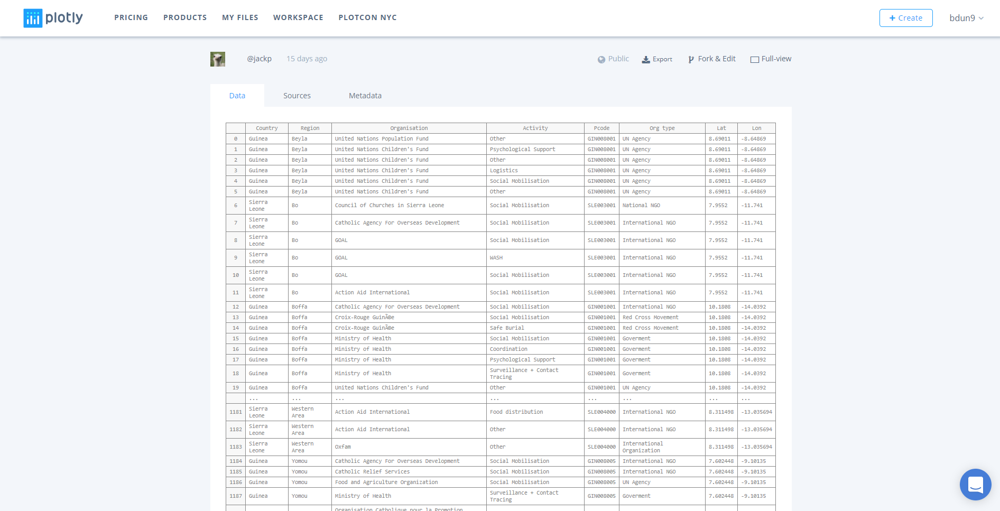

If you choose the latter, the Chart Studio ought to have opened and you're all set to go. If the former, navigate to the [Chart Studio](https://plot.ly/create/) and click **'Import'**, **'By URL'**, and then paste in the **URL** (https://plot.ly/~jackp/18129.csv).

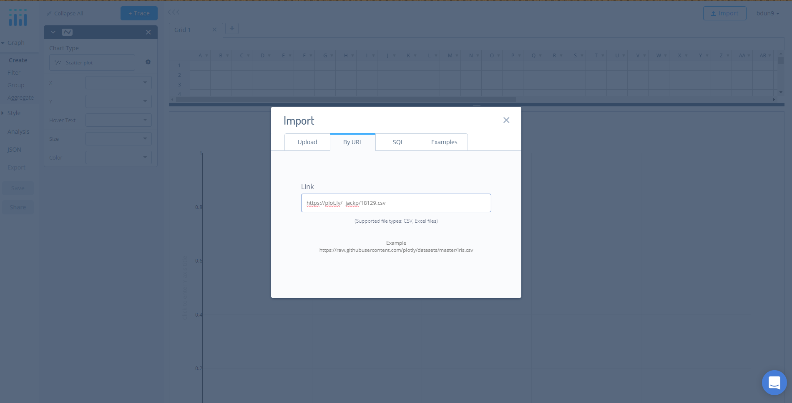

## 2. Create a Chart

To visualize aid agencies during the Ebola outbreak, we'll create four individual charts: (1) a satellite map to illustrate aid agency location, (2) a pie chart indicating aid agency activity, (3) another pie chart looking at countries, and (4) a bar chart highlighting the total activity by relief organizations. In this section we'll look at how to make each of the charts.

### 2.1. Satellite Map

##### 2.1.1. Create
Now that we have the data added to the grid, we can select our chart type. To do so, select *Graph* on the left-hand side, then *Create*. Click *Chart Type*, and **Satellite Maps** from the *Maps* column.

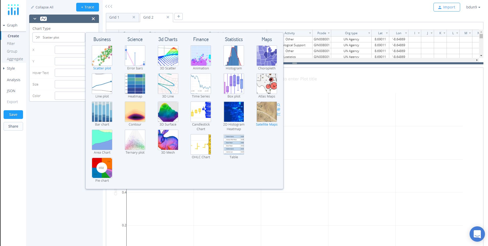

Now to populate the graph with data, in the *Latitude* and *Longitude* dropdown select **Lat** and **Lon**, respectively. Additionally, add **Region** in the *hover text* dropdown to display region names on hover.

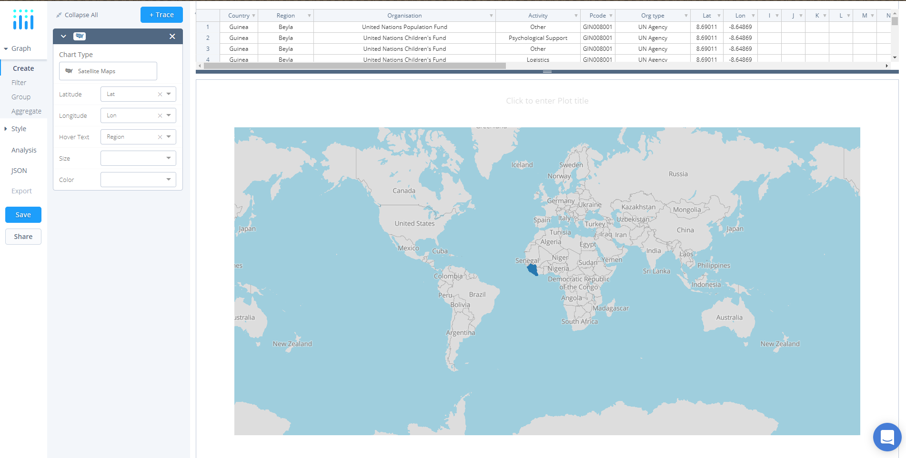

##### 2.1.2. Layout
Now that the map is populated with scatter points, navigate to the *Layout* to fix the map positioning and map style to help focus in on the data points. Open the *Map Style* box and select **Light** from the dropdown menu to change the map to a lighter style.

Next, click *Map Positioning* to adjust the center and zoom of the map. Set *Center Latitude* to **8.5**, *Center Longitude* to **-10**, and *Zoom Level* to **5.4**. The map now ought to display West Africa.

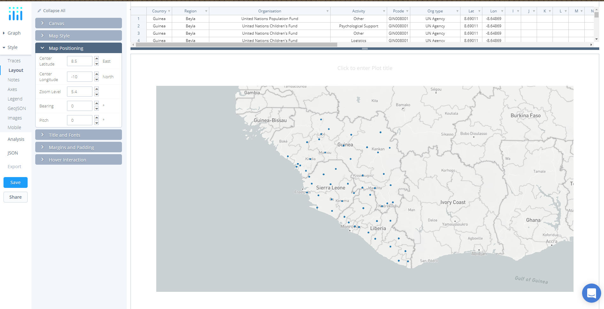

To make the map the full width and height, open *Margins and Paddings* and set all the values to **0**.

##### 2.1.3. Traces
With our layout styled, navigate to the *Traces* tab to style the data points. Here, set the color to **#000000**, *Diameter* to **16**, and **select / tick all values** in the *Values Shown on Hover*.

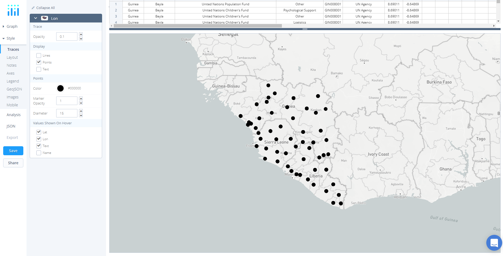

##### 2.1.4. Save
Congrats, your chart is complete! Click **Save** on the left-hand side of the screen. In the pop-up, enter your filename and select either **Public** (visible to all) or **Private Link** (visible only to those who you share the link with) and hit **Save**. Since these plots are destined for a dashboard, they can't be set to private.

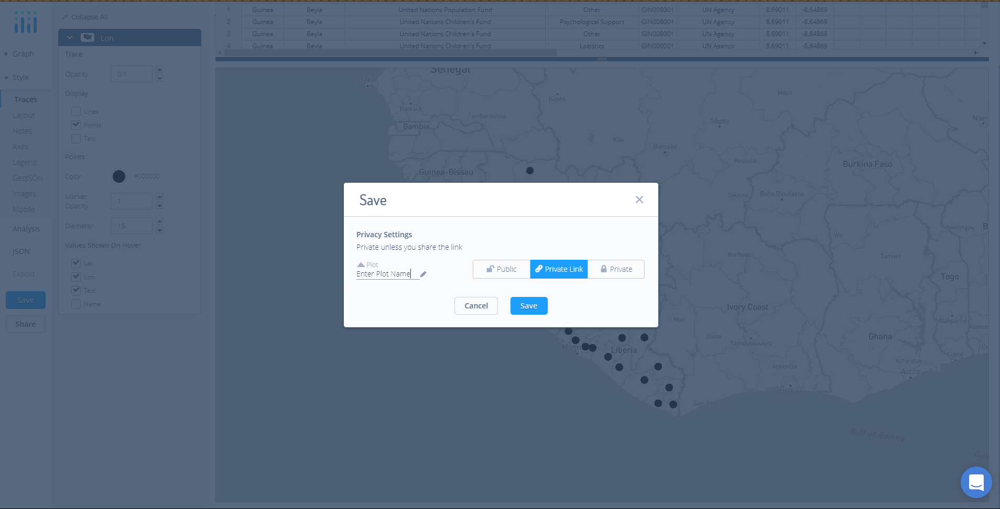

### 2.2. Pie Chart (Activities)

##### 2.2.1. Create
Again, now that we have the data in the grid, we can select our chart type. To do so, select *Graph* on the left-hand side, then *Create*. Click *Chart Type*, and **Pie Chart** from the *Business* column.

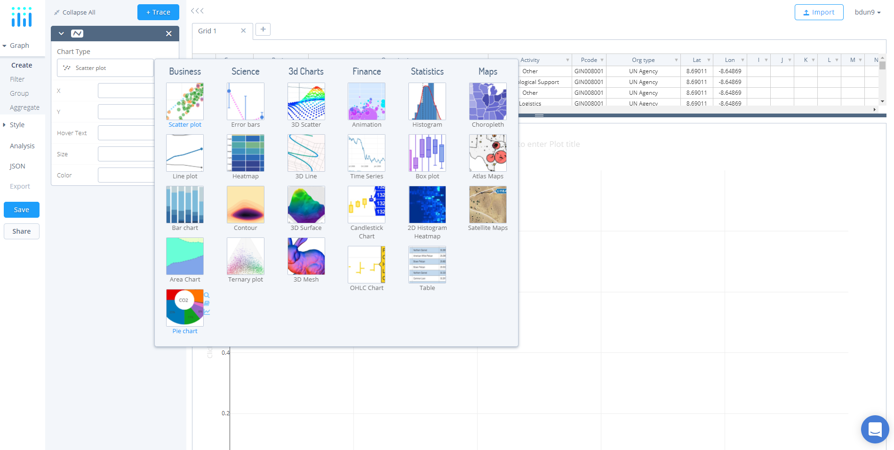

Next, we can populate the graph by selecting **Activity** in the *Labels* dropdown. You ought to see a pie chart with a legend like below.

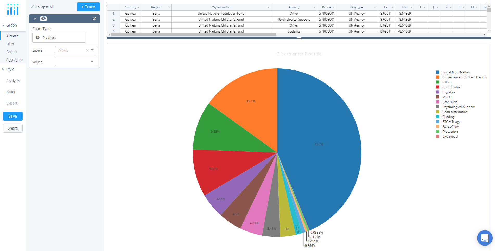

##### 2.2.2. Traces
To style the pie chart, we can make changes to the text, colors, borders, and order. To do so, navigate to the *Traces* tab under *Style*. Here, **select Label** and **unselect %**, change the *Typeface* to **Raleway**, set the *Slice Order* to **Clockwise**, and the *Rotation* to **130 degrees**. Additionally, to make the slices more defined set the *Border Width* to **1**.

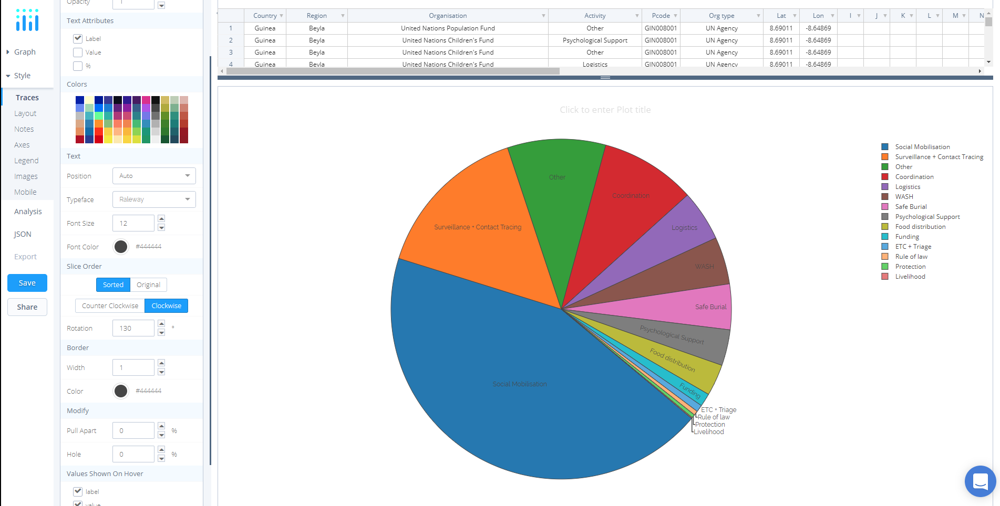

##### 2.2.3. Legend
With the styling done and the option to use labels directly on the slices the legend on the right-hand side is redundant. Thus, click *Legend* under *Style* and select **Hide**.

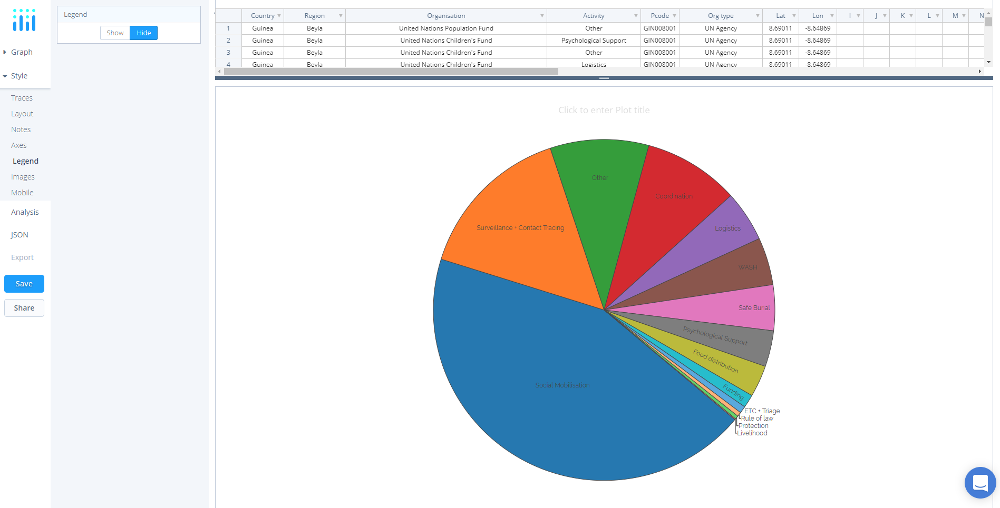

##### 2.2.4. Save
Congrats, your chart is complete! Click **Save** on the left-hand side of the screen. In the pop-up, enter your filename and select either **Public** (visible to all) or **Private Link** (visible only to those who you share the link with) and hit **Save**. Since these plots are destined for a dashboard, they can't be set to private.

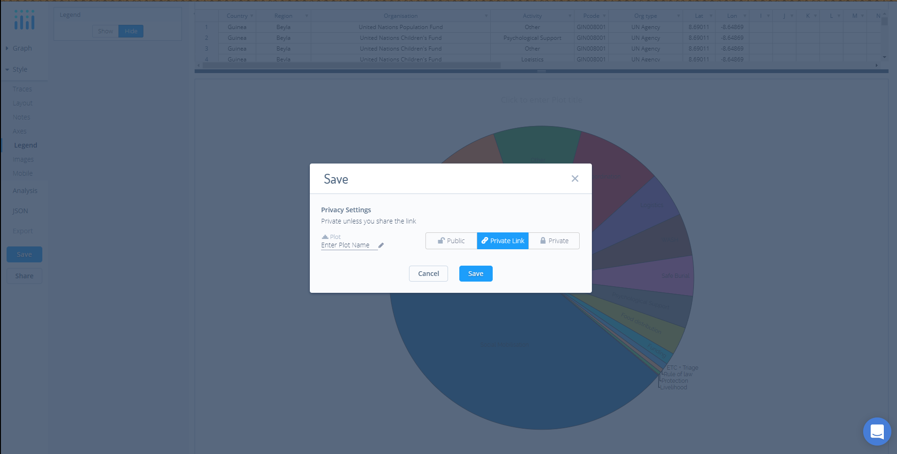

### 2.3. Pie Chart (Countries)

##### 2.3.1. Create
Like the previous pie chart, select *Graph* on the left-hand side, then *Create*. Click *Chart Type*, and **Pie Chart** from the *Business* column.

Populate the graph by selecting **Country** in the *Labels* dropdown. You ought to see a pie chart with a legend like below.

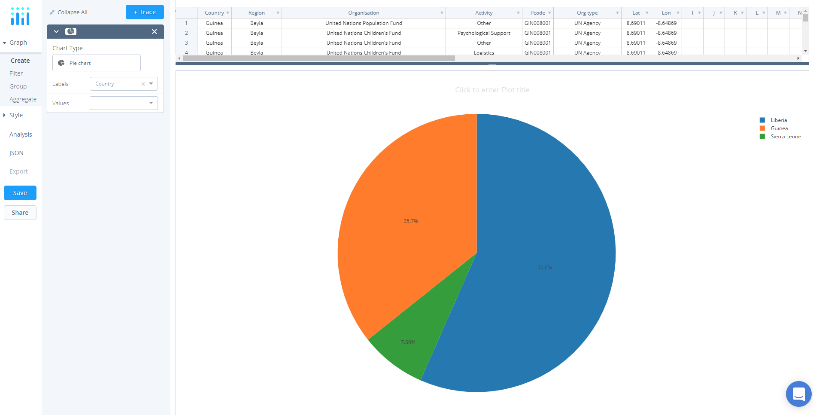

##### 2.3.2. Traces
To style the pie chart, we can make changes to the text, colors, borders, and order. To do so, navigate to the *Traces* tab under *Style*. Here, **select Label, Value, and %**, change the *Typeface* to **Raleway**, and the *Rotation* to **120 degrees**. Additionally, to make the slices more defined set the *Border Width* to **1**.

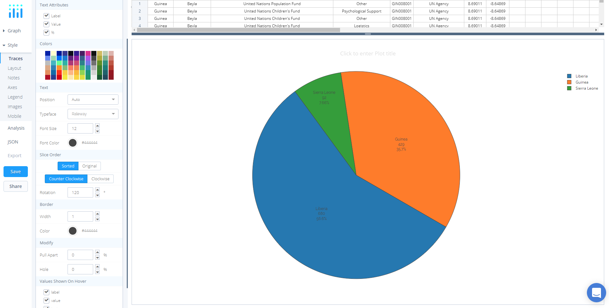

##### 2.3.3. Legend
With the styling done and the option to use labels directly on the slices the legend on the right-hand side is redundant. Thus, click *Legend* under *Style* and select **Hide**.

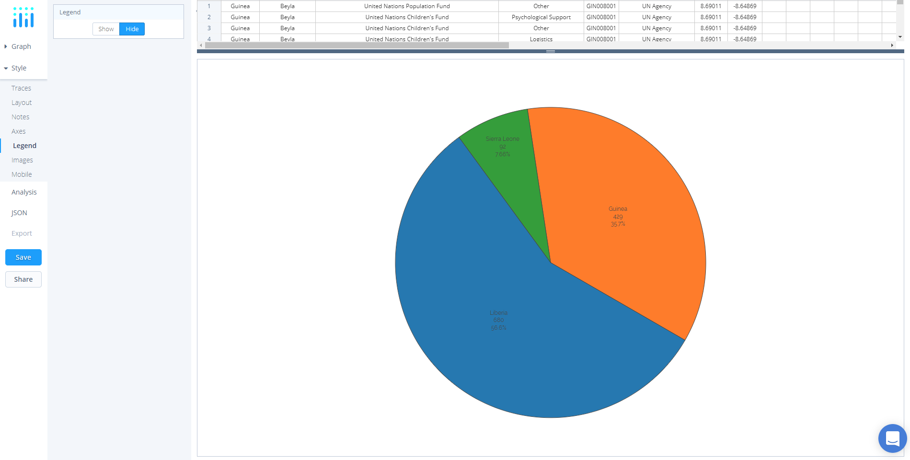

##### 2.3.4. Save
Congrats, your chart is complete! Click **Save** on the left-hand side of the screen. In the pop-up, enter your filename and select either **Public** (visible to all) or **Private Link** (visible only to those who you share the link with) and hit **Save**. Since these plots are destined for a dashboard, they can't be set to private.

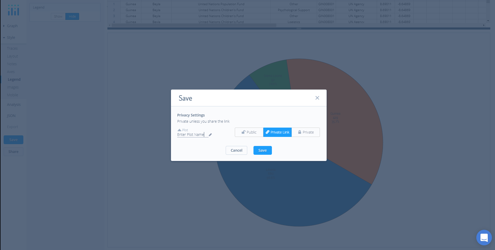

### 2.4. Bar Chart

##### 2.4.1. Create
After loading the data, select *Graph* on the left-hand side, then *Create*. Click *Chart Type*, and select **Bar Chart** from the *Business* column.

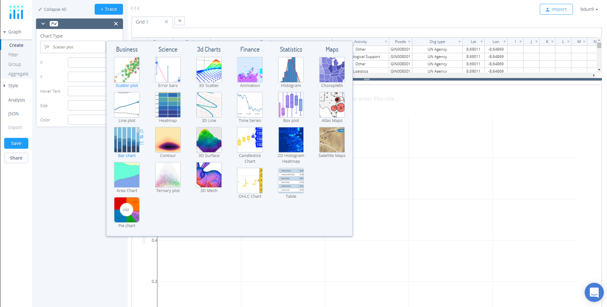

Now, you ought to see *y*, *x*, and *Hover Text* dropdowns. Select **Lat**, **Organisation**, and **Org type**, respectively.

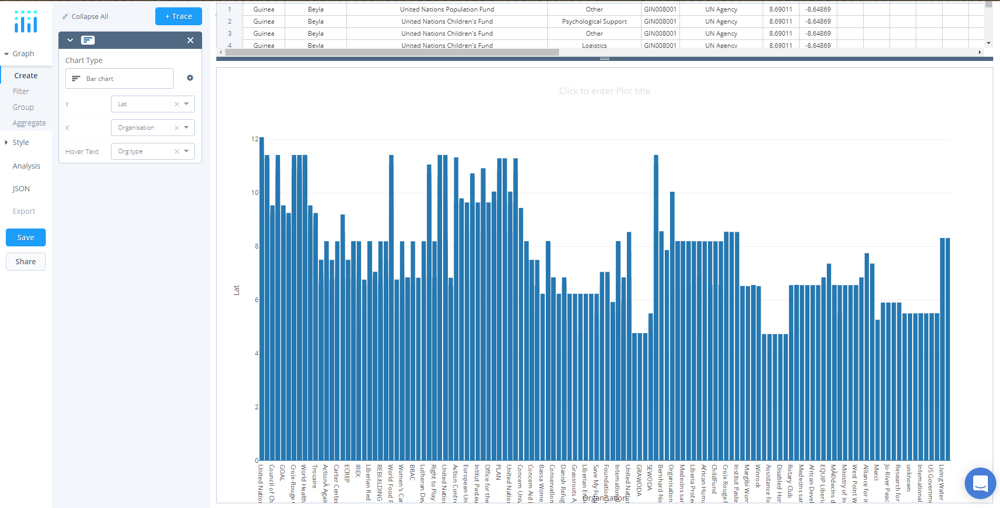

##### 2.4.2. Aggregate
As we are wanting to display the total count for each organization, under *Graph* click *Aggregate*. Next, click the blue *+ Agreggate* button. In the box that appears, select **Organisation** as the *Group By Column*. Set *Trace* to **Lat**, *x* to **first**, and aggregate *y* by **count**.

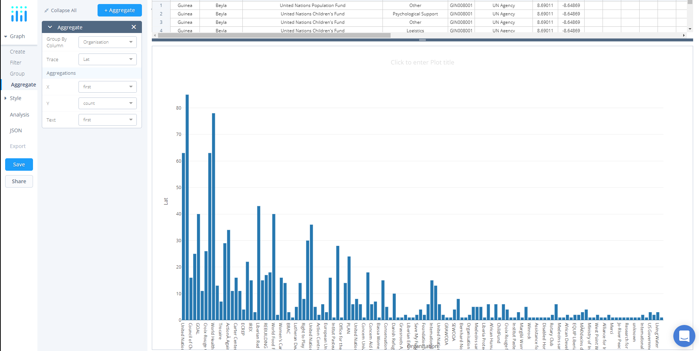

##### 2.4.3. Layout
Now that our data display the total count for each organization, we can style the layout. More specifically, the margins. Navigate to *Layout*, open *Margins and Paddings* and set the values to **0, 400, 20, 0, 0**, respectively.

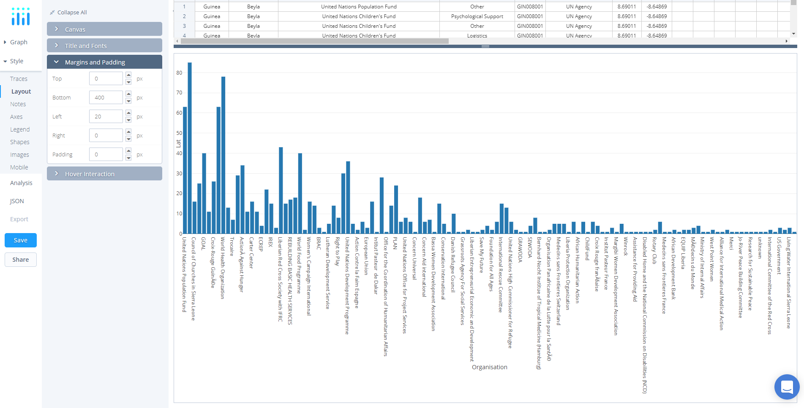

##### 2.4.4. Axes
With the margins adjusted and the x axis tick labels visible, select *Axes* under *Style* to style the tick labels. First, however, open the *Titles*, select *All* and **remove all titles**.

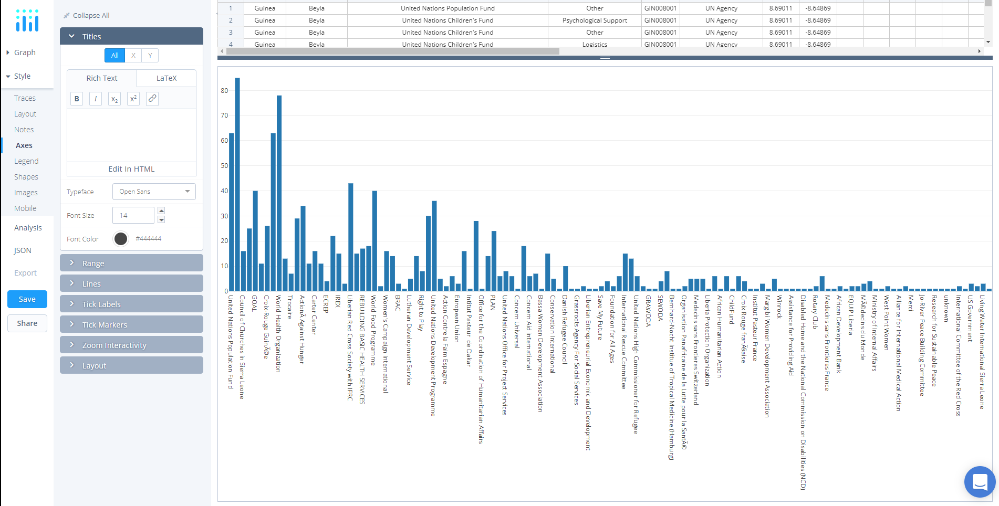

To style the tick labels, open *Tick Labels* and set the *Typeface* to **Raleway** and *Angle* to **90 degrees**. This is to ensure that the tick labels always stay at 90 degrees.

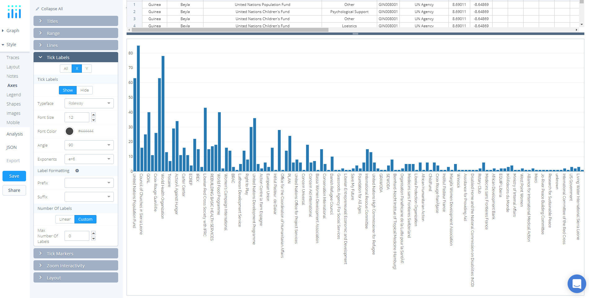

Lastly, for this bar chart, at the bottom of *Axes* open the *Zoom Interactivity* box, select *All* and **Disable**.

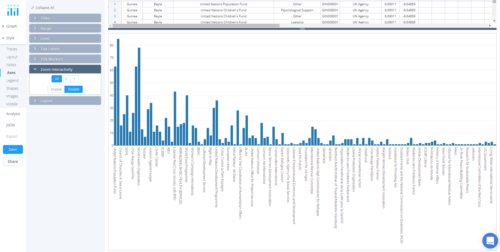

##### 2.4.5. Save
Congrats, your chart is complete! Click **Save** on the left-hand side of the screen. In the pop-up, enter your filename and select either **Public** (visible to all) or **Private Link** (visible only to those who you share the link with) and hit **Save**. Since these plots are destined for a dashboard, they can't be set to private.

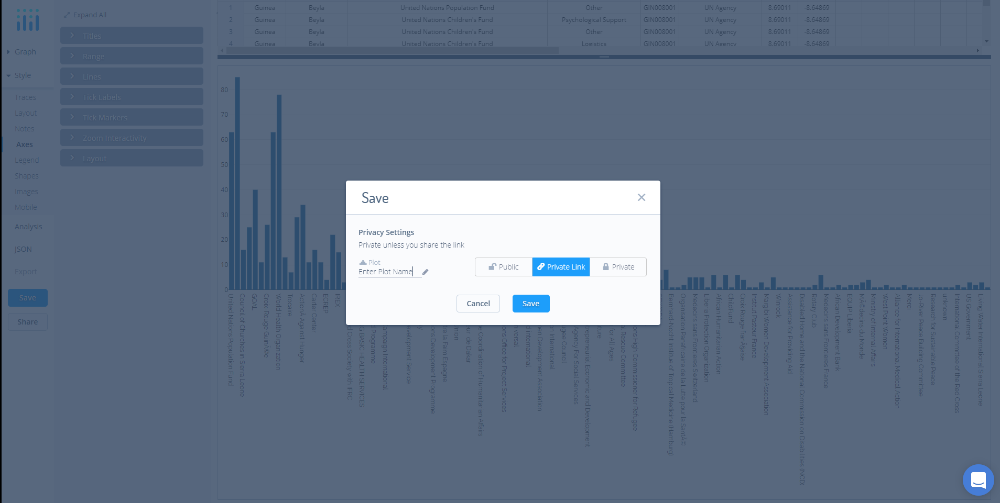

## 3. Create a Dashboard

With the charts completed and saved in your [home folder](https://plot.ly/organize/home), we can now create a dashboard by simply adding these charts, adjusting the layout, and styling the dashboard before sharing and interacting. To get started with creating a dashboard, hover over the *+Create* button and select **Dashboard** from the menu. Alternatively, open this [link](https://plot.ly/dashboard/create).

### 3.1. Add Charts

First, to add the satellite map, click *+Plot* in the bottom left corner of the screen. A new box ought to appear with the option to 'Add a Plot'. Click, the *'Your Files'* option and then in the pop-up select the **satellite map** we made earlier.

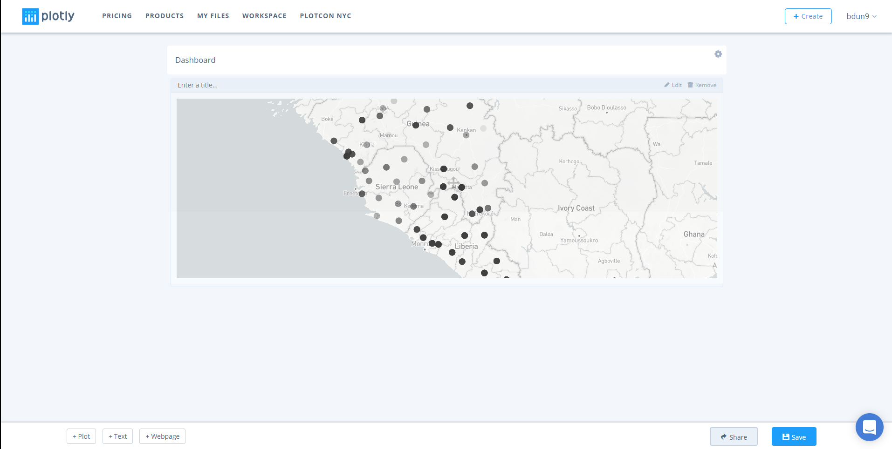

Next, add the pie chart (activities) following the same process. This time drag and drop the plot on the right half of the satellite map.

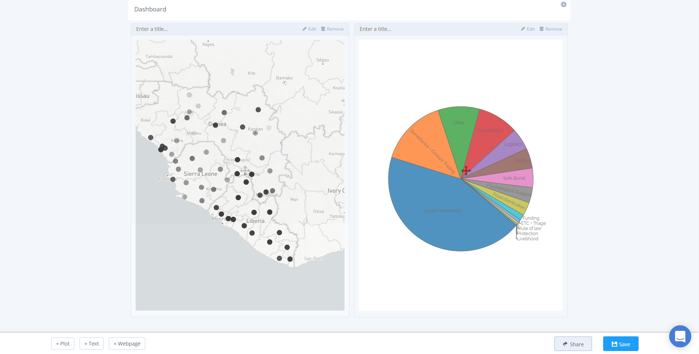

Again, follow the same process for pie chart (countries). However, drag and drop pie charts (countries) on the bottom half of pie chart (activities). You ought to see something similar to below.

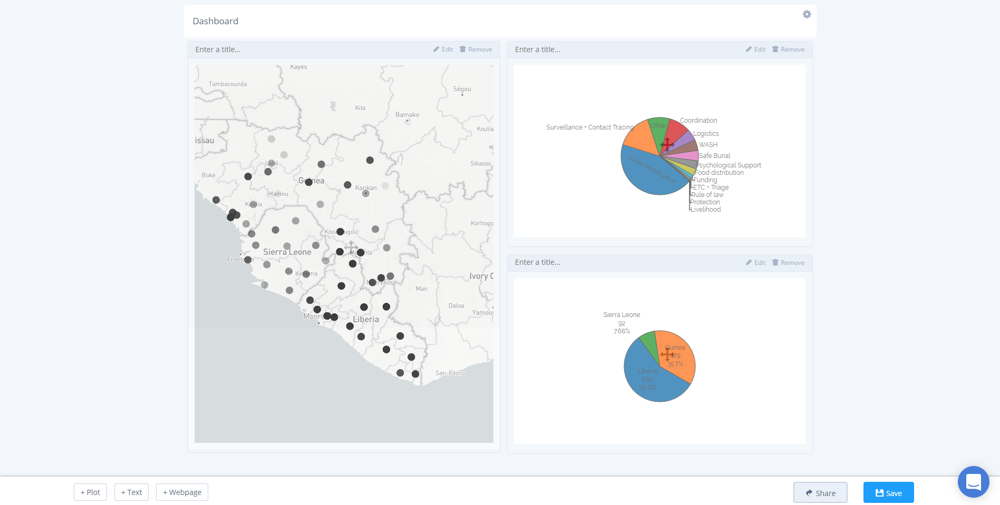

For the final plot, the bar chart, simply add this to the bottom of the dashboard.

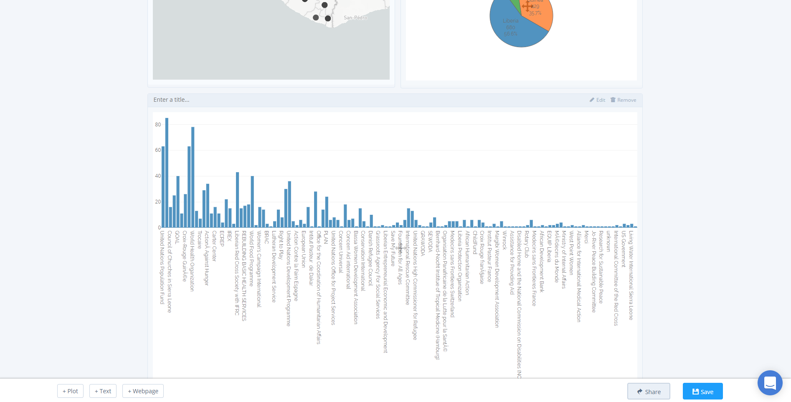

Now that we have added all the plots to the dashboard, for each plot where it says "Enter a title..." insert plot titles: **"Map (darker locations had more relief attention)"**, **Activities**. **Countries**, and **Relief Organization Total Activity Count**, in the same order as we added the plots. Your result ought to look like below.

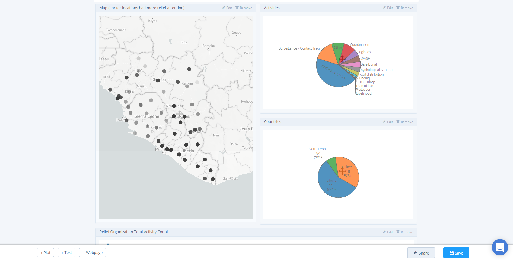

### 3.2. Style It

Now that we have the structure of our dashboard, we can style it. To do so, navigate to the *settings icon* directly opposite the dashboard title. When hovering you ought to see the option settings from the menu.

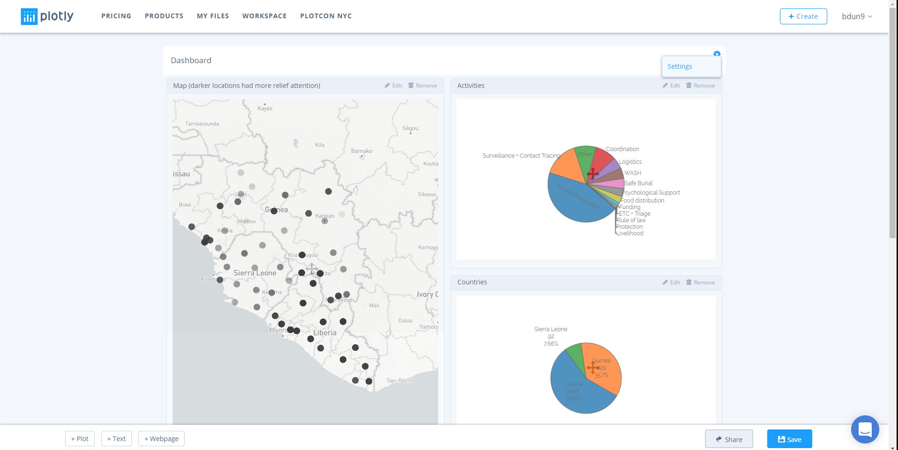

After clicking *settings*, a panel ought to appear from the right-hand side of the screen. Here, we have the option of headers, colors, text, layout, and filter. First, in *Headers*, we can set the title, add a logo, and multiple links. For this tutorial, add **"UN Office for the Coordination of Humanitarian Affairs"** to the *Title* text box. Next, let's add the OCHA ROWCA logo. We can do this by simply adding the URL for the logo PNG: **http://www.elrha.org/wp-content/uploads/2015/01/ocha.jpg**. As previously mentioned you can add links, in this tutorial we'll use this feature to link the original dataset. Thus, add the text **"December 10, 2013 Data"** with the URL: **https://data.humdata.org/dataset/3w-dataset-on-the-organizations-involved-in-the-response-to-the-ebola-crisis**.

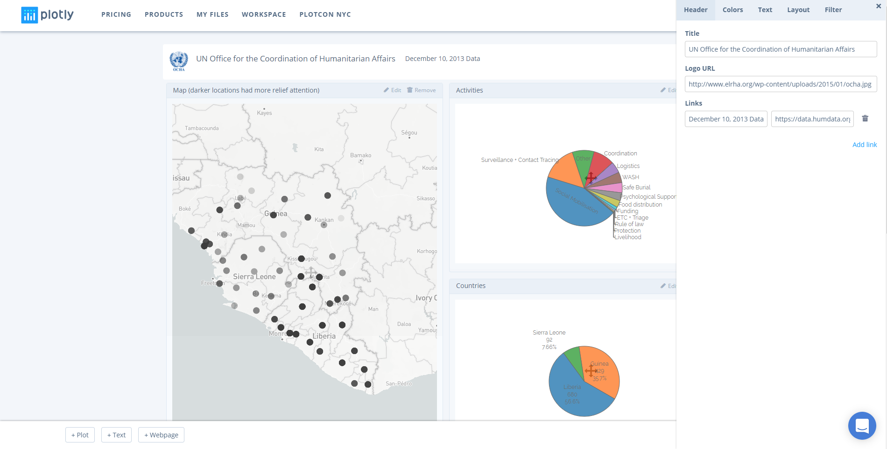

In the next tab, *Colors*, we can manipulate the background, borders, and text colors. As you can see, the dashboard has already added these by default. That said, for this dashboard we will set *Header Background*, *Page Background*, *Box Background*, *Box Border*, and *Box Header Background* to **#FFFFFF**.

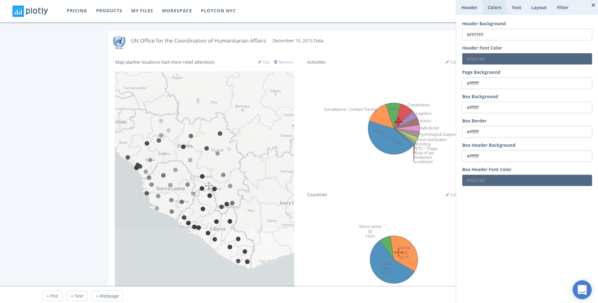

*Text*, the third settings option, allows you to control all things text, including font color, family, and size, as well as header styles and text box styles. Again, like the Colors tab, some values are defined. However, here, we'll set the *Font Family* to **Raleway**. Make the header font larger by selecting **2.2em** in the *Header Font Size* and, additionally, change the *Header Font Weight* to **300**.

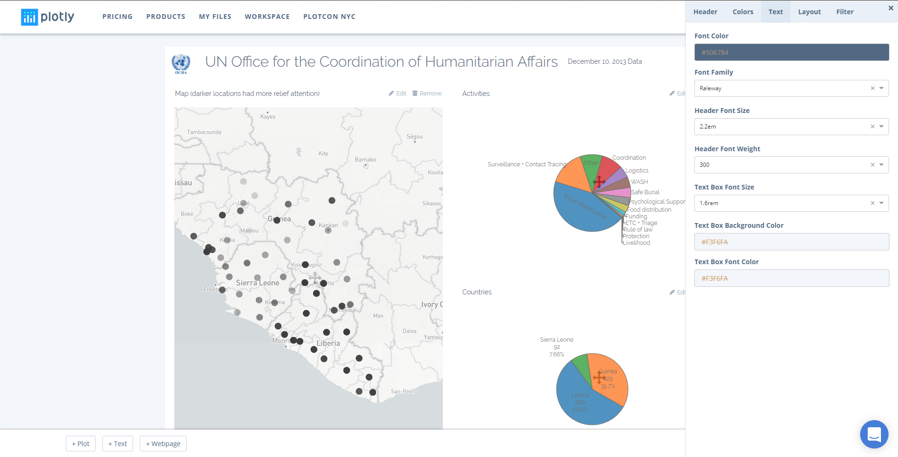

In *Layout*, you have the option of setting the page layout as either a dashboard or a report. Here, we'll leave it as the default dashboard setting. The last settings category, *Filter*, provides you with the option to enable or disable the Search Bar or the Crossfilter feature. For this tutorial, leave the *Search Bar* as is but lets enable the *Crossfilter* feature by selecting **enable** (for more information about this feature see the next section).

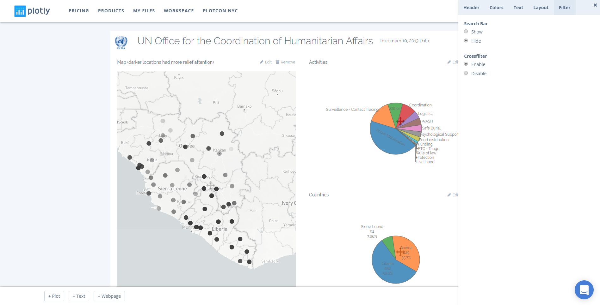

Congrats, your dashboard is complete! Click **Save** on in the bottom right-hand side of the screen. In the pop-up, enter your filename and select either **Public** (visible to all), or **Private Link** (visible only to those who you share the link with), or **Private** (visible only to you) and hit **Save**. .

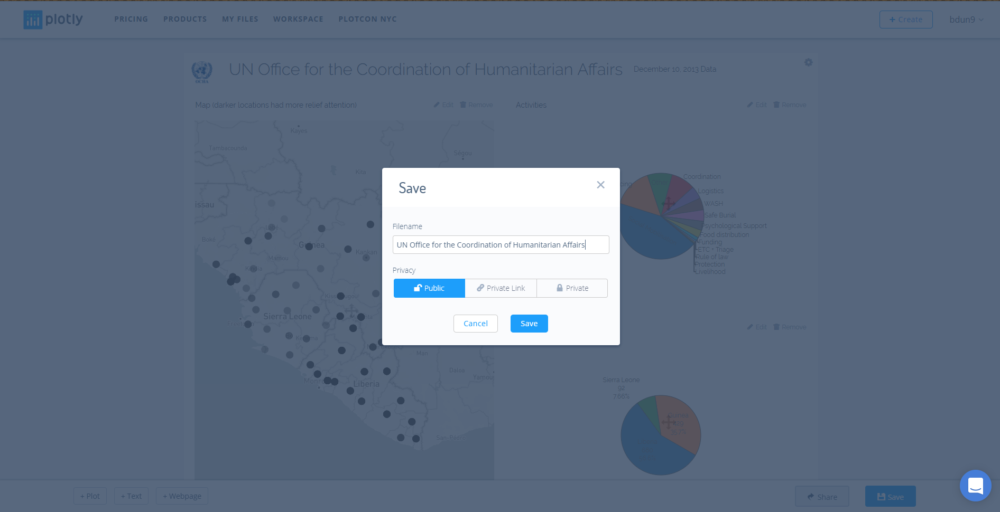

## 4. Crossfilter

TODO
