# Ebola Outbreaks 1976-2013
In this tutorial, we'll create and style multiple individual plots in the Chart Studio, add them to a dashboard, and utilize the crossfilter feature to interact and explore these data further.

## Contents

- [Data](#1-data)
- [Create a Chart](#2-create-a-chart)
  - [Outbreak Location Map](#21-outbreak-location-map)
  - [Deaths Per Outbreak Scatter Plot](#22-deaths-per-outbreak-scatter-plot)
  - [Ebola Outbreak Table](#23-ebola-outbreak-table)
- [Create a Dashboard](#3-create-a-dashboard)
  - [Add Charts](#31-add-charts)
  - [Style It](#32-style-it)
- [Crossfilter](#4-crossfilter)

## 1. Data

To get started, head to Plotly’s [Chart Studio](https://plot.ly/create/) and add your data. You have the option of typing directly in the grid, uploading your file, or entering a URL of an online dataset. For this tutorial, we'll use the Ebola Outbreak dataset from [Nature: Science Direct](http://go.nature.com/2zKJN9u). To begin, simply view the [dataset](https://plot.ly/~public.health/8) and click **'Fork & Edit'** to begin. The Chart Studio ought to open and you're all set to go.

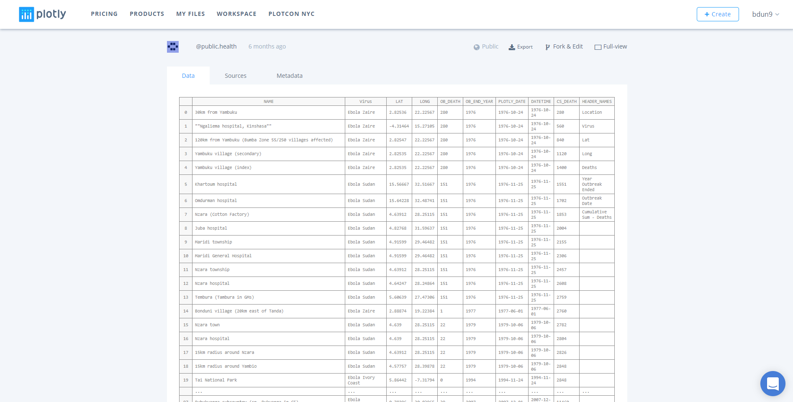

Alternatively, navigate to the [Chart Studio](https://plot.ly/create/) and click **Import**, **By URL**, and then paste in the **URL** (https://plot.ly/~public.health/8.csv).

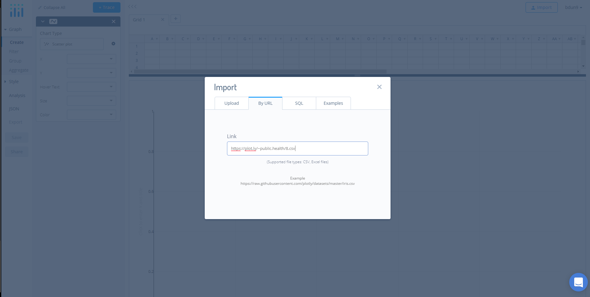

## 2. Create a Chart

To visualize Ebola outbreaks from 1973 to 2013, we'll create three individual charts: (1) an outbreak location atlas map, (2) a scatter plot looking at deaths per outbreak, and (3) a table to display all outbreak data. In the section below, we'll look at how to make each of the charts.

### 2.1. Outbreak Location Map

##### 2.1.1. Create
Now that we have the data added to the grid, we can select our chart type. To do so, select *Graph* on the left-hand side, then *Create*. Click *Chart Type*, and **Atlas Maps** from the *Maps* column.

Now to populate the graph with data, in the *Latitude* and *Longitude* dropdown select **LAT** and **LONG**, respectively. Additionally, add **NAME** in the *Hover Text* dropdown to display names on hover and **OB_DEATH** to *Color*. As we are looking at the Ebola outbreaks which took place in Africa, set *Map Region* to **Africa**.

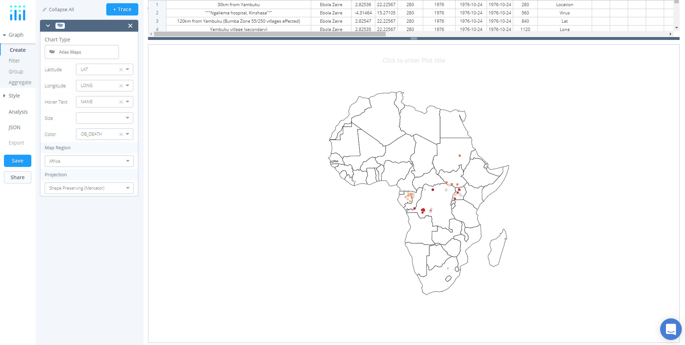

##### 2.1.2. Traces
With our trace values entered, next, open *Traces* to begin styling the plot. First, set the *Colorscale* to **Pink/Green** (roughly the 9th from the left), and the select **Reversed** and **Show Color Bar**. Moving on to style the points, alter the *Diameter* to **5**, *Border Width* to **0.5**, and set the *Border-Color* to **#FFFFFF**. Your data points ought to look like the ones below.

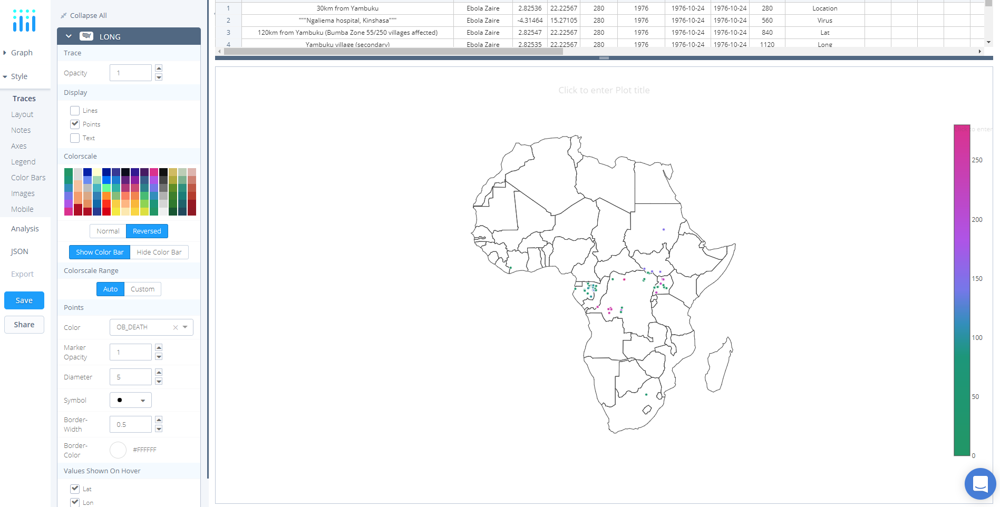

##### 2.1.3. Layout
Next, navigate to the *Layout* tab to set the background colors and margins. To complete the former, open the *Canvas* box and set *Plot* and *Margin Color* to **#F2F5FA**.

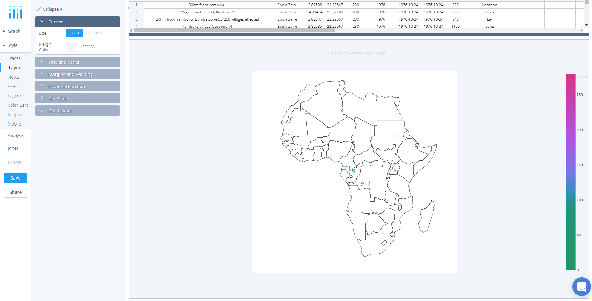

Below *Layout*, open the *Title and Fonts* box and under *Global Font*, set *Typeface* to **Raleway** and *Font Size* to **12**.

To make the atlas map full width and height, open *Margins and Paddings* and set all the values to **0**.

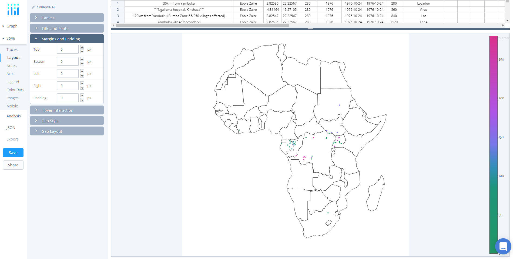

In atlas maps, we have *Geo Style* and *Geo Layout*. To alter the former, select *Geo Style* and set *Land* to **Show** and *Color* **#222222**; *Coastlines* to **Show**, **1**, and **#444444**; *Oceans* to **Show** and **#FFFFFF**; *Country* to **Show**, **0.2**, **#A2B1C6**. Now, you ought to see substantial changes to the map style.

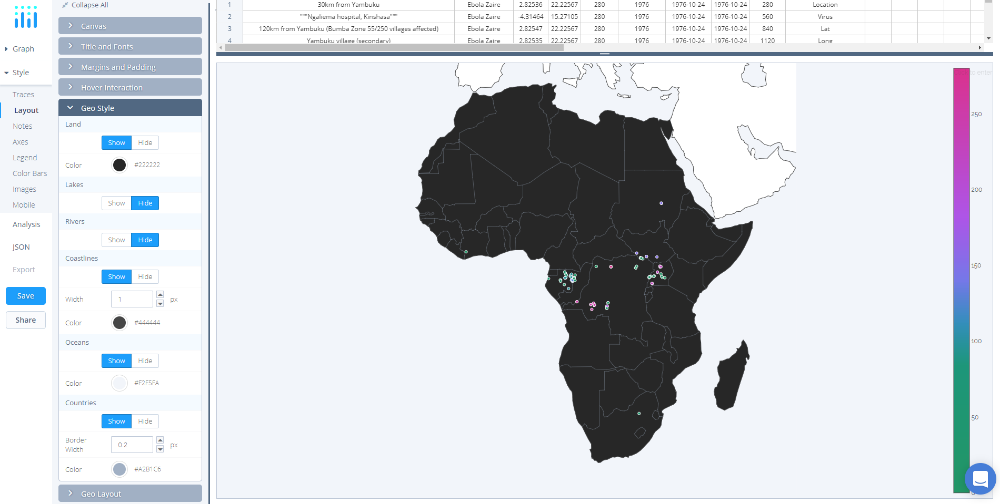

Next, in *Geo Layout* you can define attributes such as *Map Scope*, *Projection*, *Rotation*, *Scale*, and *Map Resolution*. Set the latter two to **2** and **1:50,000,000**, respectively.

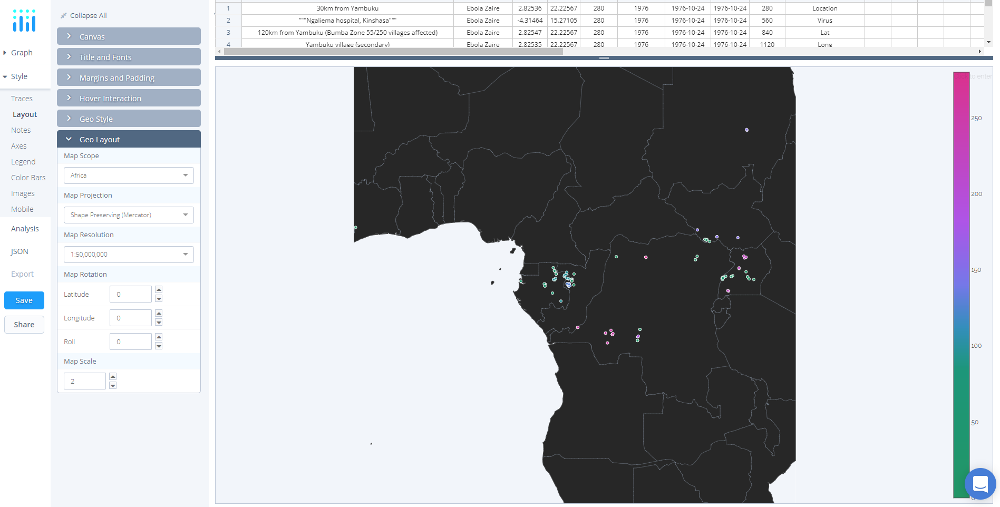

##### 2.1.4. Color Bars
Finally, you can style the color bar by navigating to *Color Bars*. For this tutorial, in the *Title* box we enter the title **Deaths per Outbreak** and set the *Typeface* to **Raleway**.

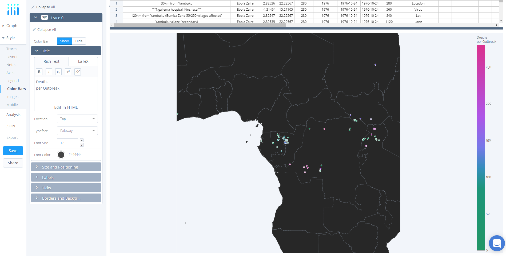

Now to minimize the size of the color bar, select the *Size and Positioning* box and set the *Height* to **0.8** and *Width* to **20**.

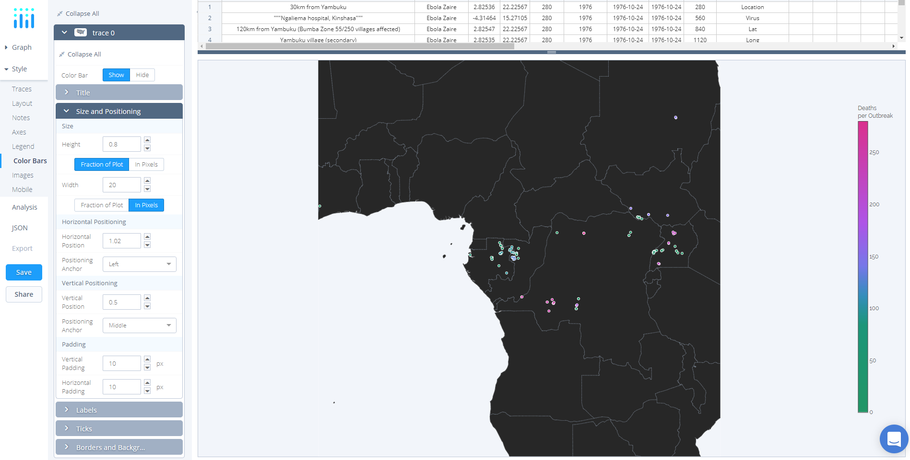

##### 2.1.5. Save
Congrats, your chart is complete! Click **Save** on the left-hand side of the screen. In the pop-up, enter your filename and select either **Public** (visible to all) or **Private Link** (visible only to those who you share the link with) and hit **Save**. Since these plots are destined for a dashboard, they can't be set to private.

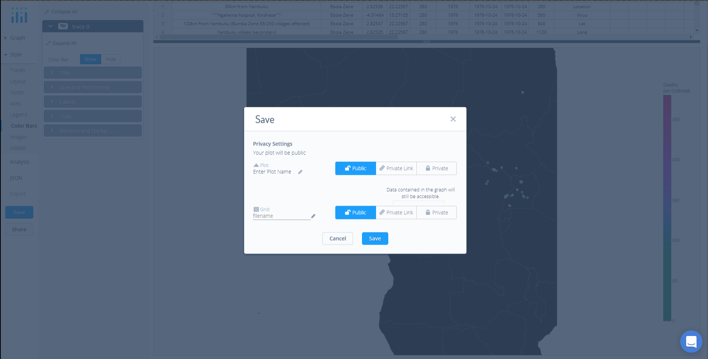

### 2.2. Deaths Per Outbreak Scatter Plot
Using the same grid as the previous plot, open the data in the Chart Studio.

##### 2.2.1. Create
Now that we have the data added to the grid, we can select our chart type. To do so, select *Graph* on the left-hand side, then *Create*. Click *Chart Type*, and **Scatter** from the *Business* column.

Now to populate the graph with data, in the *x* and *y* dropdown select **PLOTLY_DATE** and **OB_DEATH**, respectively. Additionally, we want to color these data by deaths, thus in the *Color* dropdown select **OB_DEATH**. Lastly, add **NAME** to *hover text*.

##### 2.2.2. Traces
Now that we have a graph with data we can style it. Thus, navigate to *Traces* and set the *Colorscale* to **Greyscale** and **Reversed**. Further below, set the *Diameter* to **10** to make the data points larger and then set Border Width to **2**, which will help define the lighter colored markers.

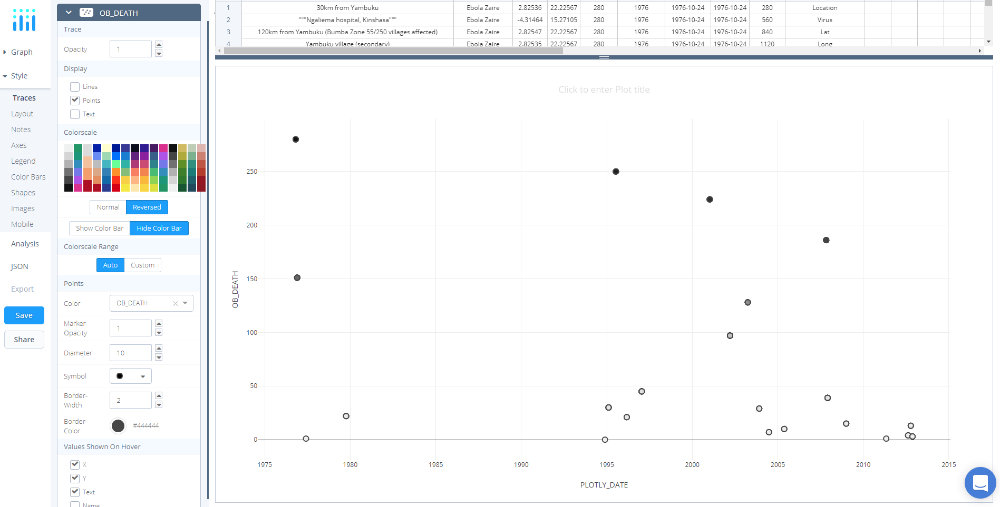

##### 2.2.3. Axes
We won't style this plot that much, so we'll just remove the titles by clicking *Axes*, *Titles*, *All*, and then deleting **MIXED_VALUES**.

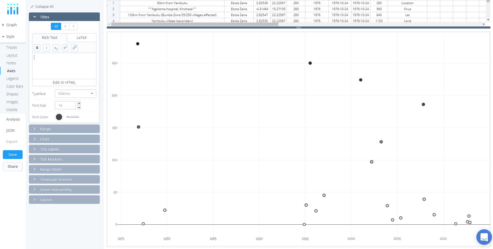

Finally, open *Zoom Interactivity* and select **Disable**.

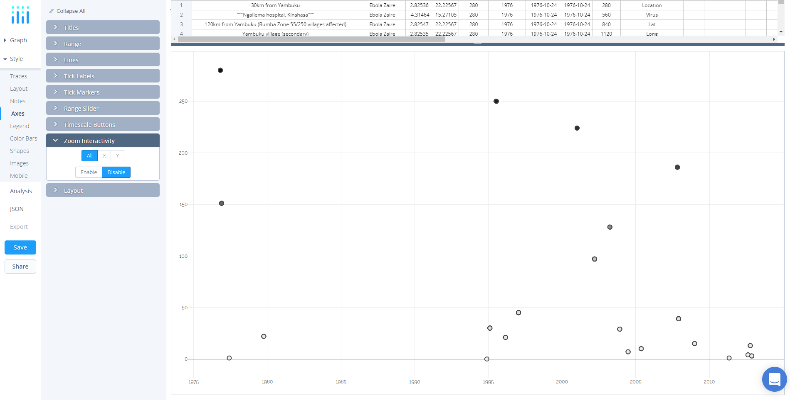

##### 2.2.4. Save
Congrats, your chart is complete! Click **Save** on the left-hand side of the screen. In the pop-up, enter your filename and select either **Public** (visible to all) or **Private Link** (visible only to those who you share the link with) and hit **Save**. Since these plots are destined for a dashboard, they can't be set to private.

### 2.3. Ebola Outbreak Table
Using the same grid as the previous plot, open the data in the Chart Studio.

##### 2.3.1. Create
Now that we have the data added to the grid, we can select our chart type. To do so, select *Graph* on the left-hand side, then *Create*. Click *Chart Type*, and **Table** from the *Statistics* column.

Now to populate the table with data, we need to define the *Header Values* and *Columns*. Thus, add **HEADER_VALUES** to the former and **NAME**, **VIRUS**, **LAT**, **LONG**, **OB_DEATH**, **OB_END_YEAR**, **PLOTLY_DATE**, **CS_DEATH** to the latter. Lastly, add **VIRUS** to *Header Fill Color*.

##### 2.3.2. Traces
To style tables, it is divided into two sections: *Header* and *Cells*. For the *Header*, set the *Typeface* to **Raleway**, *Font Color* to **#FFFFFF**, and the *Border Color* to **#C8D4E3**. For the *Cells*, set the *Fill Color* to **#F2F5FA**, *Cell Height* to **28**, and the *Border Color* the same as the *Header*.

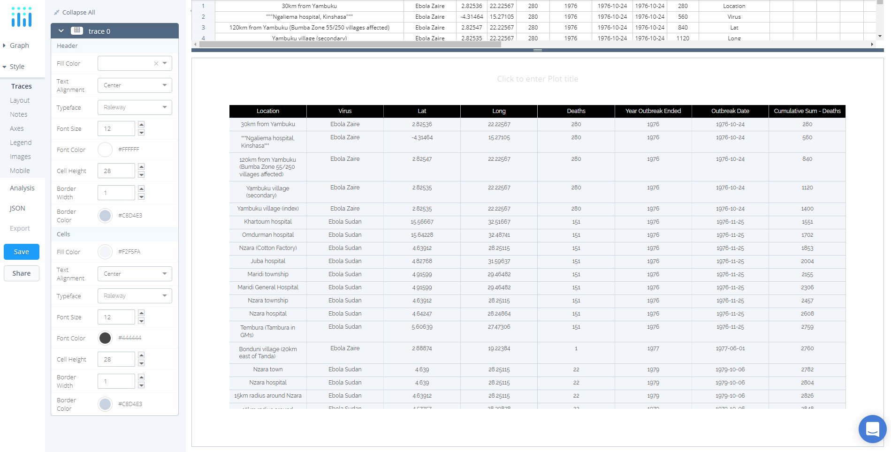

##### 2.3.3. Layout
Finally, navigate to the *Layout* tab, open *Margins and Paddings* and set all the values to **0** to make the table the full width and height.

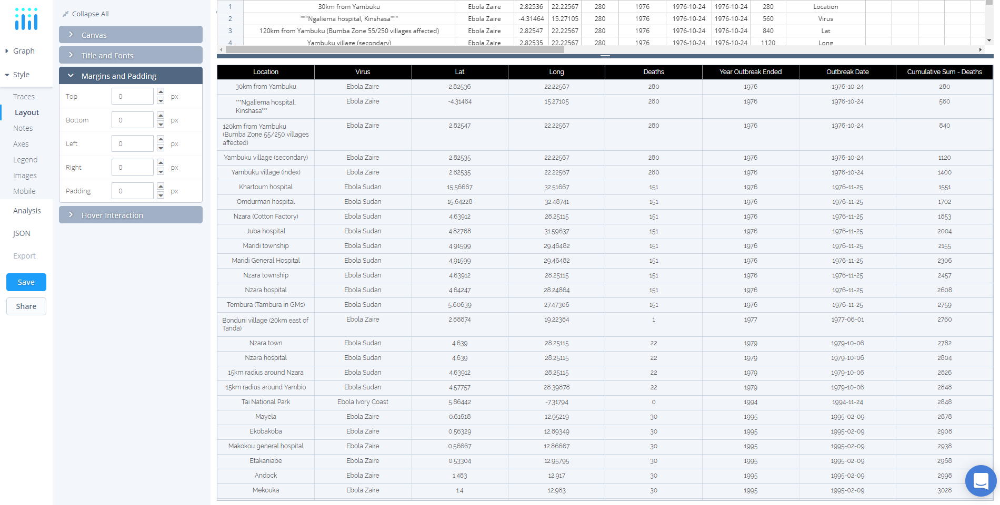

##### 2.3.4. Save
Congrats, your table is complete! Click **Save** on the left-hand side of the screen. In the pop-up, enter your filename and select either **Public** (visible to all) or **Private Link** (visible only to those who you share the link with) and hit **Save**. Since these plots are destined for a dashboard, they can't be set to private.

## 3. Create a Dashboard

With the charts completed and saved in your [home folder](https://plot.ly/organize/home), we can now create a dashboard by simply adding these charts, adjusting the layout, and styling the dashboard before sharing and interacting. To get started with creating a dashboard, hover over the *+Create* button and select **Dashboard** from the menu. Alternatively, open this [link](https://plot.ly/dashboard/create).

### 3.1. Add Charts

First, to add the Outbreak Locations Map, click *+Plot* in the bottom left corner of the screen. A new box ought to appear with the option to 'Add a Plot'. Click, the *'Your Files'* option and then in the pop-up select the **Outbreak Locations Map** we made earlier.

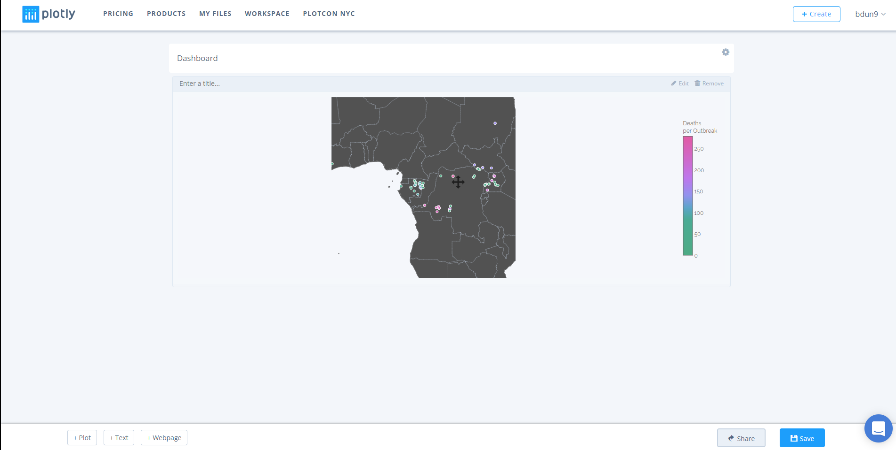

Next, add the **Deaths per Outbreak Scatter Plot**  following the same process. This time drag and drop the plot on the right half of the Outbreak Locations Map. You ought to something like below.

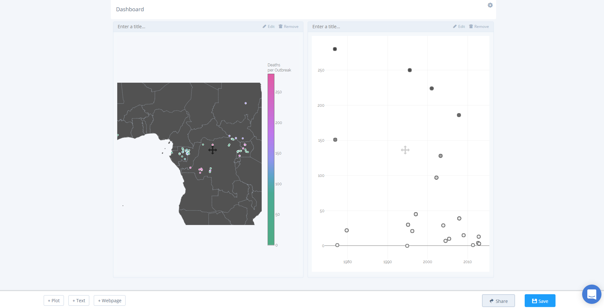

Add the final plot (or table), **All Outbreak Data**, to the bottom of the dashboard and size accordingly.

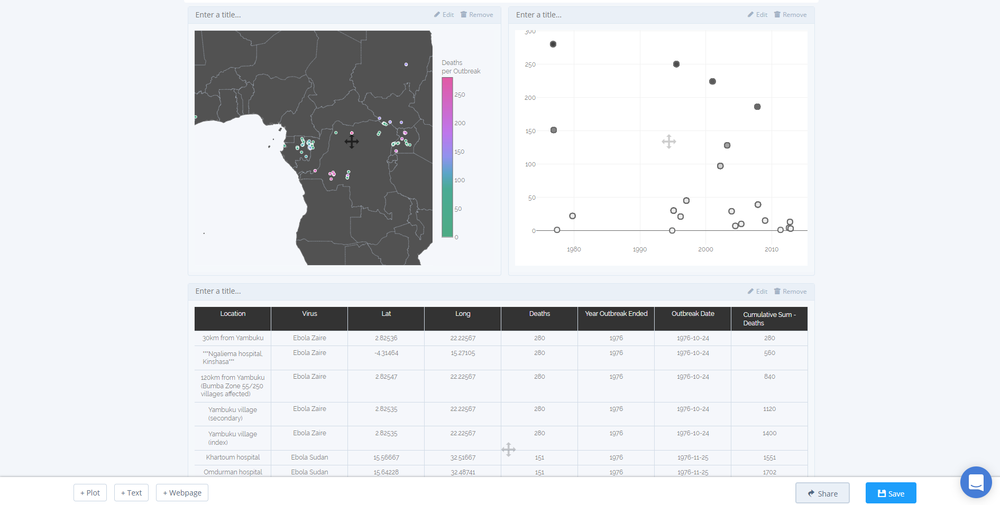

Now that we have added all the plots to the dashboard, for each plot where it says, "Enter a title..." insert plot titles: **Outbreak Locations**, **Death per Outbreak**, and **All Outbreak Data** in the same order as we added the plots. Your result ought to look like below.

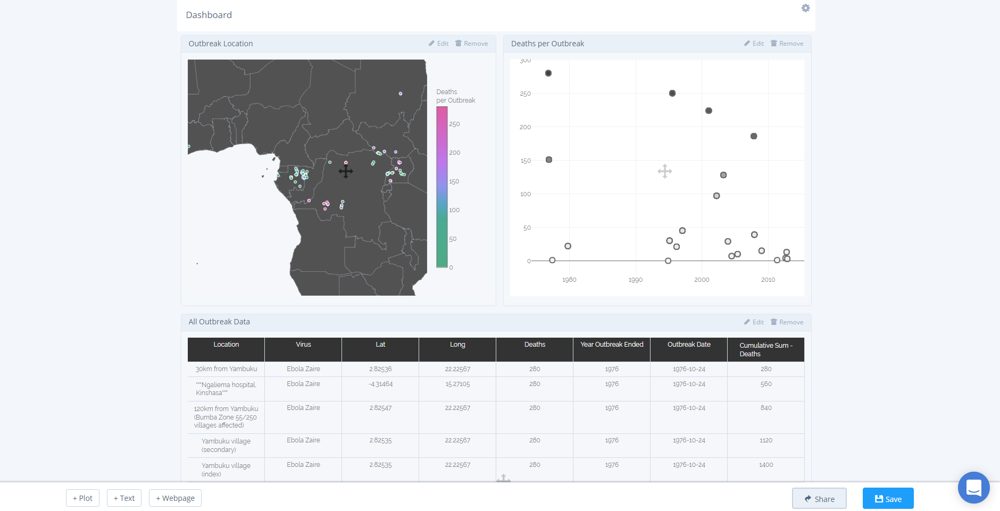

### 3.2. Style It

Now that we have the structure of our dashboard, we can style it. To do so, navigate to the *Settings Icon* directly opposite the dashboard title. When hovering you ought to see the option **Settings** from the menu.

After clicking **Settings**, a panel ought to appear from the right-hand side of the screen. Here, we have the option of *Headers*, *Colors*, *Text*, *Layout*, and *Filter*. First, in *Headers*, we can set the title, add a logo, and multiple links. For this tutorial, add **Ebola Outbreaks 1976-2013** to the *Title* text box. Next, we can add a link to the original dataset by adding the text **Data Source: Nature** with the URL: **https://www.nature.com/articles/sdata201442#data-records**.

In the next tab, *Colors*, we can manipulate the background, borders, and text colors. As you can see, the dashboard has already added these by default. Thus, for this tutorial, we'll leave them as is.

*Text*, the third settings option, allows you to control all things text, including font color, family, and size, as well as header styles and text box styles. Again, like the Colors tab, some values are defined. However, here, we'll set the *Font Family* to **Raleway**. Make the header font larger by selecting **1.6em** in the *Header Font Size* and, additionally, change the *Header Font Weight* to **300**. Lastly, to separate the text box, set the *Text Box Background Color* to **#FFFFFF**.

In *Layout*, you have the option of setting the page layout as either a dashboard or a report. Here, we'll leave it as the default dashboard setting. The last settings category, *Filter*, provides you with the option to enable or disable the Search Bar or the Crossfilter feature. For this tutorial, enable both the *Search Bar* and the **Crossfilter** feature by selecting **Enable** (for more information about this feature see the next section).

Congrats, your dashboard is complete! Click **Save** on in the bottom right-hand side of the screen. In the pop-up, enter your filename and select either **Public** (visible to all), or **Private Link** (visible only to those who you share the link with), or **Private** (visible only to you) and hit **Save**. .

## 4. Crossfilter
Finally, we'll briefly demonstrate crossfilter.

Crossfilter is a visual analysis technique for multidimensional data. It is used to clarify relationships between dimensions. As discussed in the previous section, crossfilter functionality is invoked by setting **Enable** in Settings > Filter.

To use crossfilter, simply click-and-drag on a chart. Selected data that shares common rows with other charts will highlight and all other data will fade out. To reset the dashboard, click anywhere on a graph that doesn't have data.

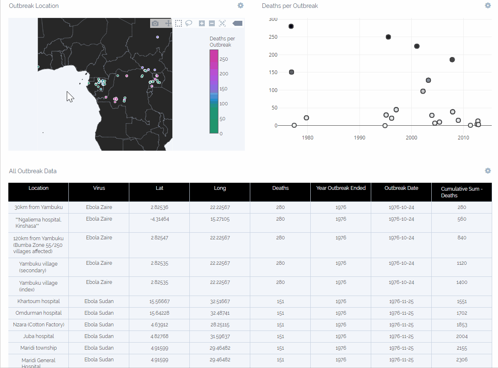
