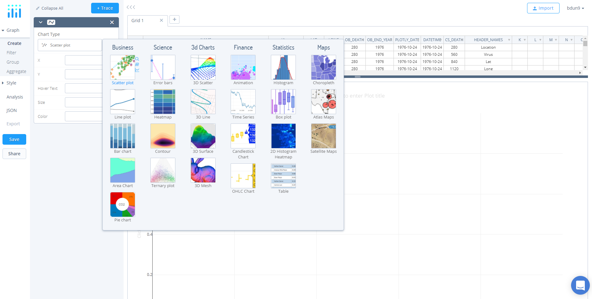
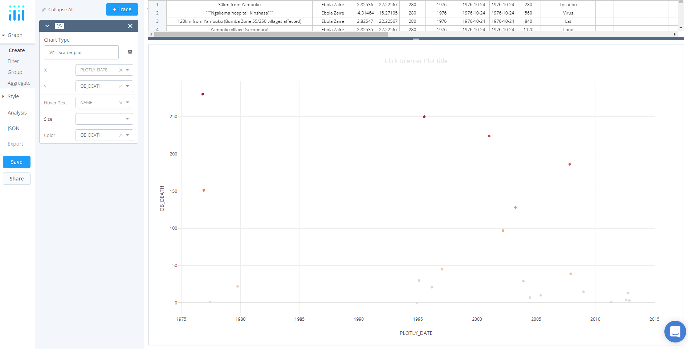
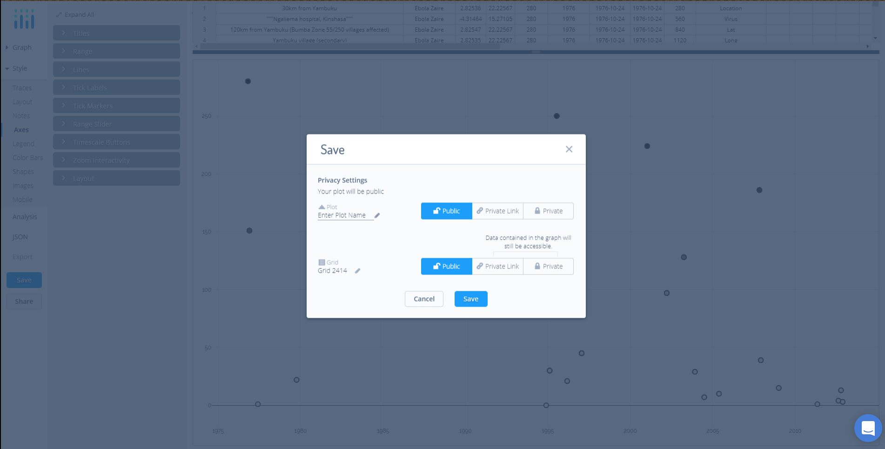
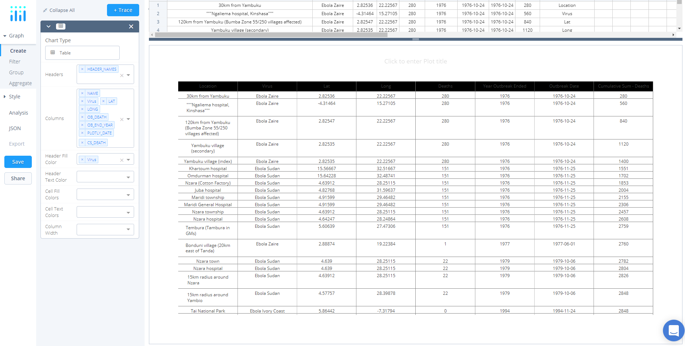
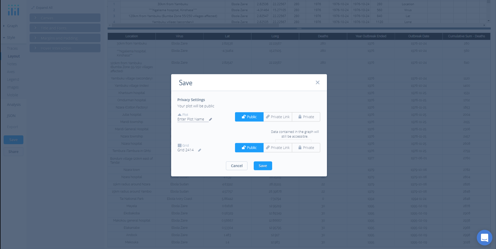
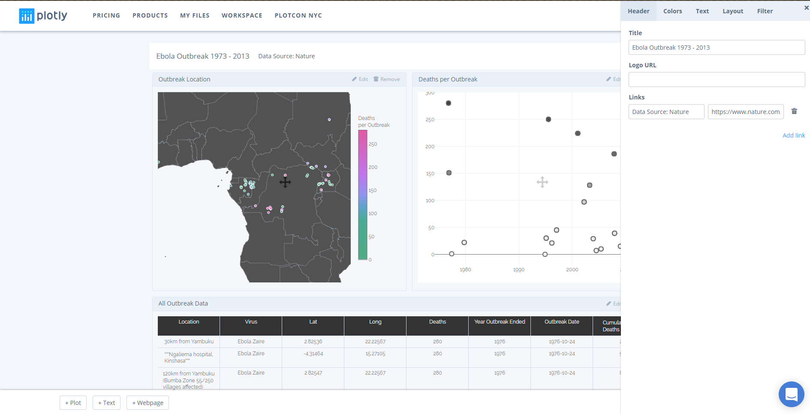
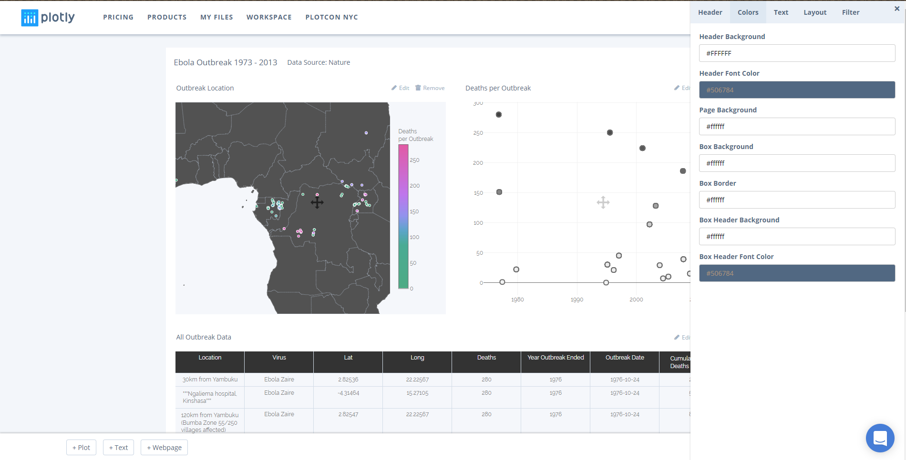
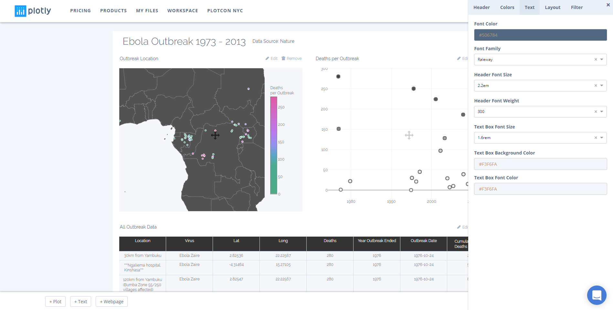
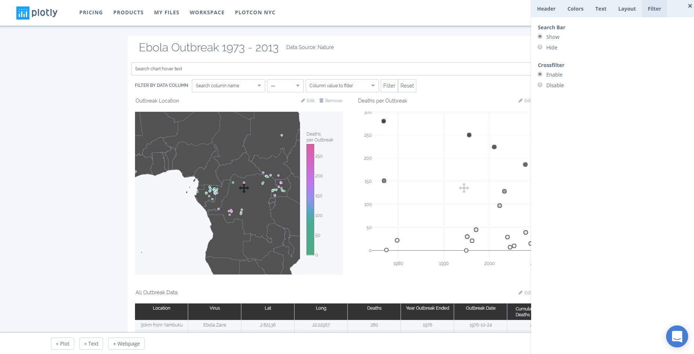
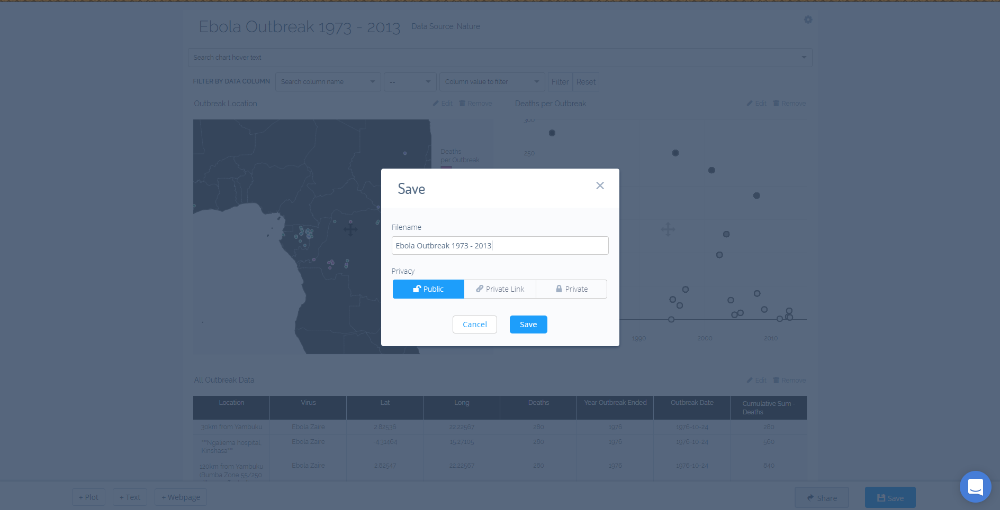

TODO

- add images
- add create a chart section
- add create a dashboard section
- restructure layout
- proofread
___

# Ebola Outbreaks 1976-2013
In this tutorial, we'll create and style multiple individual plots in the Chart Studio, add them to a dashboard, and utilize the crossfilter function to interact and explore these data further.

## Contents

- [Data](#1-data)
- [Create a Chart](#2-create-a-chart)
  - [Outbreak Location Mapbox](#21-outbreak-location-mapbox)
  - [Deaths Per Outbreak Scatter Plot](#22-deaths-per-outbreak-scatter-plot)
  - [Ebola Outbreak Table](#23-ebola-outbreak-table)
- [Create a Dashboard](#3-create-a-dashboard)
  - [Add Charts](#31-add-charts)
  - [Style It](#32-style-it)
- [Crossfilter](#4-crossfilter)

## 1. Data

To get started, head to Plotly’s [Chart Studio](https://plot.ly/create/) and add your data. You have the option of typing directly in the grid, uploading your file, or entering a URL of an online dataset. For this tutorial, we'll use the Ebola Outbreak dataset from [Nature: Science Direct](http://go.nature.com/2zKJN9u). Simply, copy the URL (https://plot.ly/~public.health/8.csv) or open the [dataset](https://plot.ly/~public.health/8) and click **'Fork & Edit'** to begin.

If you choose the latter, the Chart Studio ought to have opened and you're all set to go. If the former, navigate to the [Chart Studio](https://plot.ly/create/) and click **'Import'**, **'By URL'**, and then paste in the **URL** (https://plot.ly/~public.health/8.csv).

## 2. Create a Chart

To visualize Ebola outbreaks from 1973 to 2013, we'll create three individual charts: (1) an outbreak location mapbox chart, (2) a scatter plot looking at deaths per outbreak, and (3) a table to display all outbreak data. In the section below, we'll look at how to make each of the charts.

### 2.1. Outbreak Location Mapbox

##### 2.1.1. Create
text

text

##### 2.1.2. Layout

text

##### 2.1.3. Traces

text

##### 2.1.4. Axes

text

##### 2.1.5. Color Bars

text

##### 2.1.6. Save
Congrats, your chart is complete! Click **Save** on the left-hand side of the screen. In the pop-up, enter your filename and select either **Public** (visible to all) or **Private Link** (visible only to those who you share the link with) and hit **Save**. Since these plots are destined for a dashboard, they can't be set to private.

### 2.2. Deaths Per Outbreak Scatter Plot

##### 2.2.1. Create

text

text

##### 2.2.2. Traces

text

##### 2.2.3. Layout

text

##### 2.2.4. Axes

text

##### 2.2.5. Save
Congrats, your chart is complete! Click **Save** on the left-hand side of the screen. In the pop-up, enter your filename and select either **Public** (visible to all) or **Private Link** (visible only to those who you share the link with) and hit **Save**. Since these plots are destined for a dashboard, they can't be set to private.

### 2.3. Ebola Outbreak Table

##### 2.3.1. Create

text

text

##### 2.3.2. Layout

text

##### 2.3.4. Save
Congrats, your chart is complete! Click **Save** on the left-hand side of the screen. In the pop-up, enter your filename and select either **Public** (visible to all) or **Private Link** (visible only to those who you share the link with) and hit **Save**. Since these plots are destined for a dashboard, they can't be set to private.

## 3. Create a Dashboard

With the charts completed and saved in your [home folder](https://plot.ly/organize/home), we can now create a dashboard by simply adding these charts, adjusting the layout, and styling the dashboard before sharing and interacting. To get started with creating a dashboard, hover over the *+Create* button and select **Dashboard** from the menu. Alternatively, open this [link](https://plot.ly/dashboard/create).

### 3.1. Add Charts

text

### 3.2. Style It

Now that we have the structure of our dashboard, we can style it. To do so, navigate to the *settings icon* directly opposite the dashboard title. When hovering you ought to see the option settings from the menu.

After clicking *settings*, a panel ought to appear from the right-hand side of the screen. Here, we have the option of headers, colors, text, layout, and filter. First, in *Headers*, we can set the title, add a logo, and multiple links. For this tutorial, add **Ebola Outbreaks 1976-2013** to the *Title* text box. Next, we can add a link to the original dataset by adding the text **Data Source: Nature** with the URL: **https://www.nature.com/articles/sdata201442#data-records**.

In the next tab, *Colors*, we can manipulate the background, borders, and text colors. As you can see, the dashboard has already added these by default. Thus, for this tutorial, we'll leave them as is.

*Text*, the third settings option, allows you to control all things text, including font color, family, and size, as well as header styles and text box styles. Again, like the Colors tab, some values are defined. However, here, we'll set the *Font Family* to **Raleway**. Make the header font larger by selecting **1.6em** in the *Header Font Size* and, additionally, change the *Header Font Weight* to **300**. Lastly, to separate the text box, set the *Text Box Background Color* to **#FFFFFF**.

In *Layout*, you have the option of setting the page layout as either a dashboard or a report. Here, we'll leave it as the default dashboard setting. The last settings category, *Filter*, provides you with the option to enable or disable the Search Bar or the Crossfilter feature. For this tutorial, enable both the *Search Bar* and the **Crossfilter** feature by selecting **enable** (for more information about this feature see the next section).

Congrats, your dashboard is complete! Click **Save** on in the bottom right-hand side of the screen. In the pop-up, enter your filename and select either **Public** (visible to all), or **Private Link** (visible only to those who you share the link with), or **Private** (visible only to you) and hit **Save**. .

## 4. Crossfilter

Crossfilter is a visual analysis technique for multidimensional data. It is used to clarify relationships between dimensions. As discussed in the previous section, crossfilter functionality is invoked by setting **enable** in Settings > Filter.

To use crossfilter, simply click-and-drag on a chart. Selected data that shares common rows with other charts will highlight and all other data will fade out. To reset the dashboard, click anywhere on a graph that doesn't have data.

