TODO

- add gif
- restructure layout
- proofread
___

# Comparing 1990 and 2015 Infant Mortality Index

In this tutorial, we'll create and style multiple individual plots in the Chart Studio, add them to a dashboard, and utilize the crossfilter function to interact and explore these data further.

## Contents

- [Data](#1-data)
- [Create a Chart](#2-create-a-chart)
  - [1990 IMI Choropleth](#21-choropleth-1990)
  - [2015 IMI Choropleth](#22-choropleth-2015)
  - [1990 vs 2015 IMI Scatter Plot](#23-scatter-plot)
- [Create a Dashboard](#3-create-a-dashboard)
  - [Add Charts](#31-add-charts)
  - [Style It](#32-style-it)
- [Crossfilter](#4-crossfilter)

## 1. Data

To get started, head to Plotly’s [Chart Studio](https://plot.ly/create/) and add your data. You have the option of typing directly in the grid, uploading your file, or entering a URL of an online dataset. For this tutorial, we'll use the Mortality rate, infant (per 1,000 live births) dataset from the [World Bank](http://bit.ly/2i2SBjs).
Simply, copy the URL (https://plot.ly/~jackp/18100.csv) or open the [dataset](https://plot.ly/~jackp/18100) and click **'Fork & Edit'** to begin.

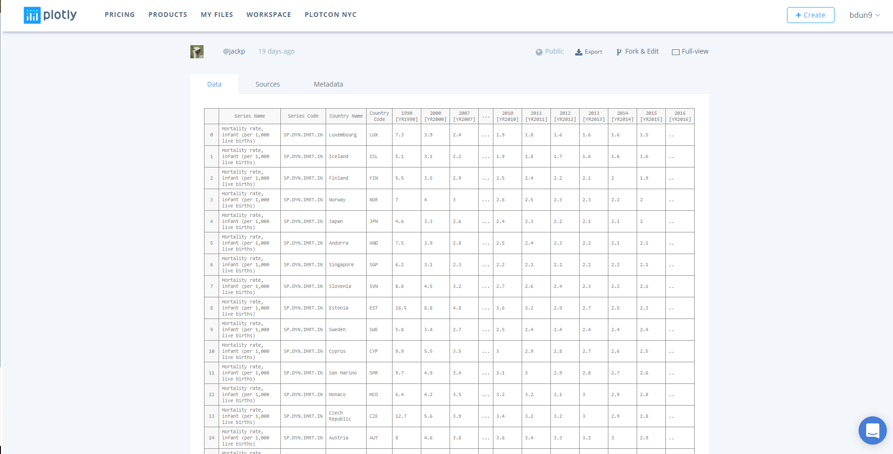

If you choose the latter, the Chart Studio ought to have opened and you're all set to go. If the former, navigate to the [Chart Studio](https://plot.ly/create/) and click **'Import'**, **'By URL'**, and then paste in the **URL** (https://plot.ly/~jackp/18100.csv).

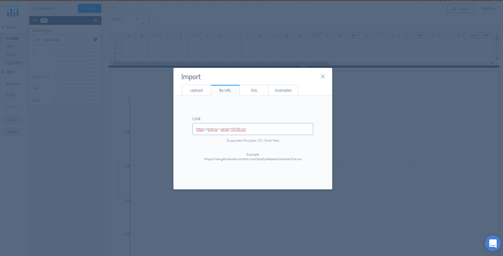

## 2. Create a Chart

To visualize the differences between 1990 and 2015 Infant Mortality Index, we'll create three individual charts: (1) a 1990 infant mortality index choropleth map, (2) 2015 infant mortality index choropleth map, and (3) a 1990 versus 2015 infant mortality index scatter plot for further comparison.

### 2.1. Choropleth 1990

##### 2.1.1. Create
Now that we have the data added to the grid, we can select our chart type. To do so, select *Graph* on the left-hand side, then *Create*. Click *Chart Type*, and **Choropleth** from the *Maps* column.

Now to populate the graph with data, in the *Locations* and *Values* dropdown select **Country Name** and **1990 [YR 1990]**, respectively. Additionally, set **Country Names** in the *Locations Format* dropdown, **World** in the *Map Regions*, and set the *Porjections* to **Robinson**. You ought to note that states aren't defined yet as we need to aggregate the data.

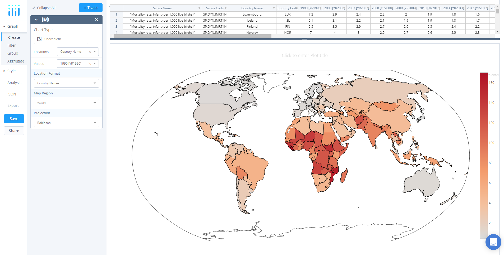

##### 2.1.2. Traces
To style, under *Style* click *Traces*. Here, we can change the colorscale by clicking the **blue to yellow** palette (around the 5th from the left). Furthermore, we can define the *Colorscale Range* by selecting **Custom** and setting the *Min Value* and *Max Value* to 0 and 170, respectively.

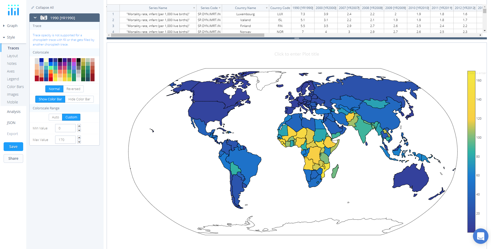

##### 2.1.3. Layout
Now that the choropleth is populated and colored, navigate to the *Layout* tab, open *Margins and Paddings* and set all the values to **0** to make it full width and height.

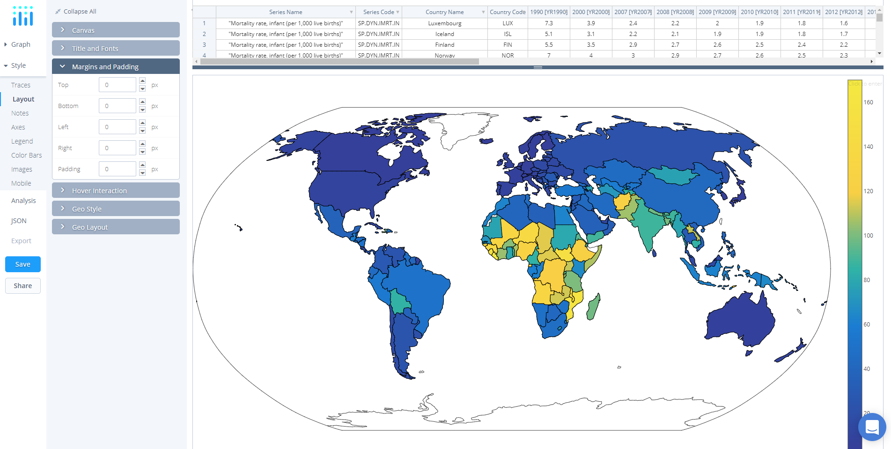

Unique to choropleth maps, we have *Geo Style* and *Geo Layout*. To alter the former, select *Geo Style* and set *Land* and *Coastline* to **Show** and *Color* **#C8D4E5**; *Oceans* to **Show** and *Color* **#FFFFFF**; *Frame* and *Country* to **Show** and *Color* **#C8D4E5**. Lastly, set *Border Width* to **0** and *Frame Width* to **0.5**.

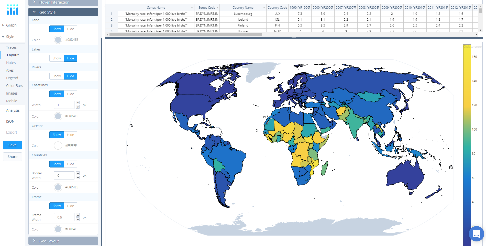

Next, in *Geo Layout* you can define attributes such as *Map Scope*, *Projection*, *Rotation*, *Scale*, and *Map Resolution*. Set the latter to **1:50,000,000**.

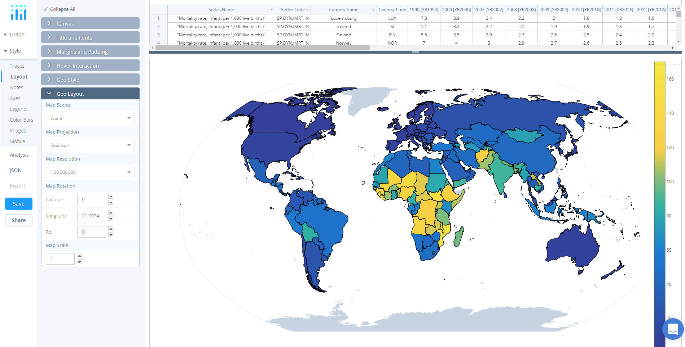

##### 2.1.4. JSON
As you can see from the image above, the line width is quite thick. To make the style lighter, navigate to the *JSON* tab, click *data*, *0*, *marker*, and then *line*. Now, set the *Width* to **0.1**.

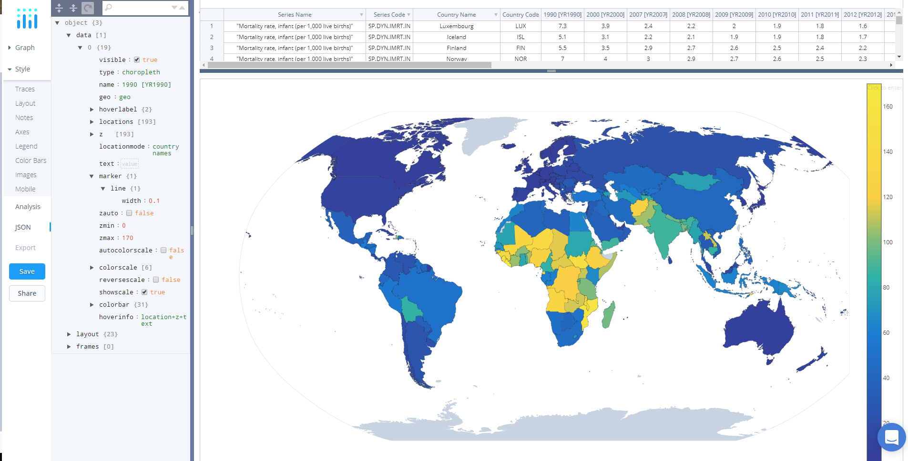

##### 2.1.5. Color Bars

Finally, you can style the color bar by navigating to *Color Bars*. To minimize the size of the color bar, select the *Size and Positioning* box and set the *Width* to **20**.

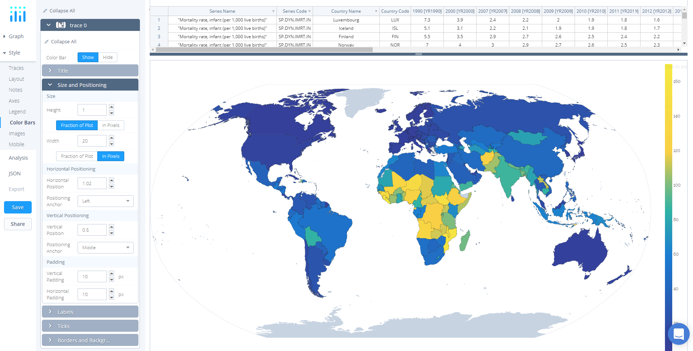

Open *Labels* and set the *Typeface* to **Raleway**.

At the bottom, open *Borders and Background* the set the *Border Width* to **0**.

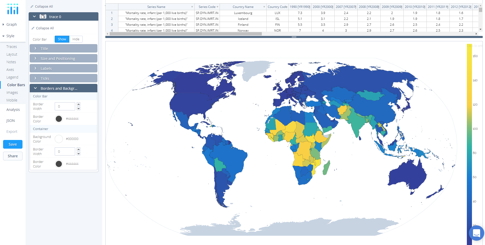

##### 2.1.6. Save
Congrats, your chart is complete! Click **Save** on the left-hand side of the screen. In the pop-up, enter your filename and select either **Public** (visible to all) or **Private Link** (visible only to those who you share the link with) and hit **Save**. Since these plots are destined for a dashboard, they can't be set to private.

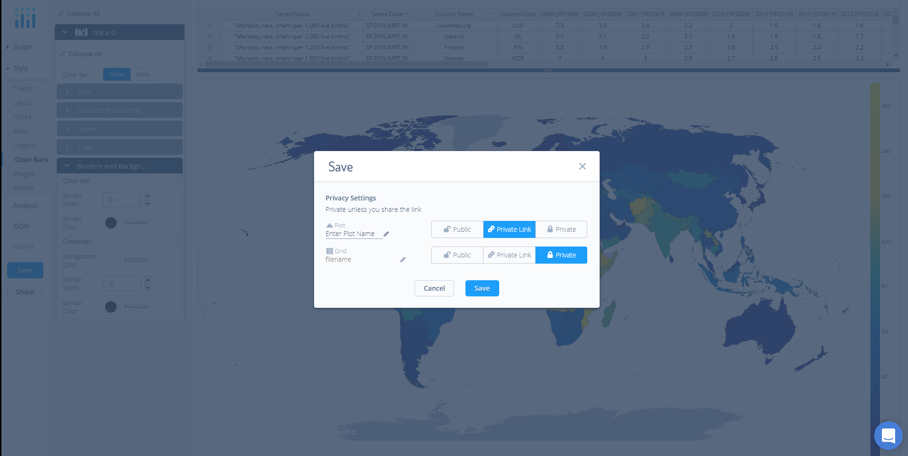

### 2.2. Choropleth 2015

##### 2.2.1. Create
Now that we have the data added to the grid, we can select our chart type. To do so, select *Graph* on the left-hand side, then *Create*. Click *Chart Type*, and **Choropleth** from the *Maps* column.

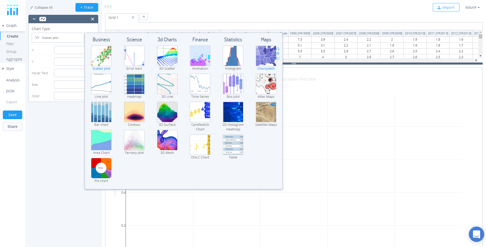

Now to populate the graph with data, in the *Locations* and *Values* dropdown select **Country Name** and **2015 [YR 2015]**, respectively. Additionally, set **Country Names** in the *Locations Format* dropdown, **World** in the *Map Regions*, and set the *Porjections* to **Robinson**. You ought to note that states aren't defined yet as we need to aggregate the data.

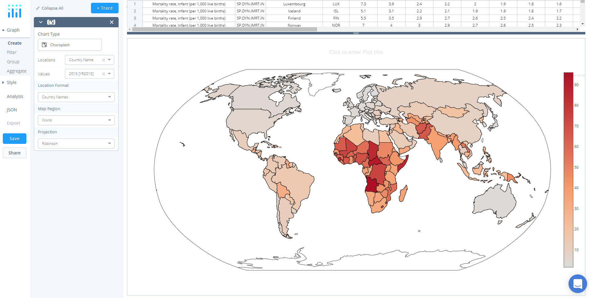

##### 2.2.2. Traces
Following the style from the previous choropleth, click *Traces*. Here, we can change the colorscale by clicking the **blue to yellow** palette (around the 5th from the left). Furthermore, we can define the *Colorscale Range* by selecting **Custom** and setting the *Min Value* and *Max Value* to 0 and 170, respectively

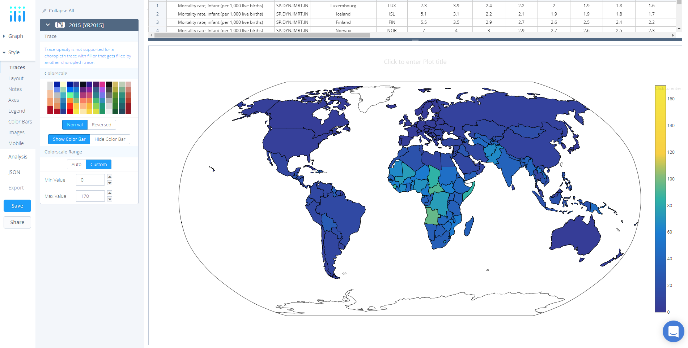

##### 2.2.3. Layout
Now that the choropleth is populated and colored, navigate to the *Layout* tab, open *Margins and Paddings* and set all the values to **0** to make it full width and height.

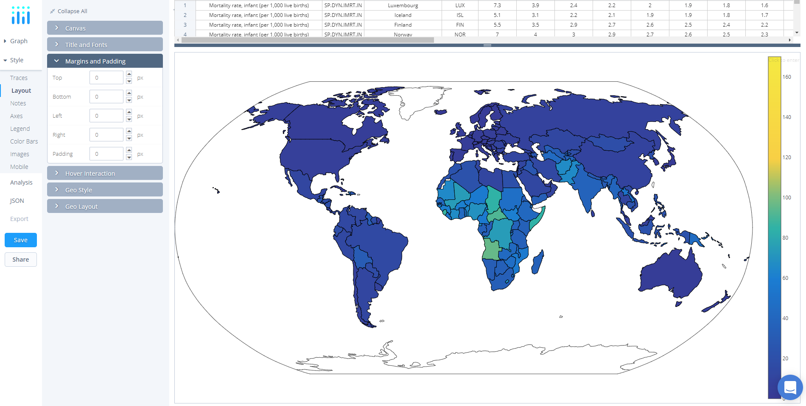

Unique to choropleth maps, we have *Geo Style* and *Geo Layout*. To alter the former, select *Geo Style* and set *Land* and *Coastline* to **Show** and *Color* **#C8D4E5**; *Oceans* to **Show** and *Color* **#FFFFFF**; *Frame* and *Country* to **Show** and *Color* **#C8D4E5**. Lastly, set *Border Width* to **0** and *Frame Width* to **0.5**.

Next, in *Geo Layout* you can define attributes such as *Map Scope*, *Projection*, *Rotation*, *Scale*, and *Map Resolution*. Set the latter to **1:50,000,000**.

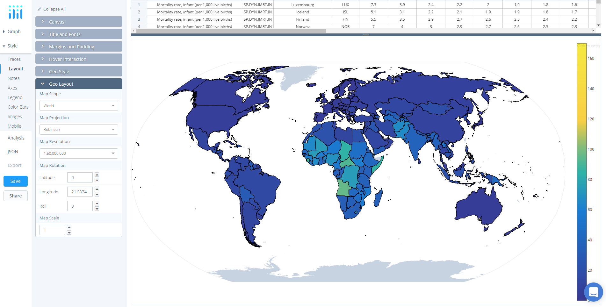

##### 2.2.4. JSON
As you can see from the image above, the line width is quite thick. To make the style lighter, navigate to the *JSON* tab, click *data*, *0*, *marker*, and then *line*. Now, set the *Width* to **0.1**.

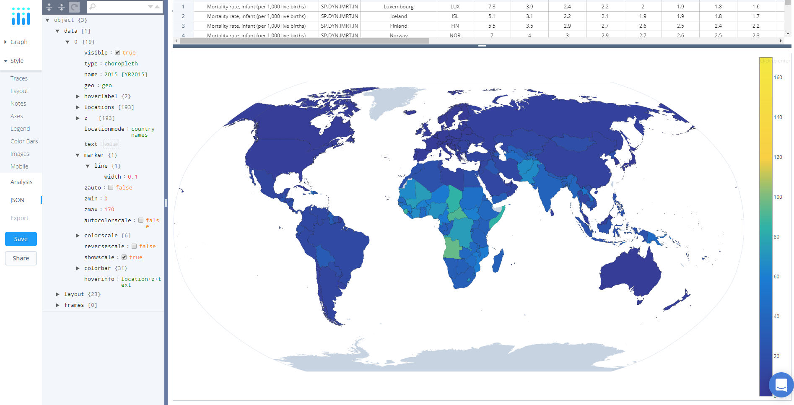

##### 2.2.5. Color Bars
Finally, you can style the color bar by navigating to *Color Bars*. To minimize the size of the color bar, select the *Size and Positioning* box and set the *Width* to **20**.

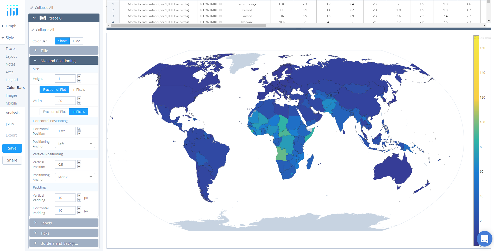

Open *Labels* and set the *Typeface* to **Raleway**.

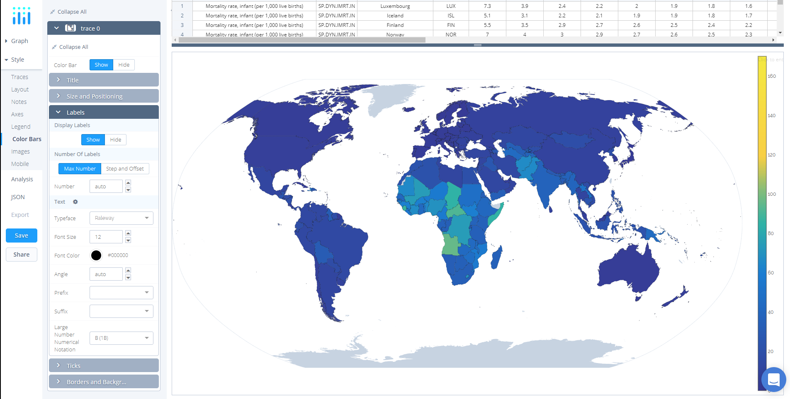

At the bottom, open *Borders and Background* the set the *Border Width* to **0**.

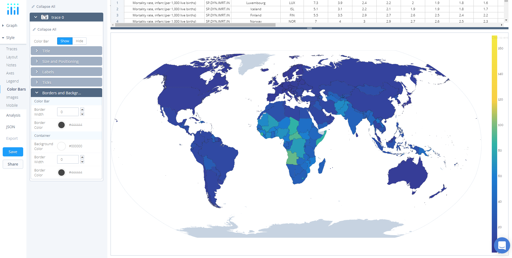

##### 2.2.5. Save
Congrats, your chart is complete! Click **Save** on the left-hand side of the screen. In the pop-up, enter your filename and select either **Public** (visible to all) or **Private Link** (visible only to those who you share the link with) and hit **Save**. Since these plots are destined for a dashboard, they can't be set to private.

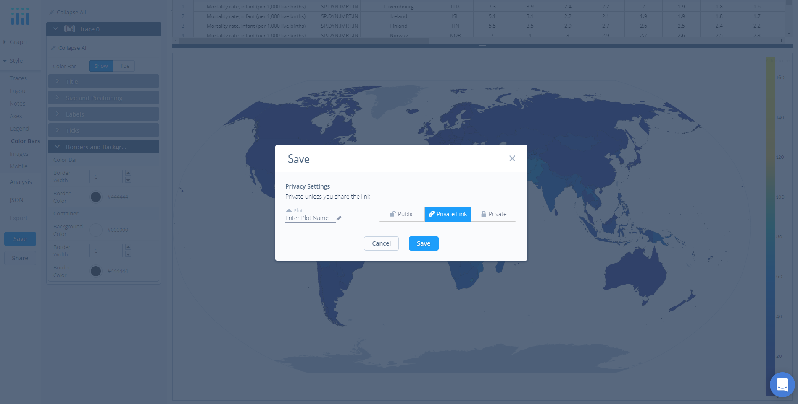

### 2.3. Scatter Plot

##### 2.3.1. Create
Now that we have the data added to the grid, we can select our chart type. To do so, select *Graph* on the left-hand side, then *Create*. Click *Chart Type*, and **Scatter** from the *Business* column.

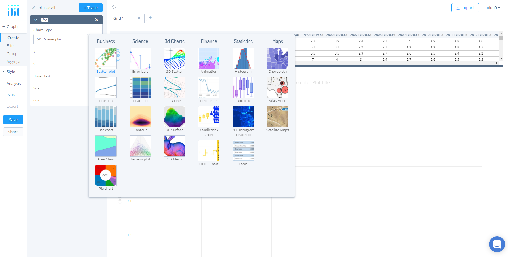

Now to populate the graph with data, in the *x* and *y* dropdown select **1990 [YR 1990]** and **Country Names**, respectively. Additionally, select **Country Names** in the *hover text* dropdown.

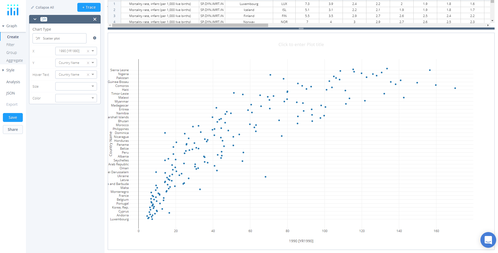

As we want to plot both 1990 and 2015, click *+ Trace* button and in the new trace box set the *x* and *y* dropdown to **2015 [YR 2015]** and **Country Names**, respectively. Like the previous trace, select **Country Names** in the *hover text* dropdown.

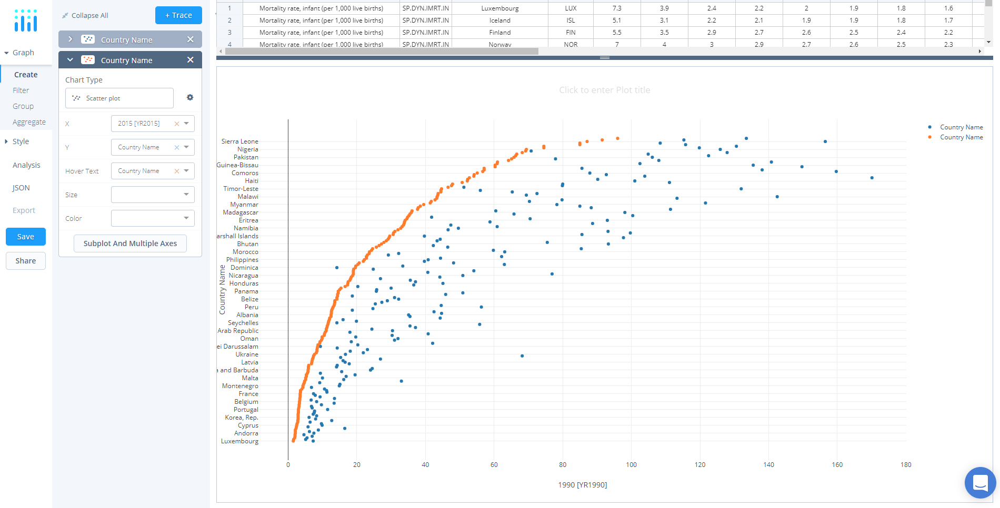

##### 2.3.2. Traces

With both traces (1990 and 2015) added, we can now style them. Navigate to the *Traces* tab and select *Individual* at the top right-hand side. Open the first trace (the blue one), and set the *Diameter* to **8**. Additionally, change the *Symbol* to **Square** - this will help further define the two traces apart.

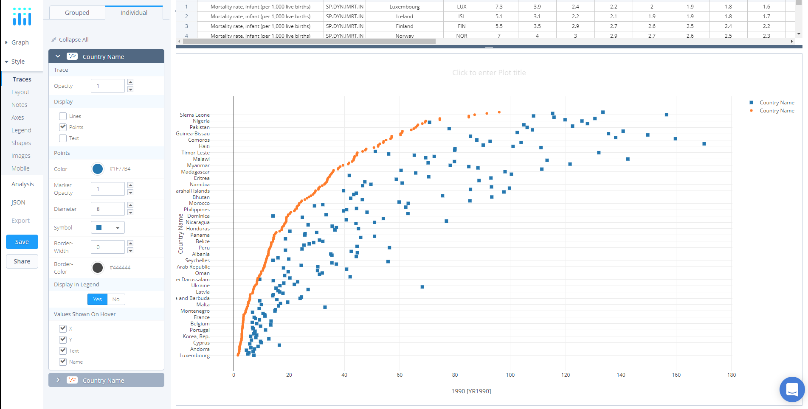

Close the first trace and open the second (positioned below). Again, change the *Diameter* but this time set it to **10** and the *Symbol* to a left pointing **Triangle**. Also, switch the *Color* to **#E377C2**.

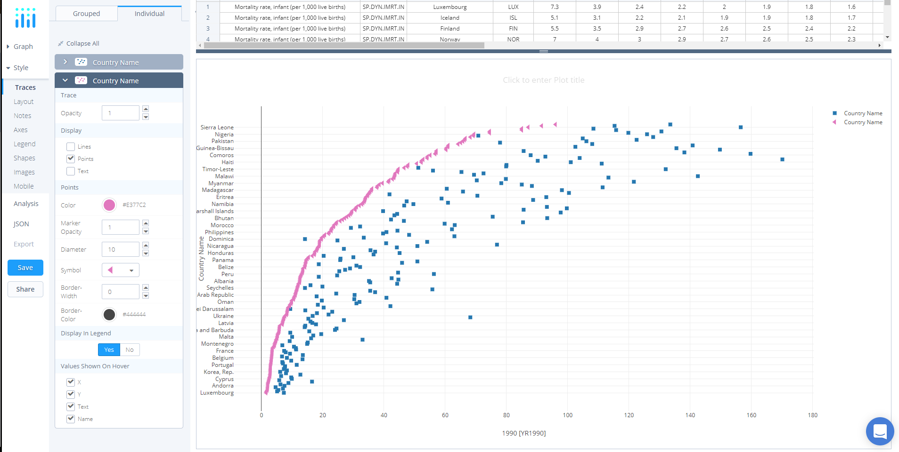

##### 2.3.3. Layout
Next, navigate to the *Layout* tab, open *Margins and Paddings* and set all the values to **0** to make the scatter plot full width and height.

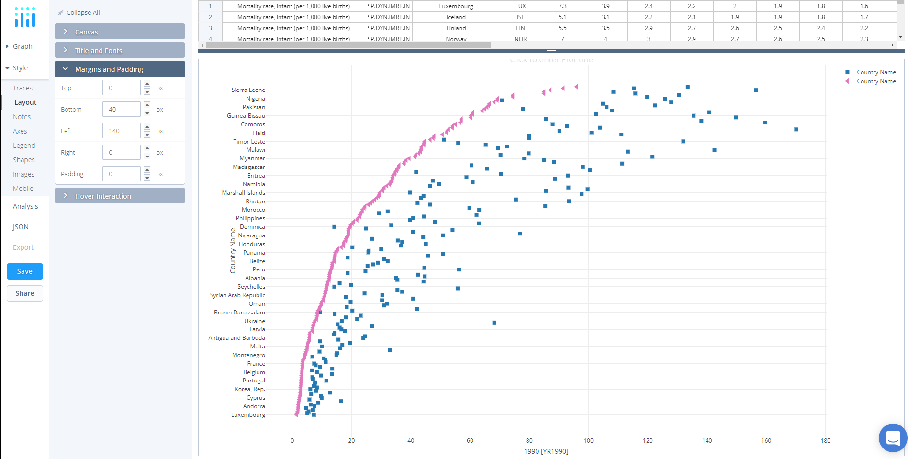

##### 2.3.4. Axes
Moving on the the *Axes* tab, select *Title*. To remove all titles,  click *all* and remove **MIXED_VALUES**.

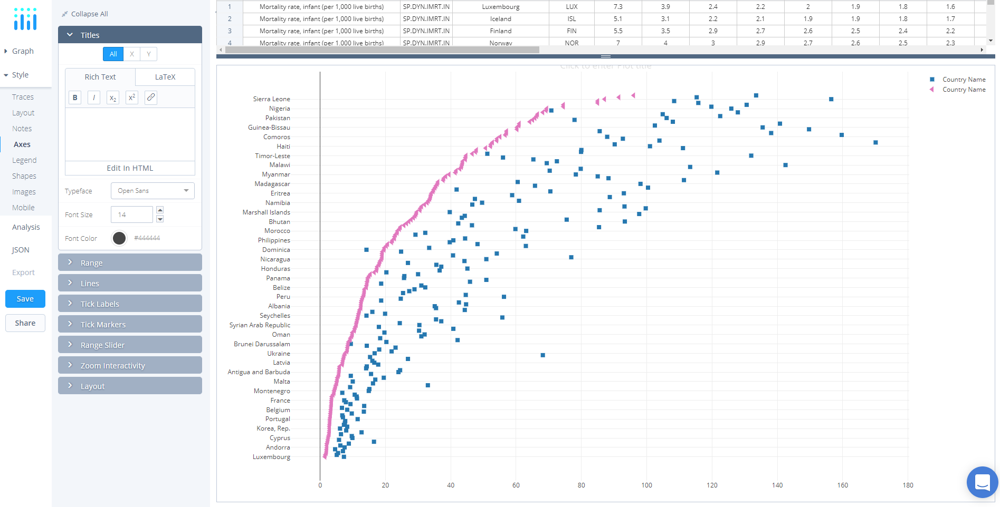

Now to make changes to the grid and zero lines, open *Lines*. First, click *x* and select **Hide** for all options.

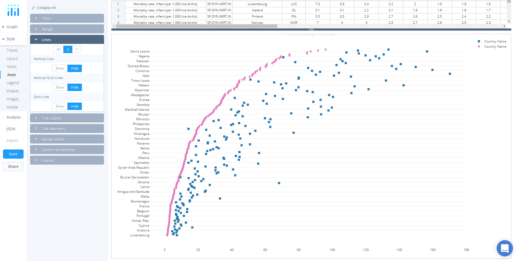

Then, click *y* and select **Hide** for *Horizontal Line* and *Zero Line*, but set *Horizontal Grid Lines* as **Show** with *Thickness* **1**.

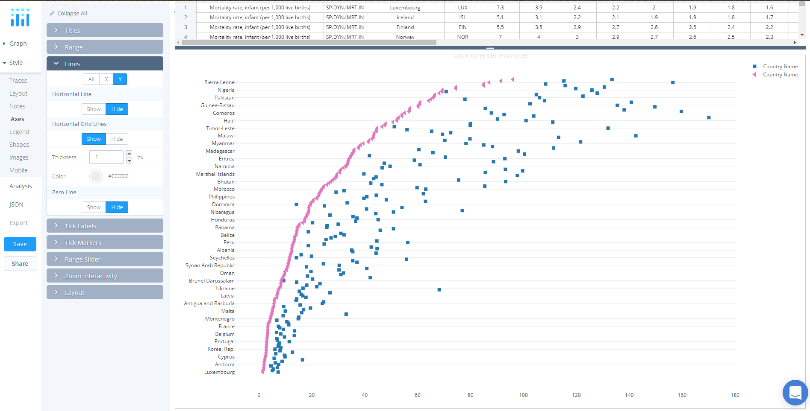

Staying in the *Axes* tab, navigate to *Tick Labels*, *x*, and set the *Typeface* to **Raleway** and *Font Size* to **14**.

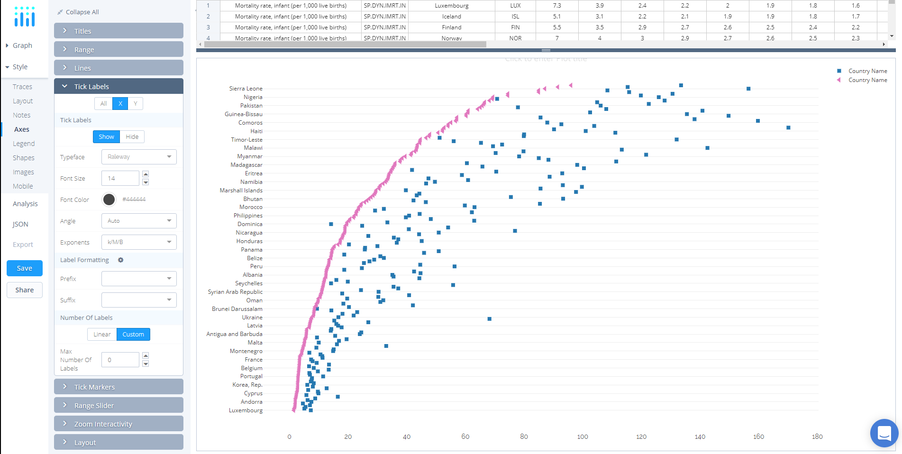

For the *y* axis, set *Typeface* to **Raleway** too, but this time set the *Font Size* to **10** to account for the large number of labels on the y axis.

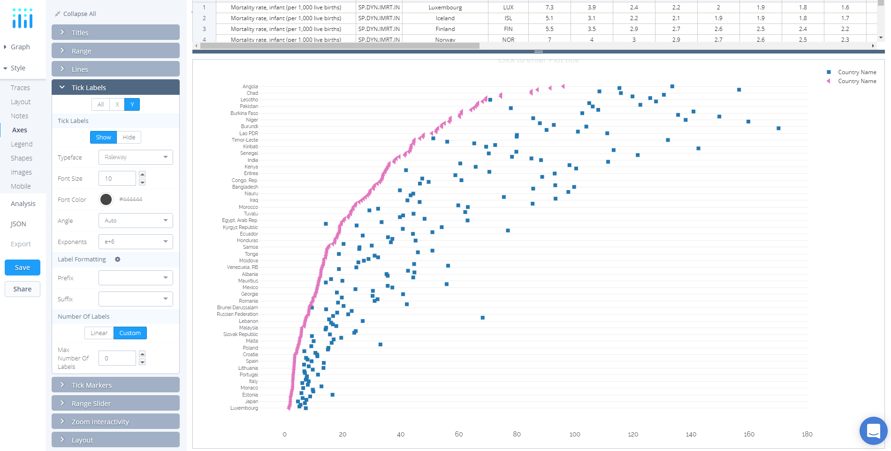

Lastly, for the *Axes*, open *Zoom* and select **disable**.

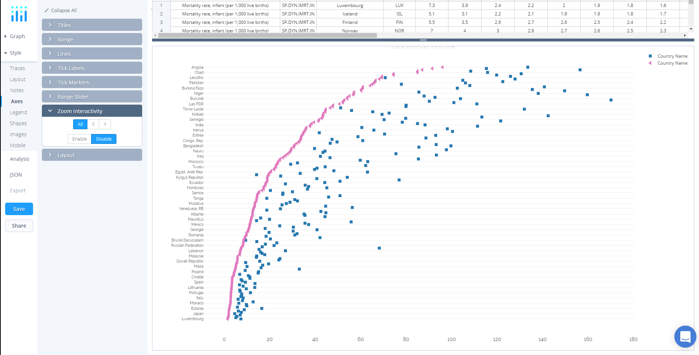

##### 2.3.5. Legend

Instead of using the legend, we'll use custom annotations. Thus, to remove the legend, click *Legend* and **Hide**.

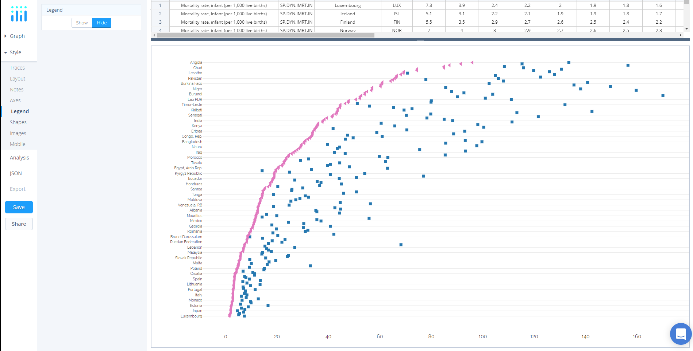

##### 2.3.6. Annotations

To illustrate which trace is which year we can use annotations. To do so, open *Notes* then click *+ Annotation* and **General Annotation**. You ought to see an annotation appear in the middle of the plot. Here, you have the option of editing directly in the plot or by using the annotation box that appeared below the blue *+ Annotation* button. For this tutorial, we'll use the latter method. Thus, set the *Title* to **2015**, *Typeface* to **Raleway**, *Size* to **18**, and the *Color* to **#E377C2**. Now to define the annotation's arrow, set *X Vector* to **70** and *Y Vector* to **0**. To define it's position, enter **0.9** as the *Horizontal Position* and **185** as the *Vertical Position*.

Too add another annotation, click *+ Annotation* and select **General Annotation**. Using the same method as above, set the *Title* to **1990**, *Typeface* to **Raleway**, *Size* to **18**, and *Arrowhead* to **Square**. Now to define the annotation's arrow, set *X Vector* to **70** and *Y Vector* to **0**. To define it's position, enter **1** as the *Horizontal Position* and **190** as the *Vertical Position*.

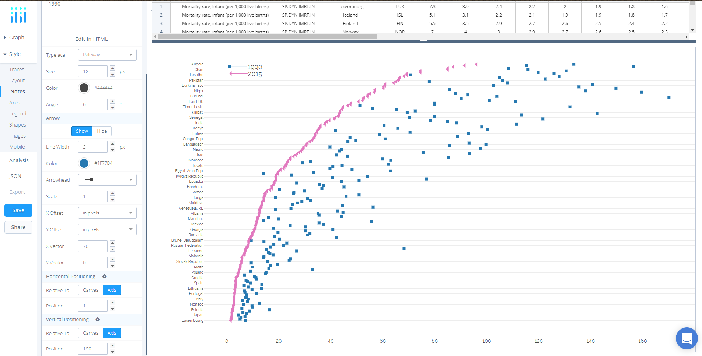

##### 2.3.7. Save
Congrats, your chart is complete! Click **Save** on the left-hand side of the screen. In the pop-up, enter your filename and select either **Public** (visible to all) or **Private Link** (visible only to those who you share the link with) and hit **Save**. Since these plots are destined for a dashboard, they can't be set to private.

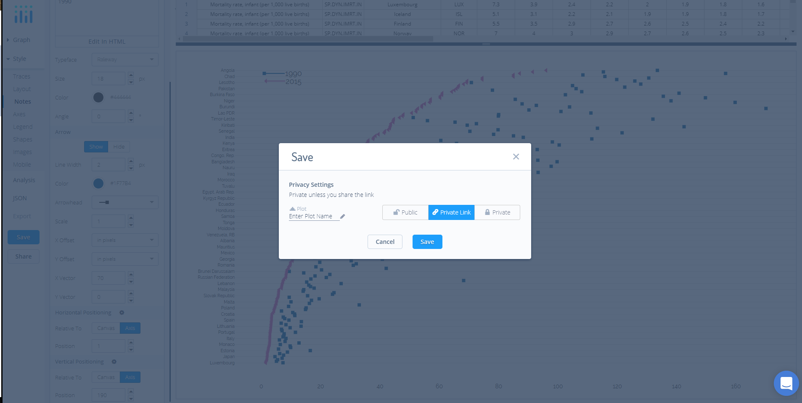

## 3. Create a Dashboard

With the charts completed and saved in your [home folder](https://plot.ly/organize/home), we can now create a dashboard by simply adding these charts, adjusting the layout, and styling the dashboard before sharing and interacting. To get started with creating a dashboard, hover over the *+Create* button and select **Dashboard** from the menu. Alternatively, open this [link](https://plot.ly/dashboard/create).

### 3.1. Add Charts

First, to add the 1990 choropleth map, click *+Plot* in the bottom left corner of the screen. A new box ought to appear with the option to 'Add a Plot'. Click, the *'Your Files'* option and then in the pop-up select the **1990 choropleth map** we made earlier.

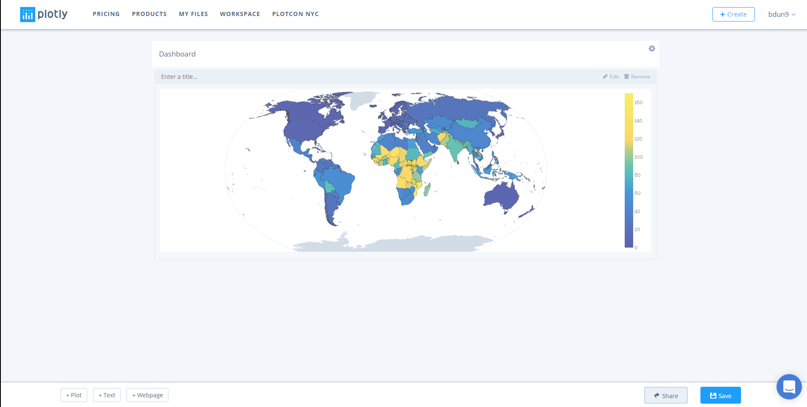

Next, add the 2015 choropleth map following the same process. This time drag and drop the plot on the right half of the 1990 choropleth map. You ough to something similar to below.

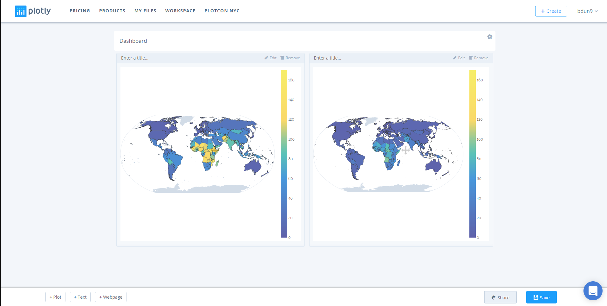

For the final plot, the 1990vs 2015 IMI (Deaths per 1000 births, lower is better) scatter plot, add this to the bottom of the dashboard and drag down accordingly.

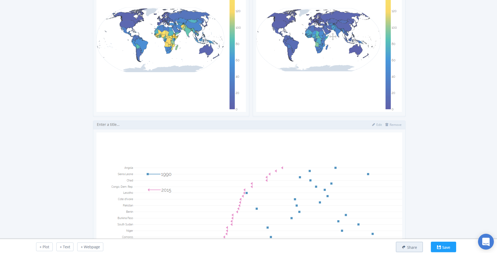

Now that we have added all the plots to the dashboard, for each plot where it says "Enter a title..." insert plot titles: **1990 IMI (Deaths per 1000 births, lower is better)**, **2015 IMI (Deaths per 1000 births, lower is better)**, and **1990 vs 2015 IMI (Deaths per 1000 births, lower is better)** in the same order as we added the plots. Your result ought to look like below.

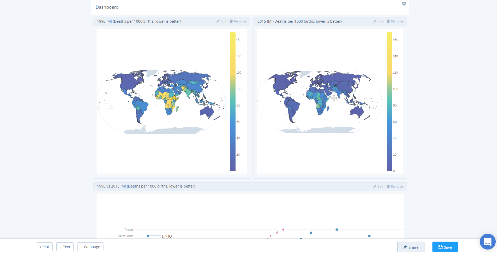

### 3.2. Style It

Now that we have the structure of our dashboard, we can style it. To do so, navigate to the *settings icon* directly opposite the dashboard title. When hovering you ought to see the option settings from the menu.

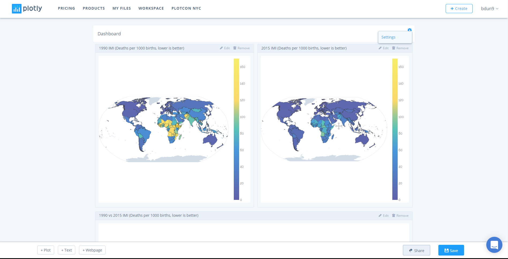

After clicking *settings*, a panel ought to appear from the right-hand side of the screen. Here, we have the option of headers, colors, text, layout, and filter. First, in *Headers*, we can set the title, add a logo, and multiple links. For this tutorial, add **Comparing 1990 and 2015 Infant Mortality Index (IMI)** to the *Title* text box. Next, let's add the World Bank logo. We can do this by simply adding the URL for the logo JPG: **http://logodatabases.com/wp-content/uploads/2012/02/who-logo-wallpaper-1024x997.jpg**. As previously mentioned you can add links, in this tutorial we'll use this feature to link the original dataset. Thus, add the text **Original Data from World Bank** with the URL: **https://data.worldbank.org/indicator/SP.DYN.IMRT.IN**.

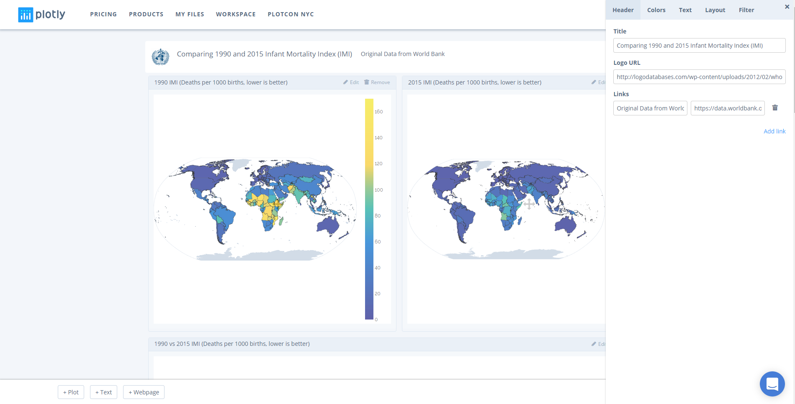

In the next tab, *Colors*, we can manipulate the background, borders, and text colors. As you can see, the dashboard has already added these by default. That said, for this dashboard we will set *Header Background*, *Page Background*, *Box Background*, *Box Border*, and *Box Header Background* to **#FFFFFF**.

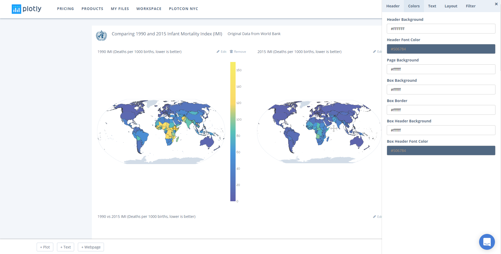

*Text*, the third settings option, allows you to control all things text, including font color, family, and size, as well as header styles and text box styles. Again, like the Colors tab, some values are defined. However, here, we'll set the *Font Family* to **Raleway**. Make the header font larger by selecting **1.6em** in the *Header Font Size* and, additionally, change the *Header Font Weight* to **300**.

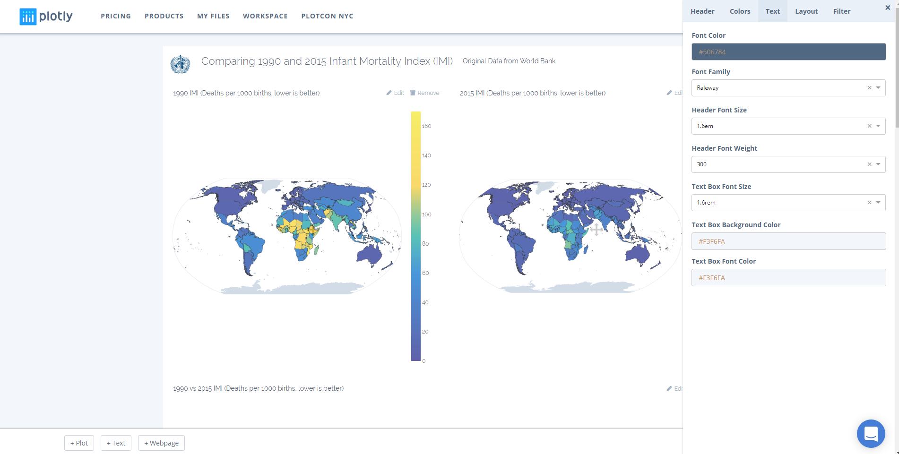

In *Layout*, you have the option of setting the page layout as either a dashboard or a report. Here, we'll leave it as the default dashboard setting. The last settings category, *Filter*, provides you with the option to enable or disable the Search Bar or the Crossfilter feature. For this tutorial, leave the *Search Bar* as-is but lets enable the *Crossfilter* feature by selecting **enable** (for more information about this feature see the next section).

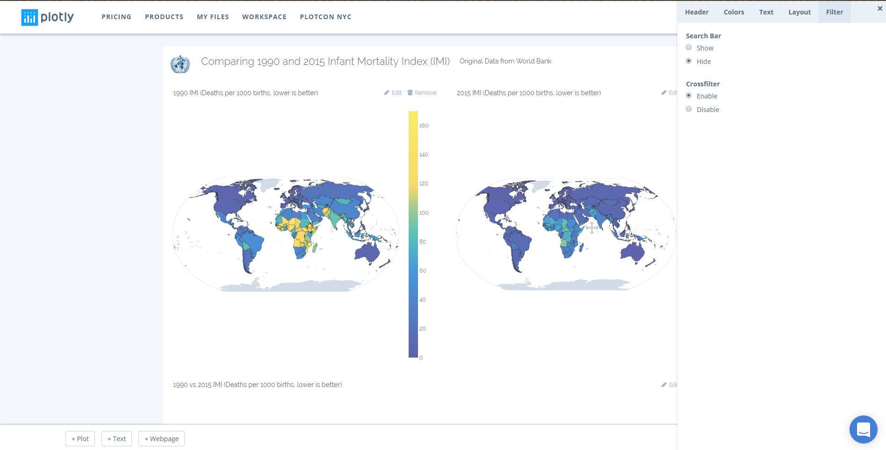

Congrats, your dashboard is complete! Click **Save** on in the bottom right-hand side of the screen. In the pop-up, enter your filename and select either **Public** (visible to all), or **Private Link** (visible only to those who you share the link with), or **Private** (visible only to you) and hit **Save**. .

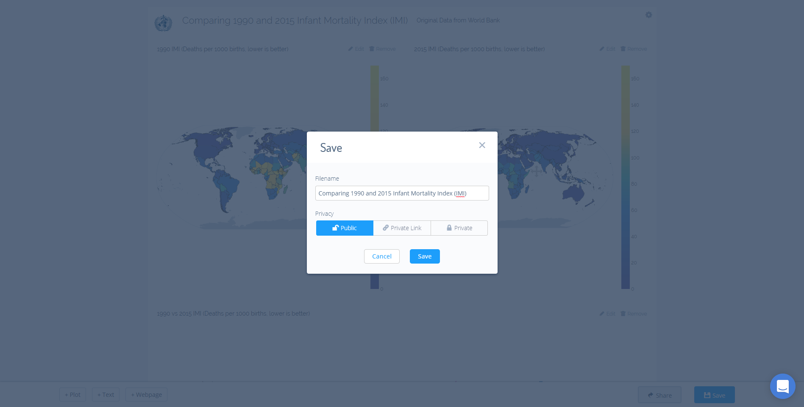

## 4. Crossfilter

Crossfilter is a visual analysis technique for multidimensional data. It is used to clarify relationships between dimensions. As discussed in the previous section, crossfilter functionality is invoked by setting **enable** in Settings > Filter.

To use crossfilter, simply click-and-drag on a chart. Selected data that shares common rows with other charts will highlight and all other data will fade out. To reset the dashboard, click anywhere on a graph that doesn't have data.

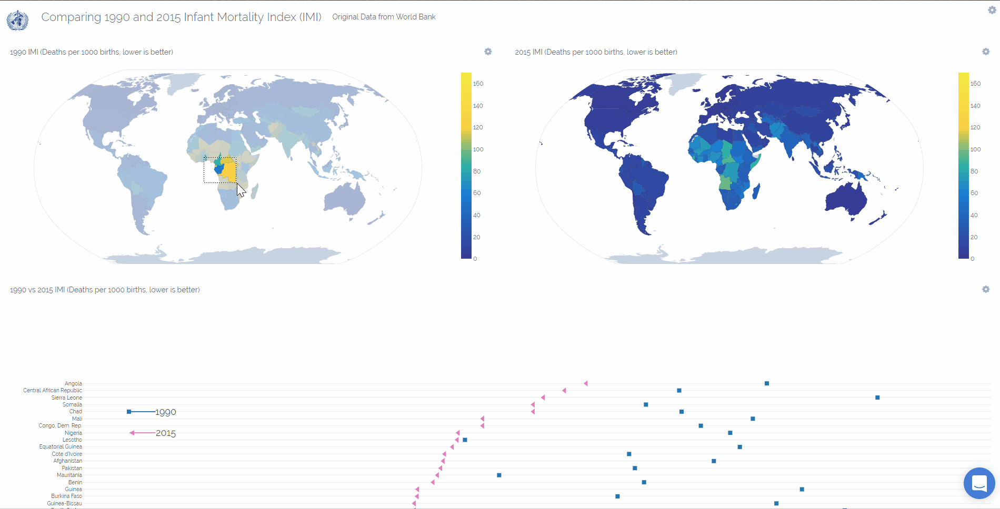
