TODO

- restructure layout
- proofread
___

# California Measles Dashboard

## Contents

- [Overview](#overview)
- [Data](#1-data)
- [Create a Chart](#2-create-a-chart)
  - [Scatter Plot](#21-scatter-plot)
  - [Box Plot](#22-box-plot)
  - [3D Scatter Plot](#23-3d-scatter-plot)
- [Create a Dashboard](#3-create-a-dashboard)
  - [Add Charts](#31-add-charts)
  - [Style It](#32-style-it)
- [Crossfilter](#4-crossfilter)

## Overview

In this tutorial, we'll create and style multiple individual plots in the Chart Studio, add them to a dashboard, and utilize the crossfilter function to interact and explore these data further.

## 1. Data

To get started, head to Plotly’s [Chart Studio](https://plot.ly/create/) and add your data. You have the option of typing directly in the grid, uploading your file, or entering a URL of an online dataset. For this tutorial, we'll use the measles outbreak dataset from the [Project Tycho at University of Pittsburgh](http://bit.ly/2zrVG6s). Simply, copy the URL (https://plot.ly/~jackp/18114.csv) or open the [dataset](https://plot.ly/~jackp/18114/) and click **'Fork & Edit'** to begin.

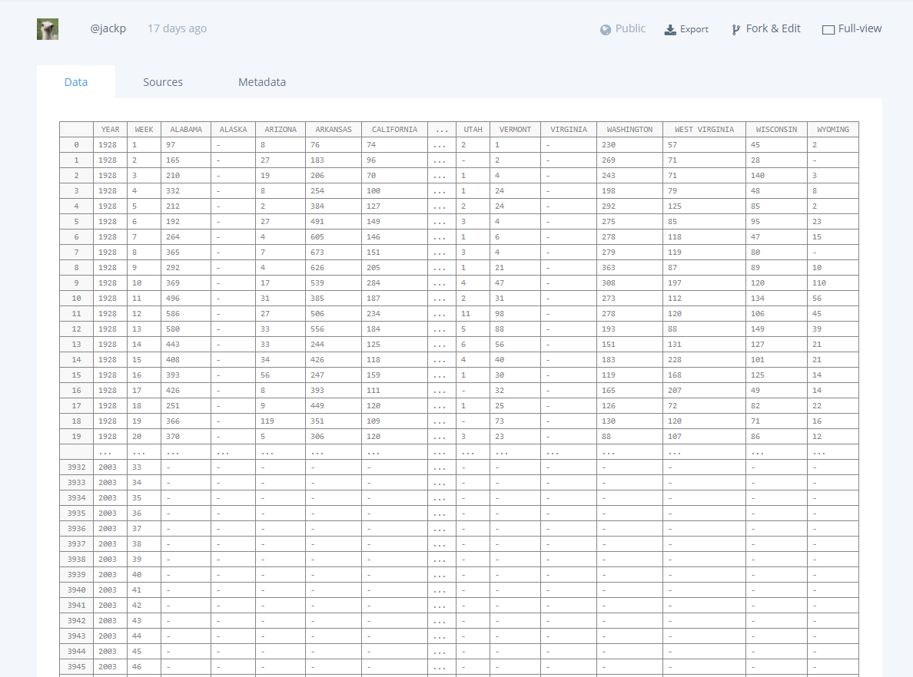

If you choose the latter, the Chart Studio ought to have opened and you're all set to go. If the former, navigate to the [Chart Studio](https://plot.ly/create/) and click **'Import'**, **'By URL'**, and then paste in the **URL** (https://plot.ly/~jackp/18114.csv).

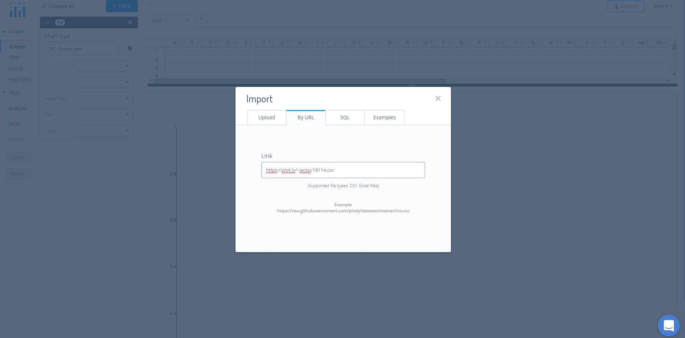

## 2. Create a Chart

To visualize measles cases in California between 1928 and 2004, we'll create three individual charts: (1) a scatter plot to illustrate cases per year, (2) a box plot looking at the cases by week of year, and (3) a 3D scatter plot to visualize the week of year versus year versus cases. In this section we'll look at how to make each of the charts.

### 2.1. Scatter Plot

##### 2.1.1. Create
Now that we have the data added to the grid, we can select our chart type. To do so, select *Graph* on the left-hand side, then *Create*. Click *Chart Type*, and **Scatter** from the *Business* column.

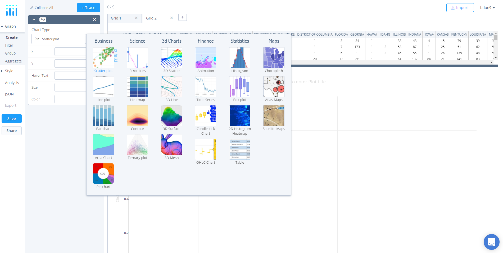

Now to populate the graph with data, in the *x* and *y* dropdown select **YEAR** and **CALIFORNIA**, respectively. Additionally, we want to color these data by week, thus in the *color* dropdown select **WEEK**. Repeat for *hover text*.

##### 2.1.2. Axes
With the graph populated, we can now style it. First, we'll make the y axis log scale instead of linear to declutter the scatter points. To do this, navigate to the *Style* tab and select *Axes* then *Range* and *y*. Next to where it says *Axis Type* click **Log**.

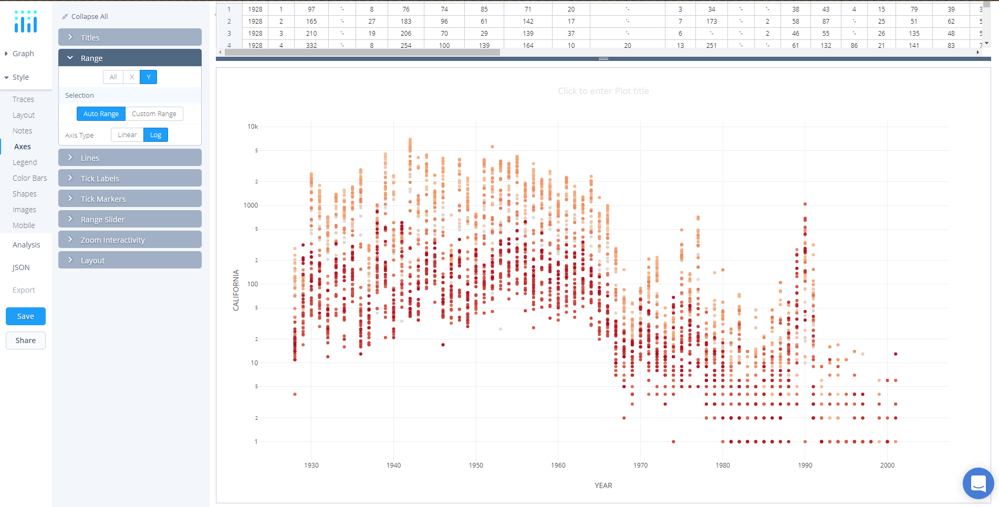

Staying in the Axes tab, we'll make a few minor adjustments to the lines and texts. Start by selecting *Title*. Remove the title under the x axis, then click *y* and in the text editor type **"Cases per year"**. Select *all* then change the *Typeface* to **Raleway**, size to **17** and the color to **#506784**.

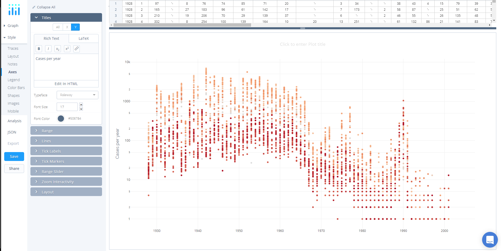

Next, click lines, all, and set the color to **#E3E5E9**.

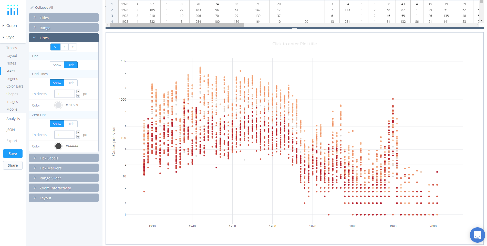

Now navigate to tick labels. Here, set the *Typeface* to **Raleway**, the *Size* to **14**, and *Color* to **#506784**.

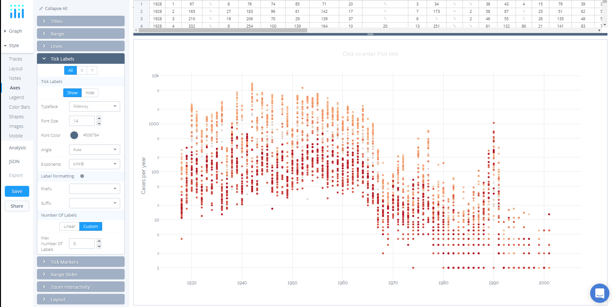

Lastly for the axes, select *Zoom Interactivity* and click **disable**.

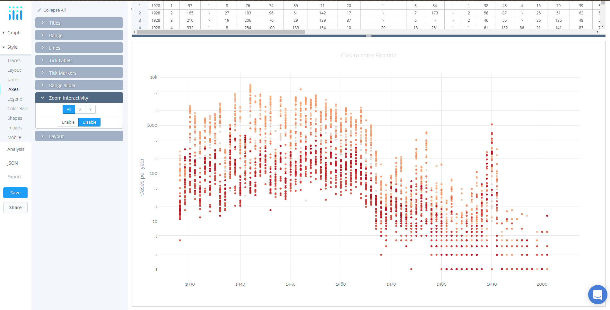

##### 2.1.3. Traces
Now that we have finished with styling the axes, click *Traces* to style the scatter points. We can redefine the *colorscale* by simply choosing from the preselected scales. For this tutorial, select **blue to yellow**. Immediately below, click **Show color Bar** to enable color bar visibility. Lastly, change the *Border-Width* to **0.5**, which will help define the scatter points.

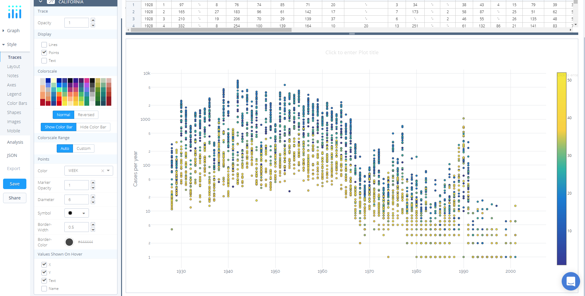

##### 2.1.4. Layout
Next, navigate to the *Layout* tab to set the background colors and margins. T complete the former, open the *Canvas* box and set the color, for both plot and margin, to **#F3F5F9**.

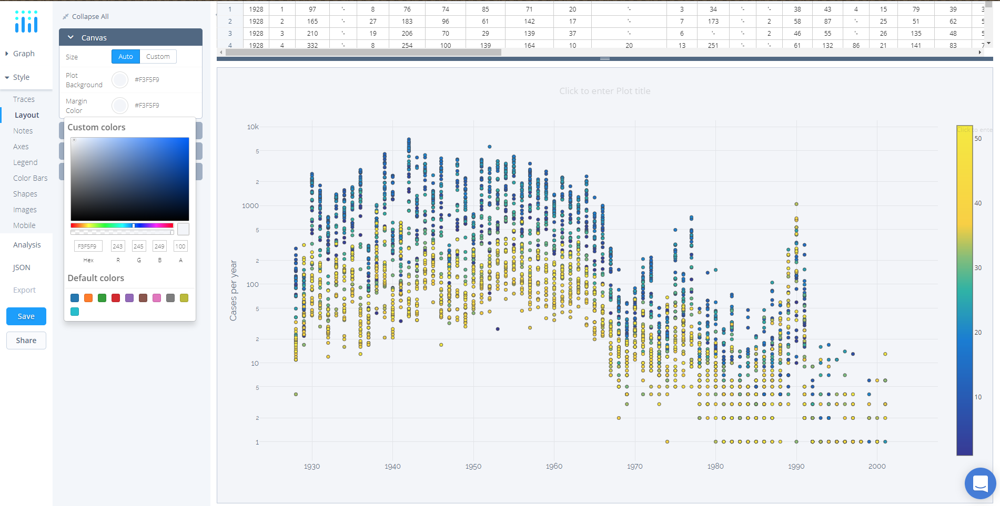

To set the margins, select the *Margins and Padding* box
and enter the values **0, 40, 60, 0, 0**, respectively.

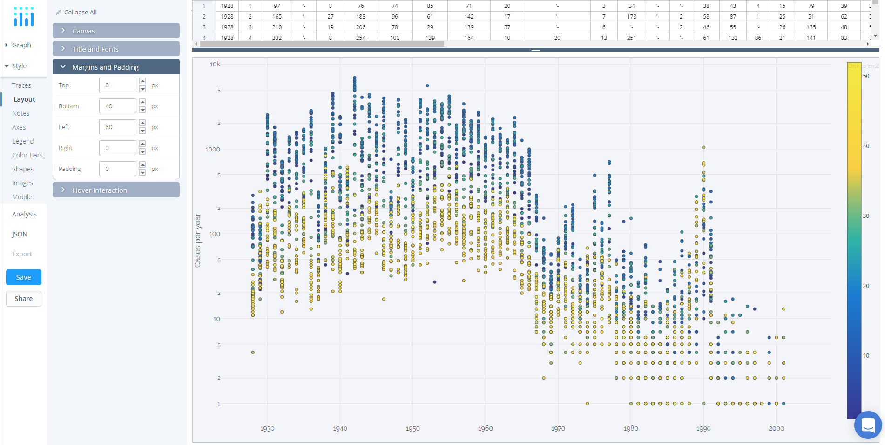

##### 2.1.5. Color Bars
Finally, you can style the color bar by navigating to *Color Bars*. For this tutorial, in the *Title* box we enter the title **"Week of year"**, set the *Typeface* to **Raleway**, adjust the *Size* to **14**, and set the *Color* to **#506784**.

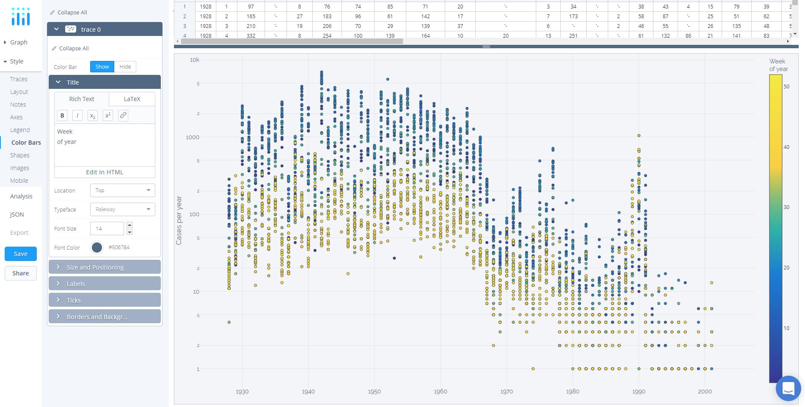

Now to minimize the size of the color bar, select the *Size and Positioning* box and set the *Height* to **0.9**.

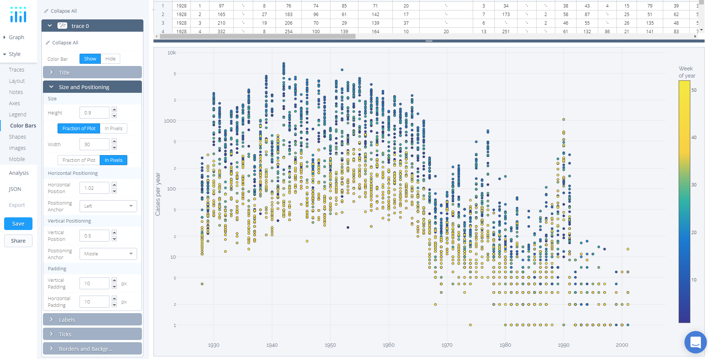

In the next box, *Labels*, set the *Typeface* to **Raleway** and the font size to **14**.

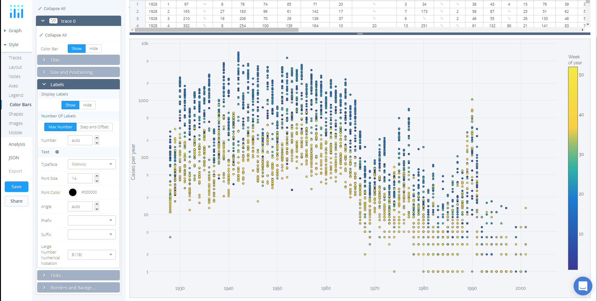

##### 2.1.6. Save
Congrats, your chart is complete! Click **Save** on the left-hand side of the screen. In the pop-up, enter your filename and select either **Public** (visible to all) or **Private Link** (visible only to those who you share the link with) and hit **Save**. Since these plots are destined for a dashboard, they can't be set to private.

### 2.2. Box Plot

##### 2.2.1. Create
Now that we have the data added to the grid, we can select our chart type. To do so, select *Graph* on the left-hand side, then *Create*. Click *Chart Type*, and **Box Plot** from the *Statistics* column.

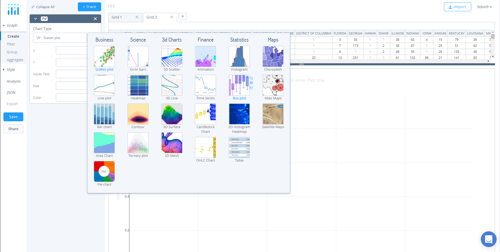

Like the previous plot we want to populate the graph with data, thus in the *values* and *X Data* dropdown select **CALIFORNIA** and **WEEK**, respectively.

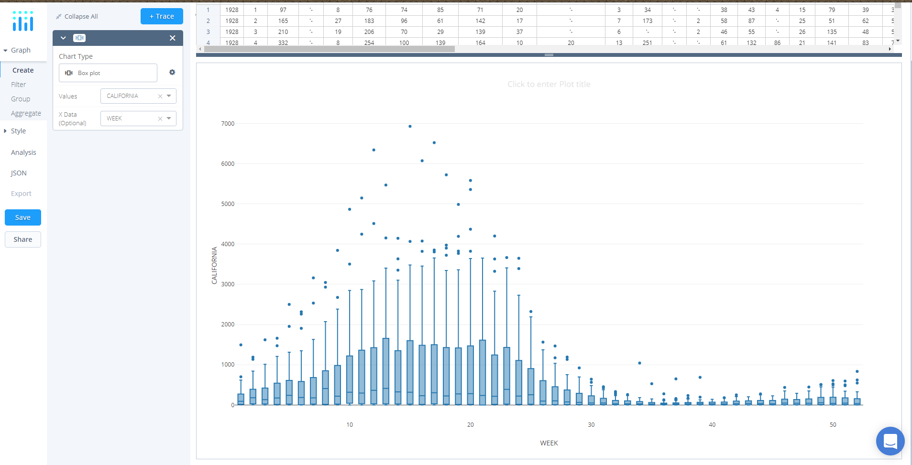

##### 2.2.2. Traces
Now that we have a populated graph. let's style the plot. First, navigate to the *Traces* tab under *Style*. Here, change the *Fill* and *Line Color* to **#222222**, but set the alpha to **50** for the fill and **100** for the line. Immediately below, set the *Display Points* dropdown to **All** and then style the points. To do so, set the *Fill* and *Line Color* to **#222222**, but set the alpha to **50** for the fill and **100** for the line. Next, in *Size and Spacing*, set the *Box Width* to **60** and the *Padding* to **30**. Lastly, with regards to trace styling, in *Show Statistics* select **Mean** from the dropdown. You ought to see the mean line appear on each boxplot.

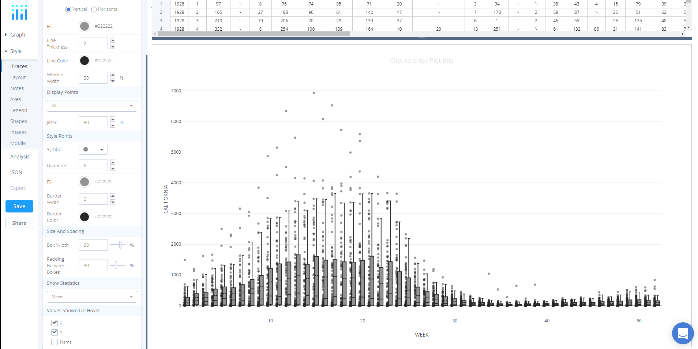

##### 2.2.3. Layout
Now that we've finished styling the trace, click *Layout* to style the background, fonts, and margins. To complete the former, select *Canvas* and set **#F3F5F9** as both plot and margin color. Below that, open the *Title and Fonts* box and under *Global Font*, set *Typeface* to **Raleway** and *Font Size* to **14**.

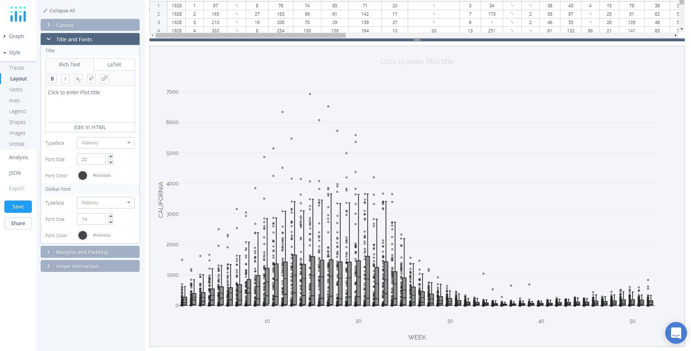

To set the margins, open *Margins and Padding* and set the values to **0, 80, 60, 0, 0**, respectively.

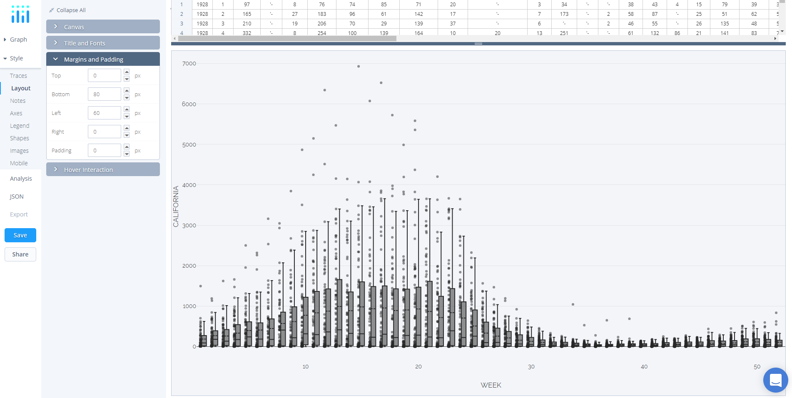

##### 2.2.4. Axes
To edit the axis titles, grid lines, and tick labels, navigate to the *Axes* tab. First, in the *Titles* set the x axis title to **"Week of year"** and then the y axis to **"Cases"**.

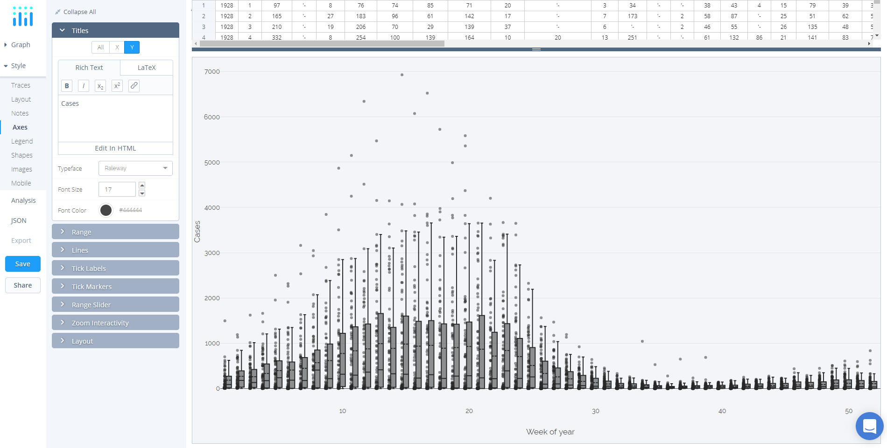

For this plot, we want to remove all grid lines. Thus, open *Lines* box, click *All*, and then select **Hide** for all three options (line, grid, zero line).

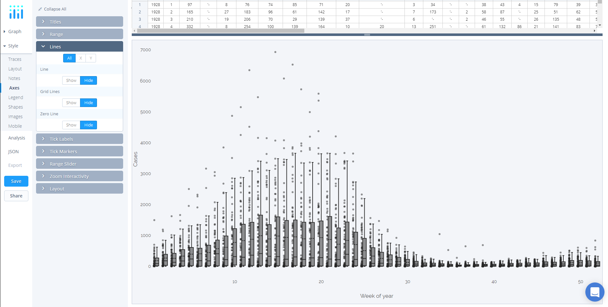

Next, open *Tick Labels* and check that the x axis is selected and scroll to the bottom of the box and, under *Number of Labels*, select **Custom** and enter **30** as the *Max Number of Labels*.

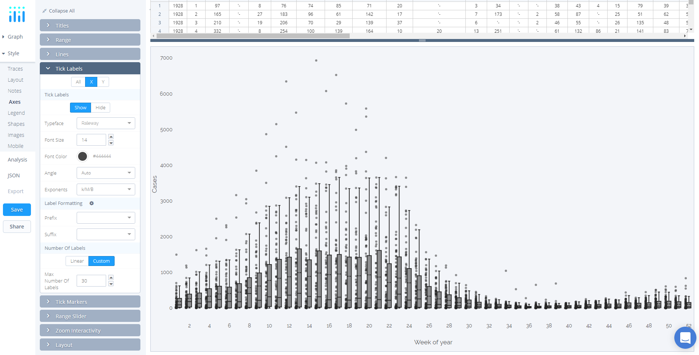

Now, you ought to see every second week tick label on the x axis. Lastly, open the *Zoom Interactivity* box and select **disable**.

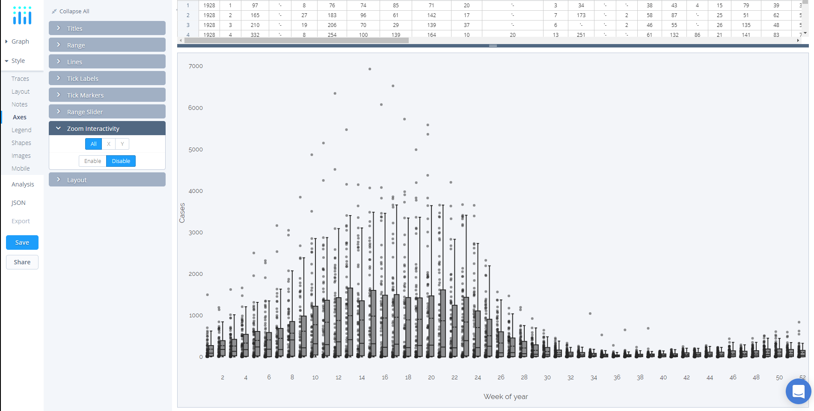

##### 2.2.5. Save
Congrats, your chart is complete! Click **Save** on the left-hand side of the screen. In the pop-up, enter your filename and select either **Public** (visible to all) or **Private Link** (visible only to those who you share the link with) and hit **Save**. Since these plots are destined for a dashboard, they can't be set to private.

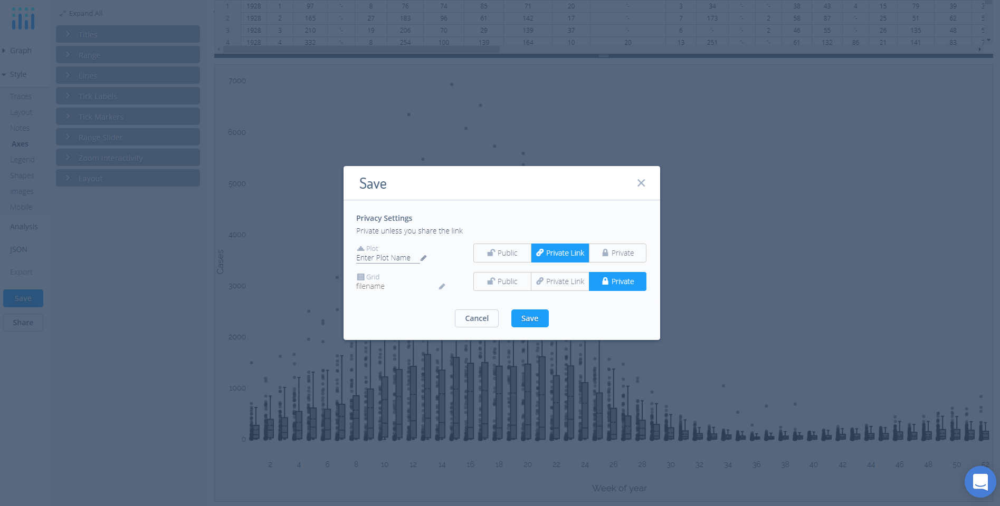

### 2.3. 3D Scatter Plot

##### 2.3.1. Create
Now that we have the data added to the grid, we can select our chart type. To do so, select *Graph* on the left-hand side, then *Create*. Click *Chart Type*, and **3D Scatter** from the *3D Charts* column.

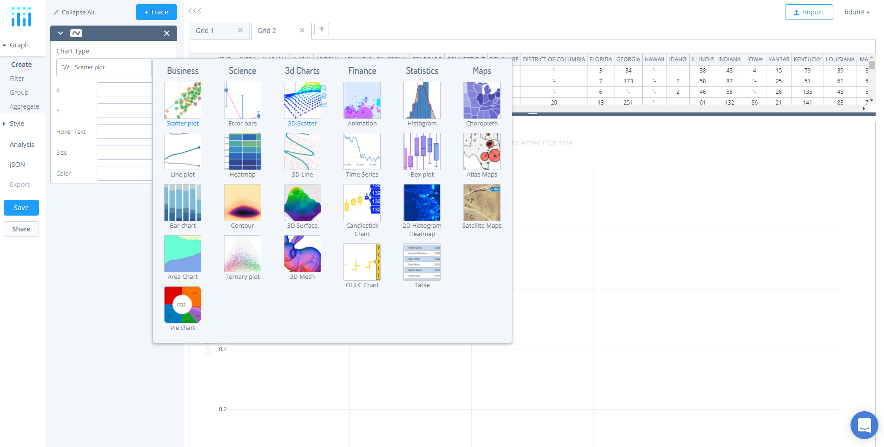

Like before, to populate the graph with data, select **YEAR**, **WEEK**, and **CALIFORNIA** in the *x*, *y*, and *z* dropdowns. Additionally, like in the scatter plot we made earlier, we want to color this by week. Thus, in the color dropdown select **WEEK**.

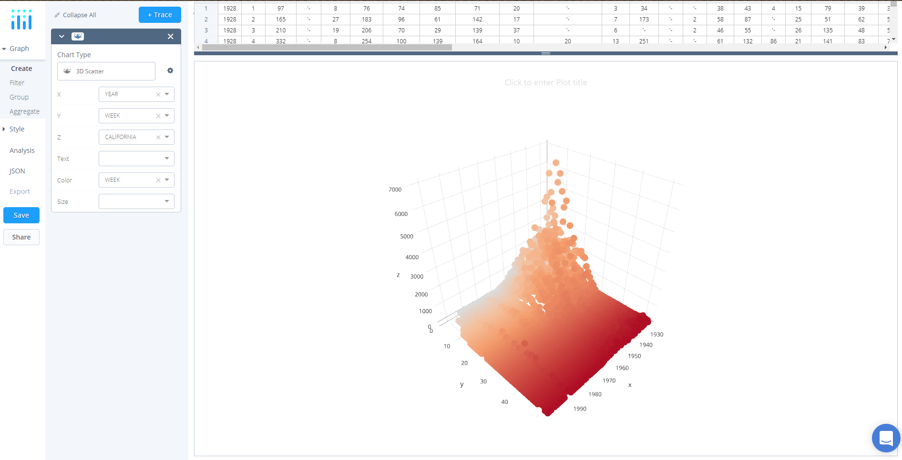

##### 2.3.2. Layout
Before styling the traces we'll first adjust the layout of the scene. Hence, navigate to *Layout* under *Style*. Here, open the *Scene* box and select **Manual** in the *Aspect Ratio* dropdown. Furthermore, set *x* to **2**.

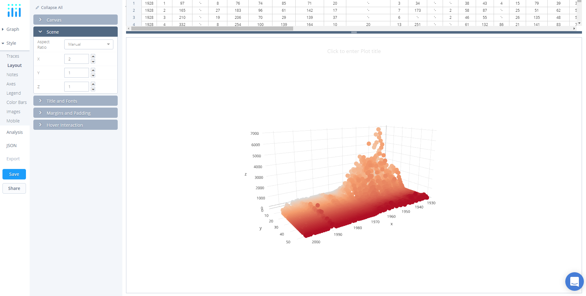

Since we have the layout open, select *Canvas* and set the *Margin Color* to **#F3F5F9**. For this plot, we'll leave the rest of the layout as is.

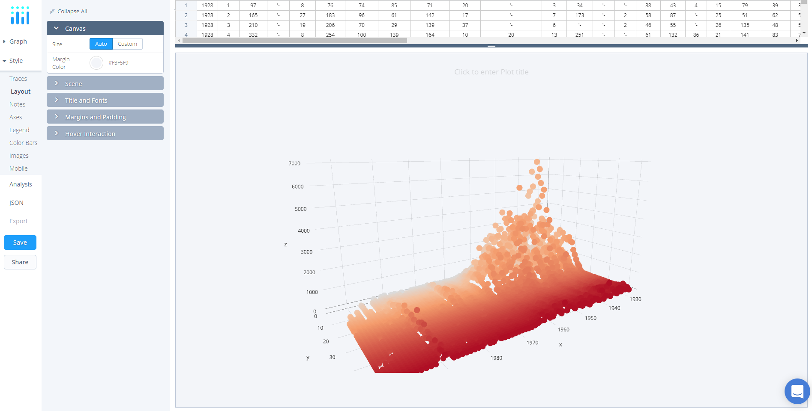

##### 2.3.3. Traces
Now that we have finished with styling the layout, click *Traces* to style the scatter points. We can redfine the colorscale by simply choosing from the preselected scales. To remain consistent with our scatter plot, select **blue to yellow**. Immediately below, click **Show color Bar** to enable color bar visibility. Lastly, change the *Border-Width* to **0.5** and *Border-Color* to **#506784**, which will help define the scatter points.

##### 2.3.4. Axes
Navigate to the *Axes* tab to style the axis' title, grid lines, and tick labels. Add **"Year"**, **"Week"**, **"Cases"** as the *x*, *y*, *z* titles, respectively. Additionally, set the *Font Size* to **16** and *Font Color* to **#506784**.

To style the grid lines, open the *Lines* box and select *All*. Here, under *All Axes Grid Lines* set *Thickness* to **3** and *Color* to **#FFFFFF**. Under *Zero Line*, set *Thickness* to **2** and *Color* to **#FFFFFF**.

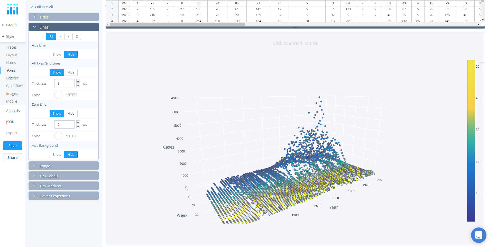

Next, alter the color of tick labels by opening the Tick Labels box, select *All*, and set *Color* to **#506784**. Lastly, for axes styling, open *Hover Projections*, select *All*, set *Color* to **#D62728** and *Width* to **4**. Now, when hovering you ought to see **#D62728** colored axis lines.

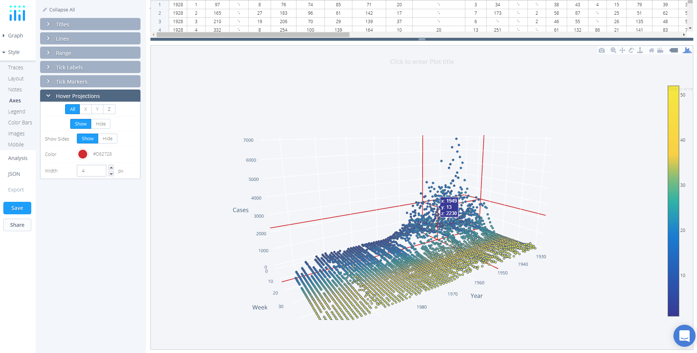

##### 2.3.5. Color Bars
Finally, you can style the color bar by navigating to *Color Bars*. For this tutorial, in the *Title* box we enter the title **"Week of year"**, set the *Typeface* to **Raleway**, adjust the *Size* to **14**, and set the *Color* to **#506784**.

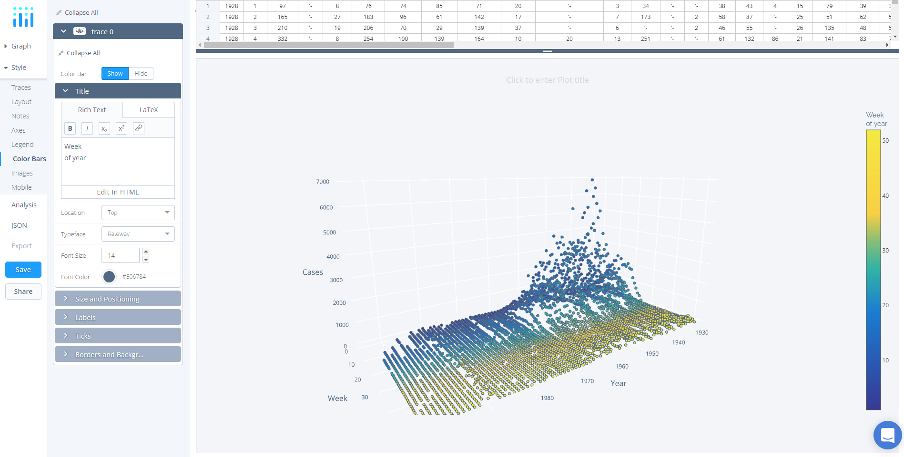

Now to minimize the size of the color bar, select the *Size and Positioning* box and set the *Height* to **0.9**.

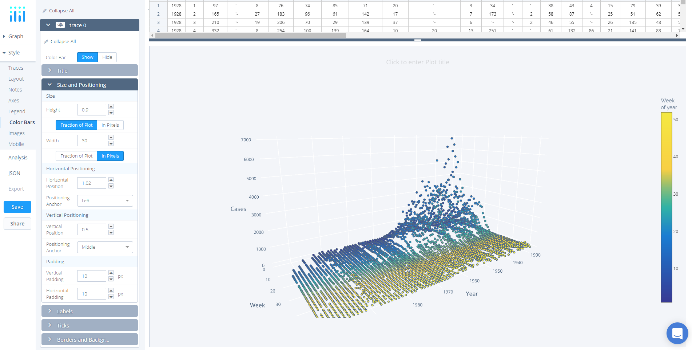

In the next box, *Labels*, set the *Typeface* to **Raleway** and the *Font Size* to **14**.

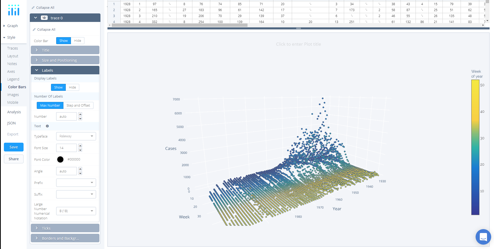

##### 2.3.6. Save
Congrats, your chart is complete! Click **Save** on the left-hand side of the screen. In the pop-up, enter your filename and select either **Public** (visible to all) or **Private Link** (visible only to those who you share the link with) and hit **Save**. Since these plots are destined for a dashboard, they can't be set to private.

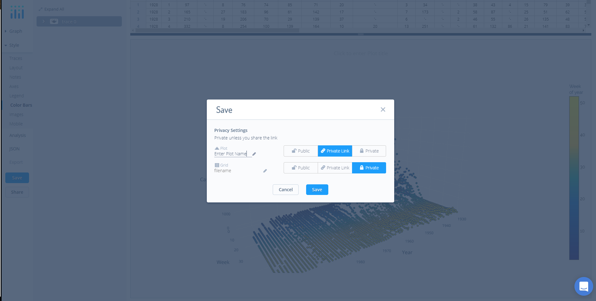

## 3. Create a Dashboard

With the charts completed and saved in your [home folder](https://plot.ly/organize/home), we can now create a dashboard by simply adding these charts, adjusting the layout, and styling the dashboard before sharing and interacting. To get started with creating a dashboard, hover over the *+Create* button and select **Dashboard** from the menu. Alternatively, open this [link](https://plot.ly/dashboard/create).

### 3.1. Add Charts

Before adding a chart, we'll add a text box to describe the dashboard and its uses. Simply, click the *Text* button, where a text editor ought to appear. In the text editor, add the text you wish to display in the dashboard.

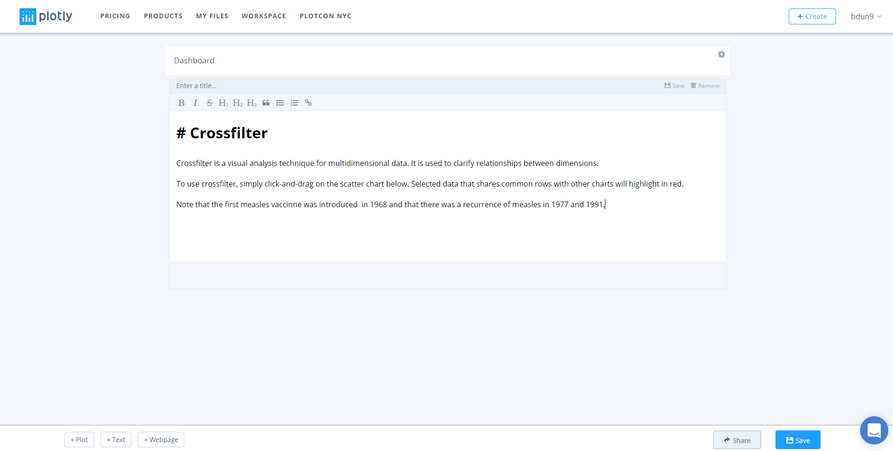

Now to add the scatter plot, click *+Plot* in the bottom left corner of the screen. A new box ought to appear with the option to 'Add a Plot'. Click, the *'Your Files'* option and then in the pop-up select the **scatter plot** we made earlier.

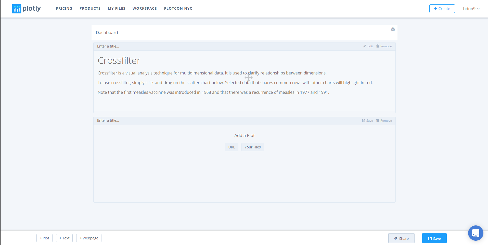

Now, you ought to see the plot added to your dashboard. Next, in the top left corner of the box where it says, "Enter a title..." insert **"California measles cases, colored by week of year"**.

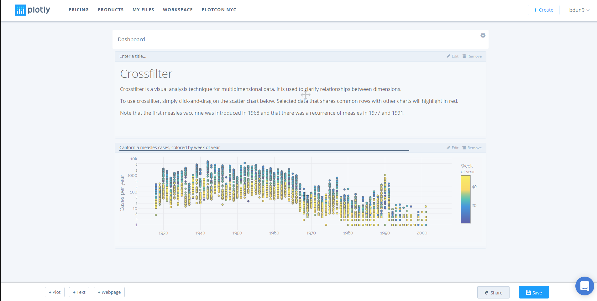

Repeat the process for the boxplot and 3D scatter plot we made earlier, but title them **"California measles cases by week of year"** and **"California measles cases: Week of year versus Year versus Cases"**, respectively.

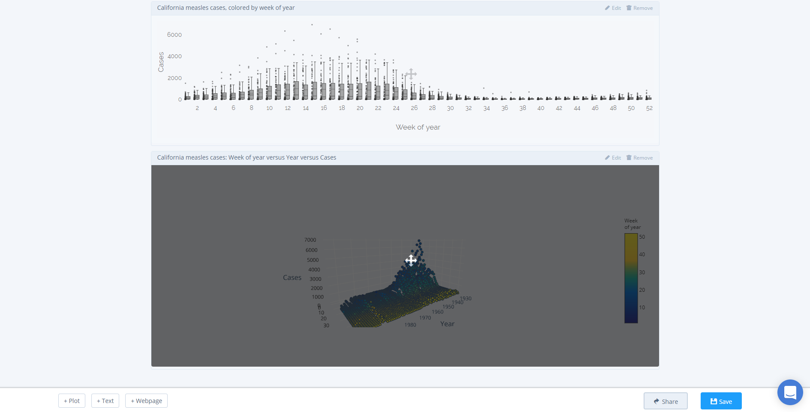

### 3.2. Style It

Now that we have the structure of our dashboard, we can style it. To do so, navigate to the *settings icon* directly opposite the dashboard title. When hovering you ought to see the option settings from the menu.

After clicking *settings*, a panel ought to appear from the right-hand side of the screen. Here, we have the option of headers, colors, text, layout, and filter. First, in *Headers*, we can set the title, add a logo, and multiple links. For this tutorial, add **"Measles Cases in California 1928-2004"** to the *Title* text box. Next, let's add the Project Tycho logo. We can do this by simply adding the URL for the logo PNG: **https://www.tycho.pitt.edu/images/web3.png**. As previously mentioned you can add links, in this tutorial we'll use this feature to link the original dataset. Thus, add the text **"Data Source: Project Tycho Level 1 data"** with the URL: **https://www.tycho.pitt.edu/data/level1.php**.

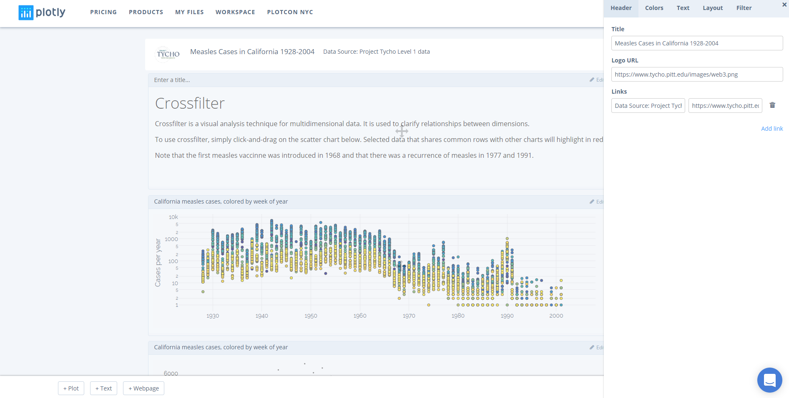

In the next tab, *Colors*, we can manipulate the background, borders, and text colors. As you can see, the dashboard has already added these by default. Thus, for this tutorial, we'll leave them as is.

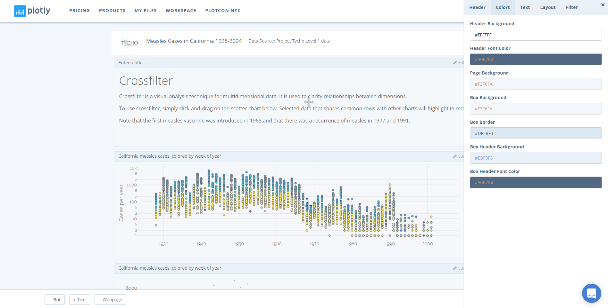

*Text*, the third settings option, allows you to control all things text, including font color, family, and size, as well as header styles and text box styles. Again, like the Colors tab, some values are defined. However, here, we'll set the *Font Family* to **Raleway**. Make the header font larger by selecting **2.2em** in the *Header Font Size* and, additionally, change the *Header Font Weight* to **300**. Lastly, to separate the text box, set the *Text Box Background Color* to **#FFFFFF**.

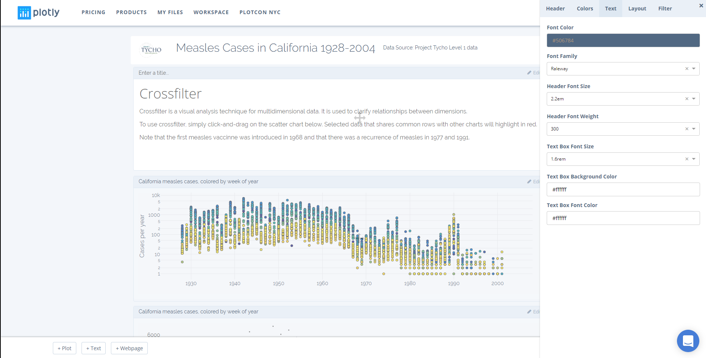

In *Layout*, you have the option of setting the page layout as either a dashboard or a report. Here, we'll leave it as the default dashboard setting. The last settings category, *Filter*, provides you with the option to enable or disable the Search Bar or the Crossfilter feature. For this tutorial, leave the *Search Bar* as is but lets enable the **Crossfilter** feature by selecting **enable** (for more information about this feature see the next section).

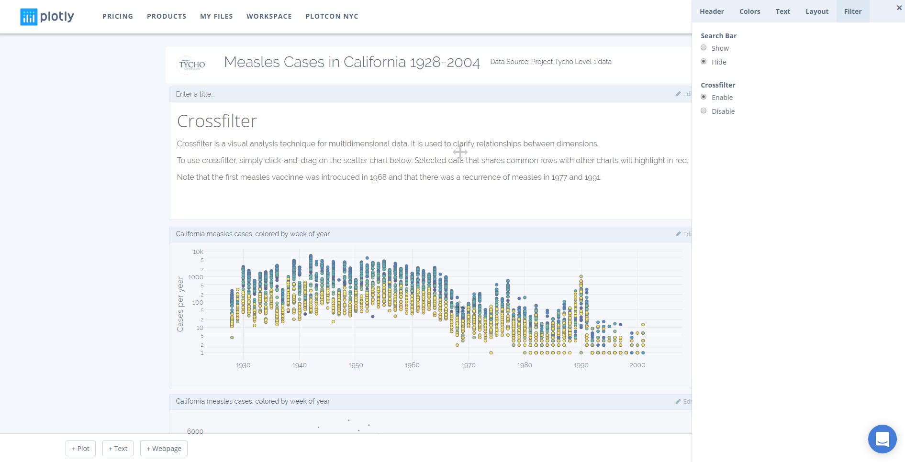

Congrats, your dashboard is complete! Click **Save** on in the bottom right-hand side of the screen. In the pop-up, enter your filename and select either **Public** (visible to all), or **Private Link** (visible only to those who you share the link with), or **Private** (visible only to you) and hit **Save**. .

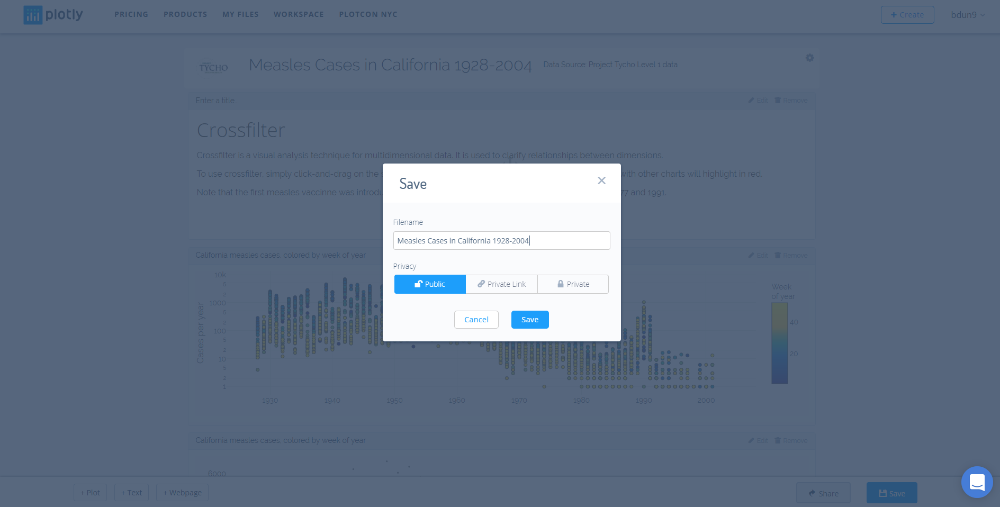

## 4. Crossfilter

TODO
