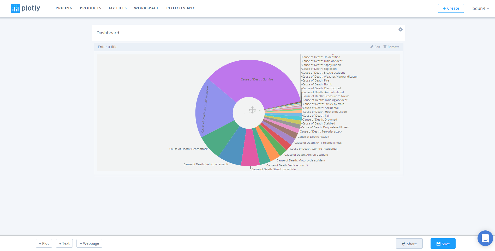
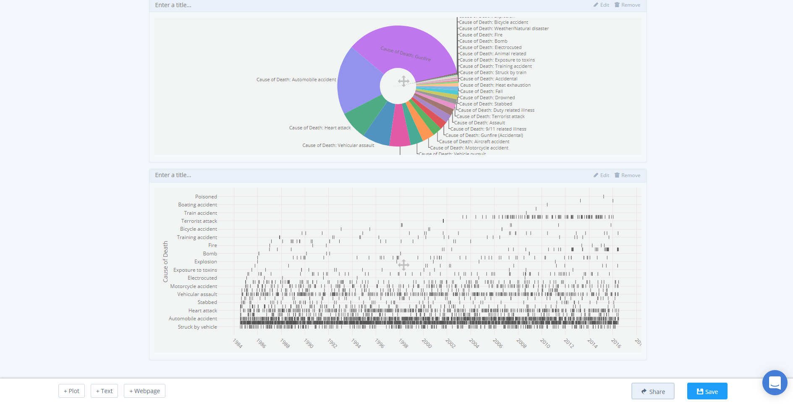
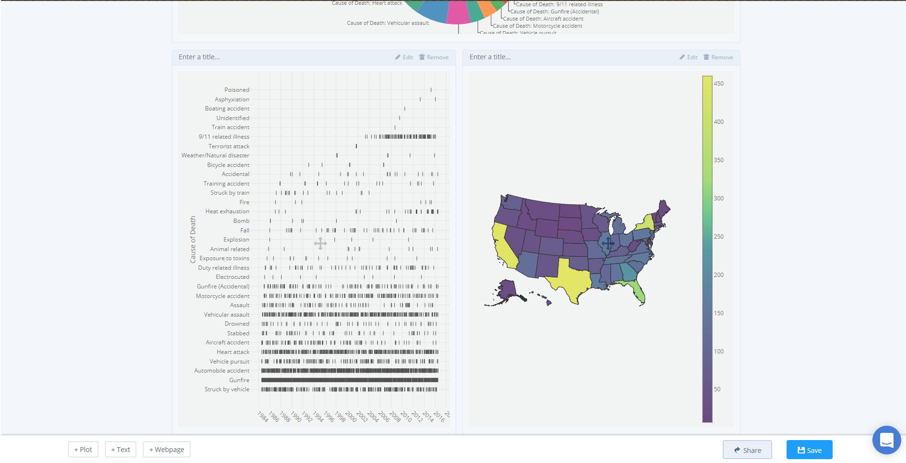
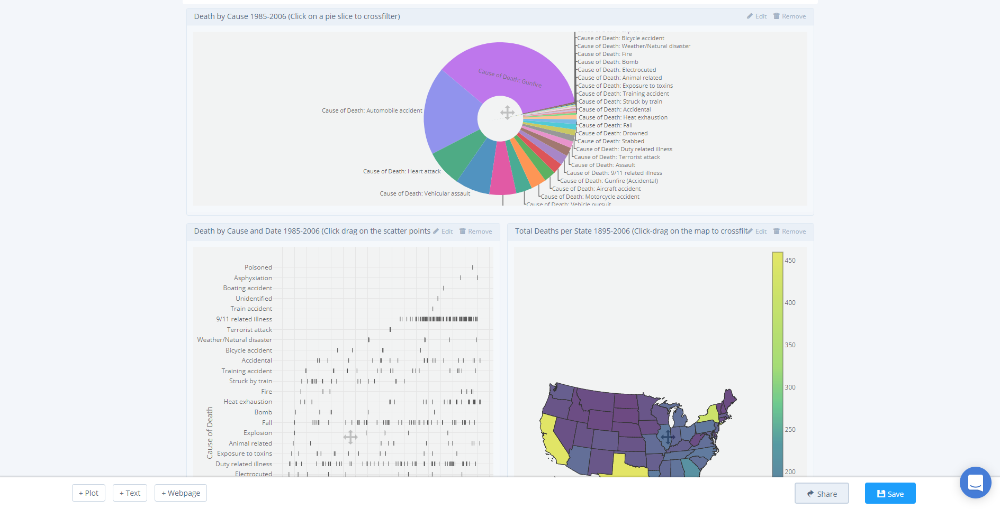
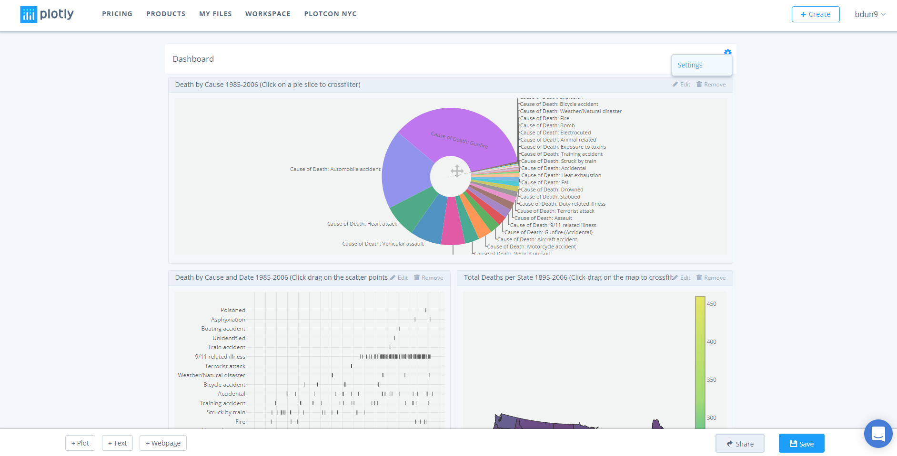
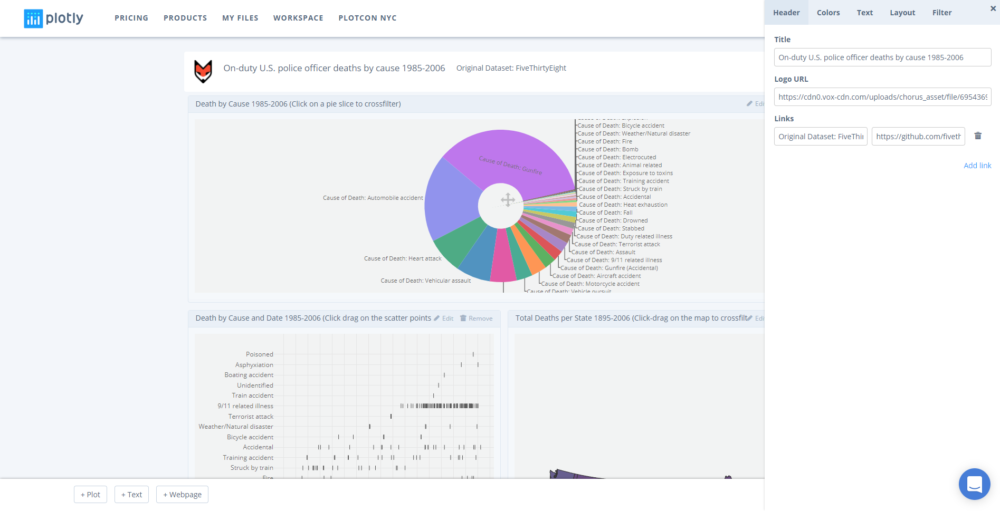
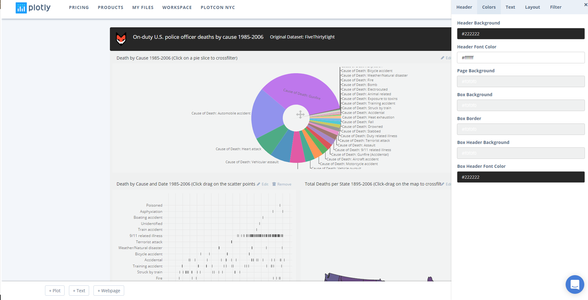
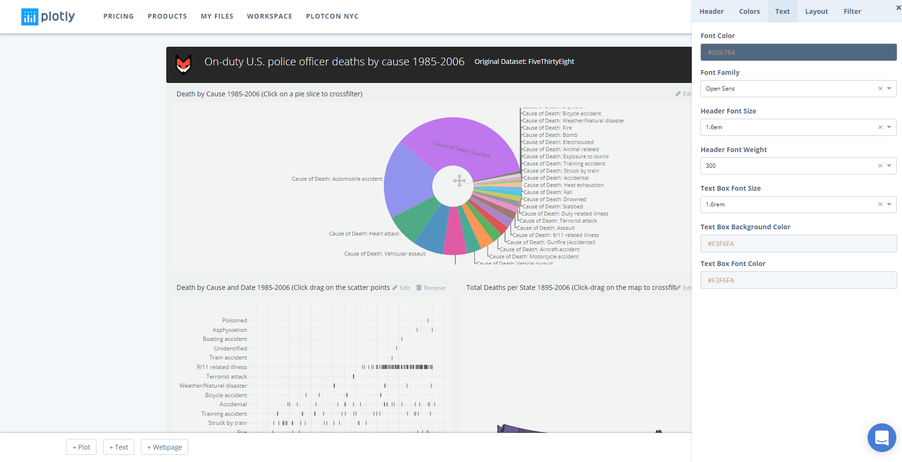
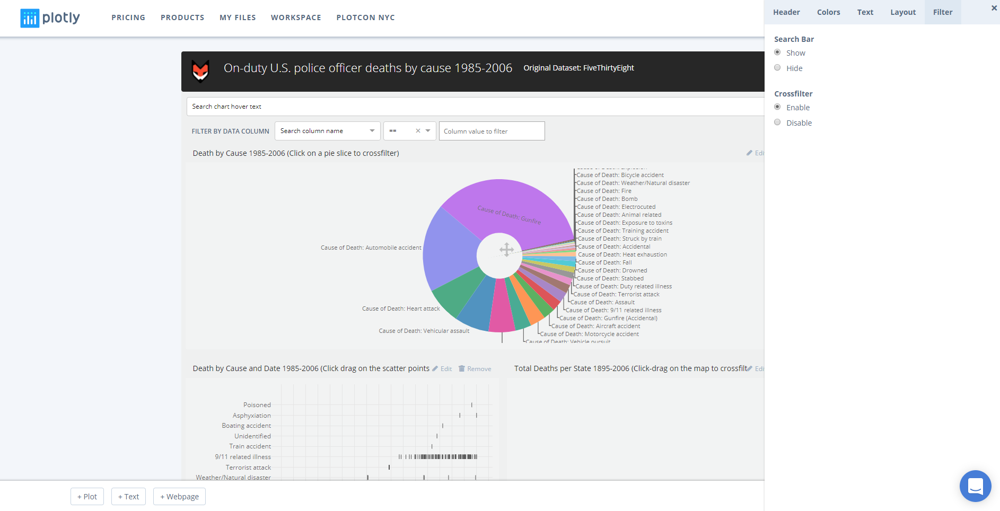
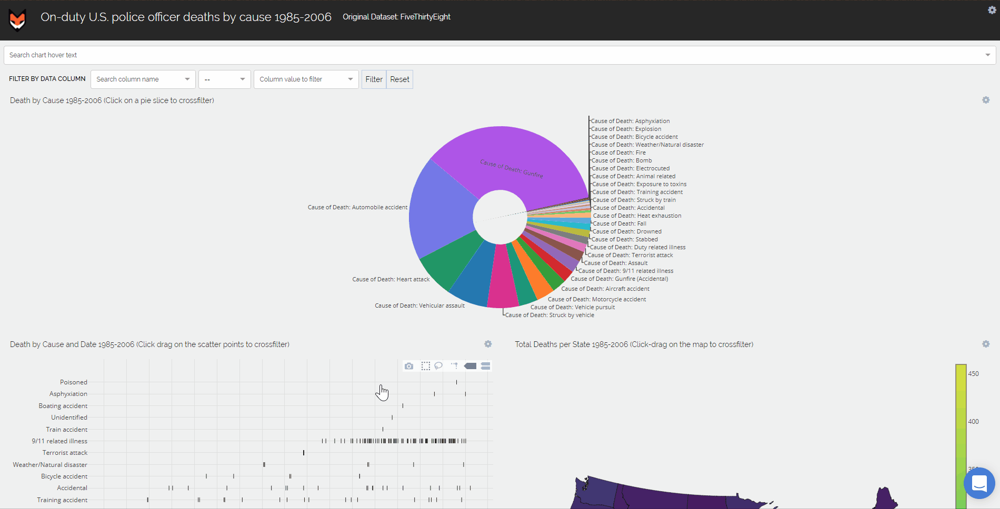

# U.S. Police officer deaths by cause

In this tutorial, we'll create and style multiple individual plots in the Chart Studio, add them to a dashboard, and utilize the crossfilter feature to interact and explore these data further.

## Contents

- [Data](#1-data)
- [Create a Chart](#2-create-a-chart)
  - [Death by Cause Pie Chart](#21-death-by-cause-pie-chart)
  - [Death by Cause and Date Scatter Plot](#22-death-by-cause-and-date-scatter-plot)
  - [Deaths per State Choropleth Map](#23-deaths-per-state-choropleth-map)
- [Create a Dashboard](#3-create-a-dashboard)
  - [Add Charts](#31-add-charts)
  - [Style It](#32-style-it)
- [Crossfilter](#4-crossfilter)

## 1. Data

To get started, head to Plotly’s [Chart Studio](https://plot.ly/create/) and add your data. You have the option of typing directly in the grid, uploading your file, or entering a URL of an online dataset. For this tutorial, we'll use the Police Killings dataset from the [FiveThirtyEight](http://bit.ly/237YWtv). To begin, simply view the [dataset](https://plot.ly/~public.health/17/) and click **'Fork & Edit'**. The Chart Studio ought to have opened and you're all set to go.

Alternatively, navigate to the [Chart Studio](https://plot.ly/create/) and click **'Import'**, **'By URL'**, and then paste in the **URL** (https://plot.ly/~public.health/17.csv).

## 2. Create a Chart
To visualize U.S. police officer deaths between 1985 and 2006, we'll create three individual charts: (1) a pie chart to illustrate deaths by cause , (2) a scatter plot looking at cause and date, and (3) a choropleth map to visualize deaths per state. In the section below, we'll look at how to make each of the charts.

### 2.1. Death by Cause Pie Chart

##### 2.1.1. Create
Now that we have the data in the grid, we can select our chart type. To do so, select *Graph* on the left-hand side, then *Create*. Click *Chart Type*, and **Pie Chart** from the *Business* column.

Next, we can populate the graph by selecting **cause** in the *Labels* dropdown. You ought to see a pie chart with a legend like below.

##### 2.1.2. Traces
To style the pie chart, we can make changes to the text, colors, borders, and order. To do so, navigate to the *Traces* tab under *Style*. Here, select ** Label** and unselect ** %**, change the *Font Size* to **11**, set the *Rotation* to **130 degrees**, and *Hole* to **30%**.

##### 2.1.4. Layout
To change the background color, click *Layout* under *Style* and set the *Color* to **F0F0F0**.

To set the margins, select the *Margins and Padding* box
and enter the values **20, 20, 0, 0, 0**, respectively.

##### 2.1.4. Legend
With the styling done and the option to use labels directly on the slices, the legend on the right-hand side is redundant. Thus, click *Legend* under *Style* and select **Hide**.

##### 2.1.5. Save
Congrats, your chart is complete! Click **Save** on the left-hand side of the screen. In the pop-up, enter your filename and select either **Public** (visible to all) or **Private Link** (visible only to those who you share the link with) and hit **Save**. Since these plots are destined for a dashboard, they can't be set to private.

### 2.2. Death by Cause and Date Scatter Plot
Using the same grid as the previous plot, open the data in the Chart Studio.

##### 2.2.1. Create
Now that we have the data added to the grid, we can select our chart type. To do so, select *Graph* on the left-hand side, then *Create*. Click *Chart Type*, and **Scatter** from the *Business* column.

Now to populate the graph with data, in the *x* and *y* dropdown select **date** and **cause_short**, respectively.

##### 2.2.2. Traces
With the data plotted, let's style the plot by first changing the scatter points color and symbol. Click *Traces*, set the points *Color* to **#222222** and change the *Symbol* to **|** (situated at the bottom of the symbol box).

##### 2.2.3. Layout
Next, navigate to the *Layout* tab to set the background colors, and margins. To complete the former, open the *Canvas* box and set the color, for both plot and margin, to **#F0F0F0**.

To set the margins, select the *Margins and Padding* box
and enter the values **0, 40, 150, 0, 0**, respectively.

##### 2.2.4. Axes
Moving on to the *Axes* tab, select *Title*. Remove the title under the *x* axis, then click *y* and in the text editor type **Causes of Death**. Leave the *Typeface* as **Open Sans** and *Font Size* as **14**.

Next, navigate to *Tick Labels*. In the *x* axis, set the *Angle* to **45 degrees** and the *Number of Labels* to **Custom** and **20**.

Finally, select *Zoom Interactivity* and click **Disable**.

##### 2.2.5. Save
Congrats, your chart is complete! Click **Save** on the left-hand side of the screen. In the pop-up, enter your filename and select either **Public** (visible to all) or **Private Link** (visible only to those who you share the link with) and hit **Save**. Since these plots are destined for a dashboard, they can't be set to private.

### 2.3. Deaths per State Choropleth Map
Using the same grid as the previous plot, open the data in the Chart Studio.

##### 2.3.1. Create
Like the previous charts, once you've added the data, select *Graph* on the left-hand side, then *Create*. Click *Chart Type*, and **Choropleth** from the *Maps* column.

Now to populate the graph with data, in the *Locations* and *Values* dropdown select **state** and **cause**, respectively. Additionally, set **USA State Abbreviations** in the *Locations Format* dropdown, **USA** in the *Map Regions*, and set the *Projections* to **Albers USA**. Note that states aren't defined yet as we need to aggregate the data. 

##### 2.3.2. Aggregate
Thus, under *Graph* click *Aggregate*. Next, click the blue *+ Aggregate* button. In the box that appears, select **state** as the *Group By Column*. Set *Trace* to **cause**, *z* to **count**, and leave *Locations* as **first**. You ought to not see something like below.

##### 2.3.3. Traces
The blue is hard to decipher, so navigate to the *Traces* tab and set the *Colorscale* to **Yellow/Purple** (roughly the 8th from the left).

##### 2.3.4. Layout
Now that the choropleth is populated and colored, navigate to the *Layout* tab to style the background, margins, and the geo style and layout. First, open the *Canvas* box and set the *Color* to **#F0F0F0**.

To make the map the full width and height, open *Margins and Paddings* and set all the values to **0**.

Unique to choropleth maps, we have *Geo Layout*. Here, you define attributes such as *Map Scope*, *Projection*, *Rotation*, *Scale*, and *Map Resolution*. Set the latter to **1:50,000,000**.

##### 2.3.5. Color Bars
Finally, you can style the color bar by navigating to *Color Bars*. To minimize the size of the color bar, select the *Size and Positioning* box and set the *Width* to **20**.

##### 2.3.6. Save
Congrats, your chart is complete! Click **Save** on the left-hand side of the screen. In the pop-up, enter your filename and select either **Public** (visible to all) or **Private Link** (visible only to those who you share the link with) and hit **Save**. Since these plots are destined for a dashboard, they can't be set to private.

## 3. Create a Dashboard

With the charts completed and saved in your [home folder](https://plot.ly/organize/home), we can now create a dashboard by simply adding these charts, adjusting the layout, and styling the dashboard before sharing and interacting. To get started with creating a dashboard, hover over the *+Create* button and select **Dashboard** from the menu. Alternatively, open this [link](https://plot.ly/dashboard/create).

### 3.1. Add Charts
First, to add the Death by Cause Pie Chart, click *+Plot* in the bottom left corner of the screen. A new box ought to appear with the option to 'Add a Plot'. Click, the *'Your Files'* option and then in the pop-up select the ** Death by Cause Pie Chart ** we made earlier.

Next, add the Death by Cause and Date Scatter Plot immediately below following the same process.

Like previously, add the Deaths per State Choropleth Map following the same process. This time drag and drop the plot on the right half of the Death by Cause and Date Scatter Plot.

Now that we have added all the plots to the dashboard, for each plot where it says, "Enter a title..." insert plot titles: **Death by Cause 1985-2006 (Click on a pie slice to crossfilter)**, **Death by Cause and Date 1985-2006 (Click drag on the scatter points to crossfilter)**, and **Total Deaths per State 1895-2006 (Click-drag on the map to crossfilter)** in the same order as we added the plots. Your result ought to look like below.

### 3.2. Style It

Now that we have the structure of our dashboard, we can style it. To do so, navigate to the *settings icon* directly opposite the dashboard title. When hovering you ought to see the option settings from the menu.

After clicking *settings*, a panel ought to appear from the right-hand side of the screen. Here, we have the option of *Headers*, *Colors*, *Text*, *Layout*, and *Filter*. First, in *Headers*, we can set the title, add a logo, and multiple links. For this tutorial, add **On-duty U.S. police officer deaths by cause 1985-2006** to the *Title* text box. Next, let's add the FiveThirtyEight logo. We can do this by simply adding the URL for the logo PNG: **https://cdn0.vox-cdn.com/uploads/chorus_asset/file/6954369/538-logo.0.png**. As previously mentioned you can add links, in this tutorial we'll use this feature to link the original dataset. Thus, add the text **"Original Dataset: FiveThirtyEight"** with the URL: **https://github.com/fivethirtyeight/data/tree/master/police-deaths**.

In the next tab, *Colors*, we can manipulate the background, borders, and text colors. As you can see, the dashboard has already added these by default. That said, for this dashboard we will set *Header Background* to **#222222**, *Header Font Color* to **#FFFFFF**, *Page Background*, *Box Background*, *Box Border*, and *Box Header Background* to **#F0F0F0**. Lastly, enter **#222222** as the *Box Header Font Color*.

*Text*, allows you to control all things text, including font color, family, and size, as well as header styles and text box styles. Again, like the *Colors* tab, some values are defined. However, here, we'll set the *Font Family* to **Open Sans**. Set the header font to **1.6em** in the *Header Font Size* and, additionally, change the *Header Font Weight* to **300**. We can leave the remainder as-is.

In *Layout*, you have the option of setting the page layout as either a dashboard or a report. Here, we'll leave it as the default dashboard setting. The last settings category, *Filter*, provides you with the option to enable or disable the Search Bar or the Crossfilter feature. For this tutorial, **Enable** both *Search Bar* and the *Crossfilter* feature (for more information about this feature see the next section). Now, like below, you ought to see a search bar and filter dropdown appear under the dashboard header.

Congrats, your dashboard is complete! Click **Save** on in the bottom right-hand side of the screen. In the pop-up, enter your filename and select either **Public** (visible to all), or **Private Link** (visible only to those who you share the link with), or **Private** (visible only to you) and hit **Save**. .

## 4. Crossfilter
Finally, we'll briefly demonstrate crossfilter.

**Crossfilter** is a visual analysis technique for multidimensional data. It is used to clarify relationships between dimensions. As discussed in the previous section, crossfilter functionality is invoked by setting **enable** in Settings > Filter.

To use crossfilter, simply click-and-drag on a chart. Selected data that shares common rows with other charts will highlight and all other data will fade out. To reset the dashboard, click anywhere on a graph that doesn't have data.

