# Laboratory Confirmed Zika Cases 2015-2016

In this tutorial, we'll create and style multiple individual plots in the Chart Studio, add them to a dashboard, and utilize the crossfilter function to interact and explore these data further.

## Contents

- [Data](#1-data)
- [Create a Chart](#2-create-a-chart)
  - [Maximum per Month Map](#21-maximum-per-month-map)
  - [Average per Month Map](#22-average-per-month-map)
  - [Confirmed Cases by Week Scatter Plot](#23-confirmed-cases-by-week-scatter-plot)
  - [Confirmed Cases by Country Scatter Plot](#23-confirmed-cases-by-country-scatter-plot)
- [Create a Dashboard](#3-create-a-dashboard)
  - [Add Charts](#31-add-charts)
  - [Style It](#32-style-it)
- [Crossfilter](#4-crossfilter)

## 1. Data

To get started, head to Plotly’s [Chart Studio](https://plot.ly/create/) and add your data. You have the option of typing directly in the grid, uploading your file, or entering a URL of an online dataset. For this tutorial, we'll use the Zika Cases dataset from the Pan American Health organization. To begin, simply view the [dataset](https://plot.ly/~jackp/18095) and click **'Fork & Edit'**. The Chart Studio ought to open and you're all set to go.

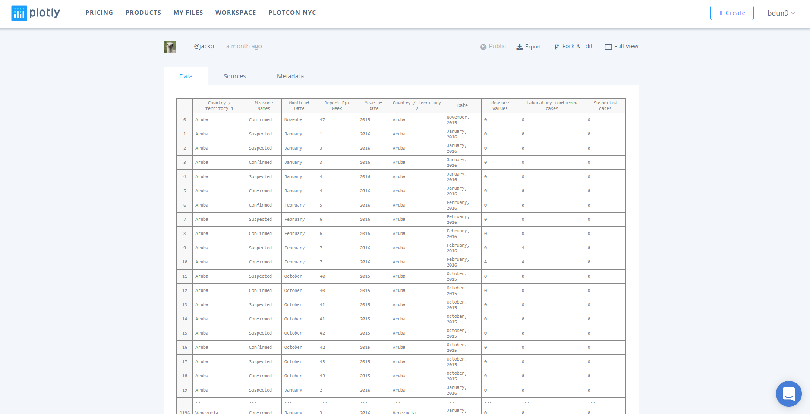

Alternatively, navigate to the [Chart Studio](https://plot.ly/create/) and click **'Import'**, **'By URL'**, and then paste in the **URL** (https://plot.ly/~jackp/18095.csv).

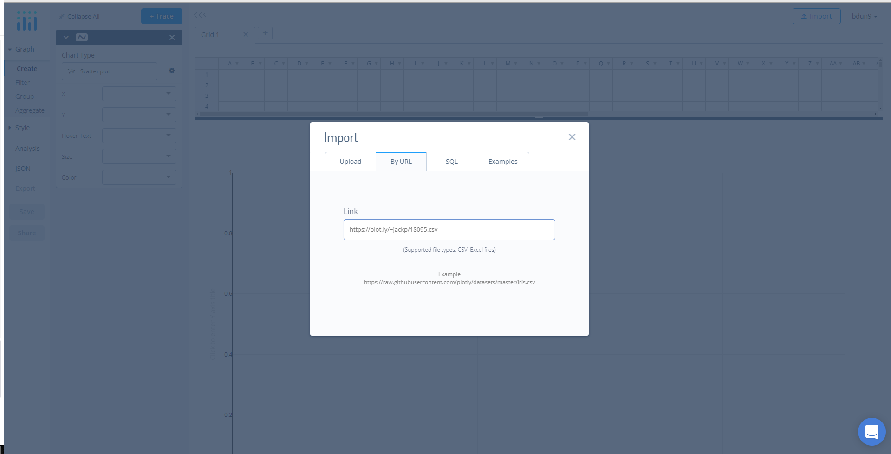

## 2. Create a Chart

To visualize confirmed Zika Cases from 2015 to 2016, we'll create four individual charts: two choropleth maps that illustrate (1) maximum cases per month and (2) the average cases per month; (3) a scatter plot to highlight confirmed cases by week of year and (4) another scatter plot to visualise confirmed cases by country. In the section below, we'll look at how to make each of the charts.

### 2.1. Maximum per Month Map

##### 2.1.1. Create
Now that we have the data added to the grid, we can select our chart type. To do so, select *Graph* on the left-hand side, then *Create*. Click *Chart Type*, and **Choropleth** from the *Maps* column.

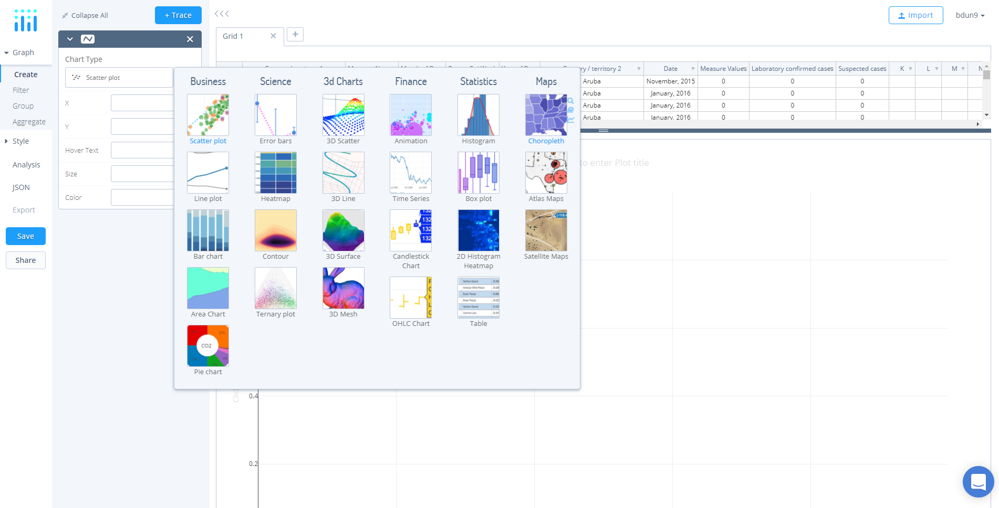

Now to populate the graph with data, in the *Locations* and *Values* dropdown select **Country / territory 1** and **Laboratory confirmed cases**, respectively. Additionally, set **Country Names** in the *Locations Format* dropdown, **World** in the *Map Regions*, and set the *Projections* to **Distance Preserving (Equirectangular)**. You ought to note that states aren't defined yet as we need to aggregate the data.

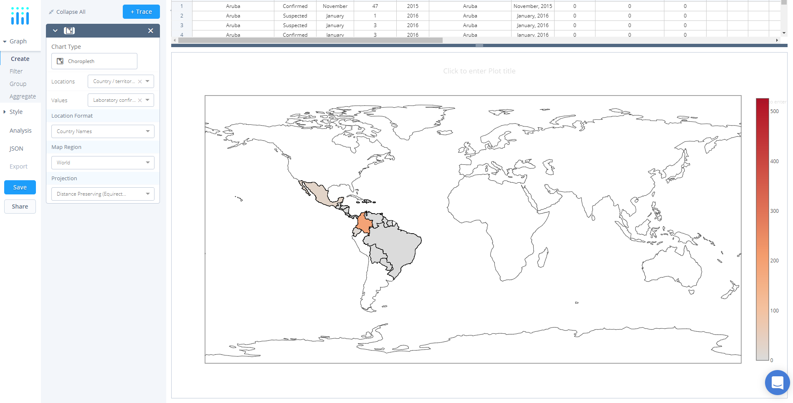

##### 2.1.2. Filter
Our Laboratory confirmed cases column consists of two categorical variables: confirmed and suspected. For this visual, we only want to plot the confirmed cases. Thus, we'll apply a filter. To do so, click *Filter* in the *Graph* tab. Then, filter on **Measure Names** and select **Laboratory confirmed cases** as the *Traces to Filter*. Set *Operator* to **Matching Values**, **Include**, and select the categorical variable **Confirmed**.

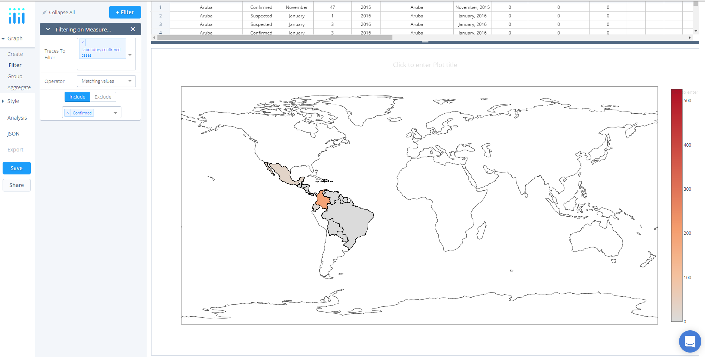

##### 2.1.3. Aggregate
Now, for this choropleth we want to plot the maximum number of confirmed cases. Therefore, we need to aggregate the data. To do so, open *Aggregate*, select **Country / territory 1** as the *Group By Column*, and **Laboratory confirmed cases** as the *Trace*. Then, set *Z* value to **max**.

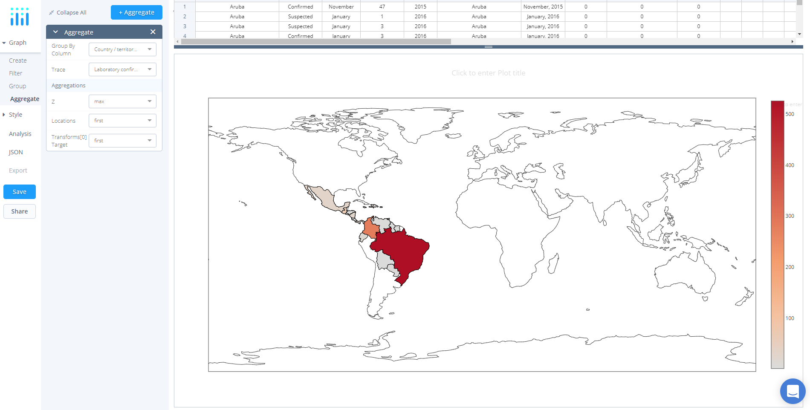

##### 2.1.4. Traces
To style, under *Style* click *Traces*. Here, we can change the colorscale by clicking the **yellow/blue** palette (around the 3rd from the left).

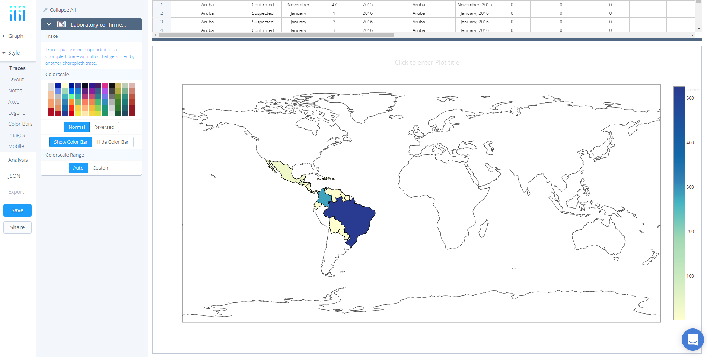

##### 2.1.5. Layout
Now that we've finished styling the trace, click *Layout* to style the background, fonts, and margins. To complete the former, select *Canvas* and set **#000000** as the *Margin Color*.

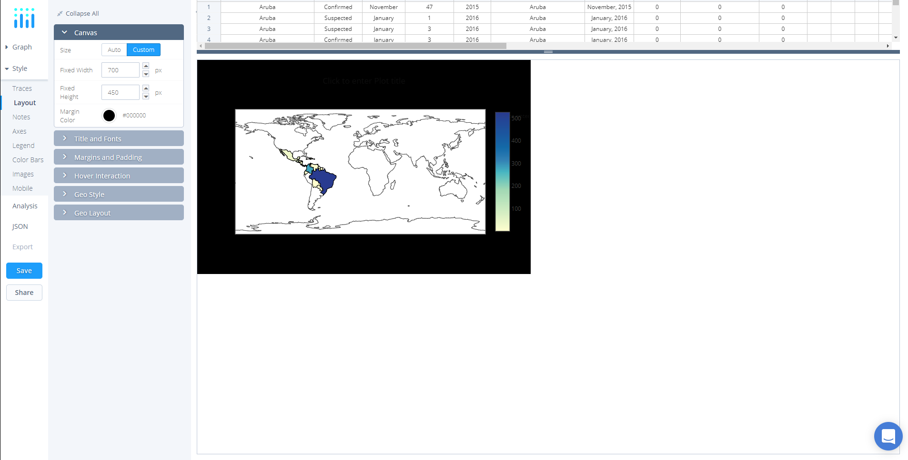

Below *Canvas*, open the *Title and Fonts* box and under *Global Font*, set *Typeface* to **Raleway**, *Font Size* to **14**, and *Font Color* to **#FFFFFF**.

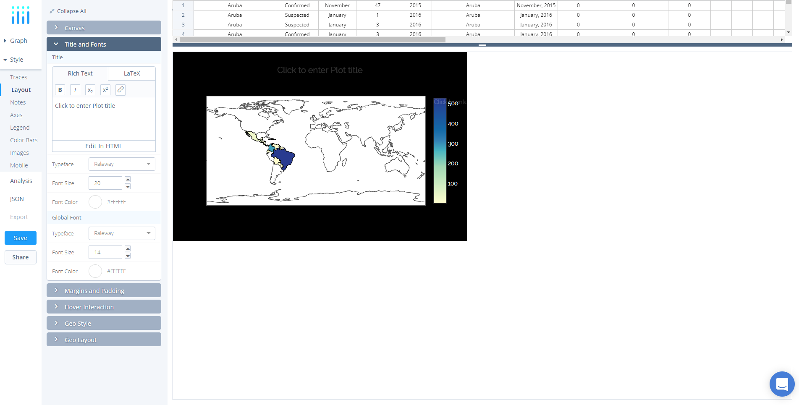

Next, navigate to the *Layout* tab, open *Margins and Paddings* and set all the values to **0** to make it full width and height.

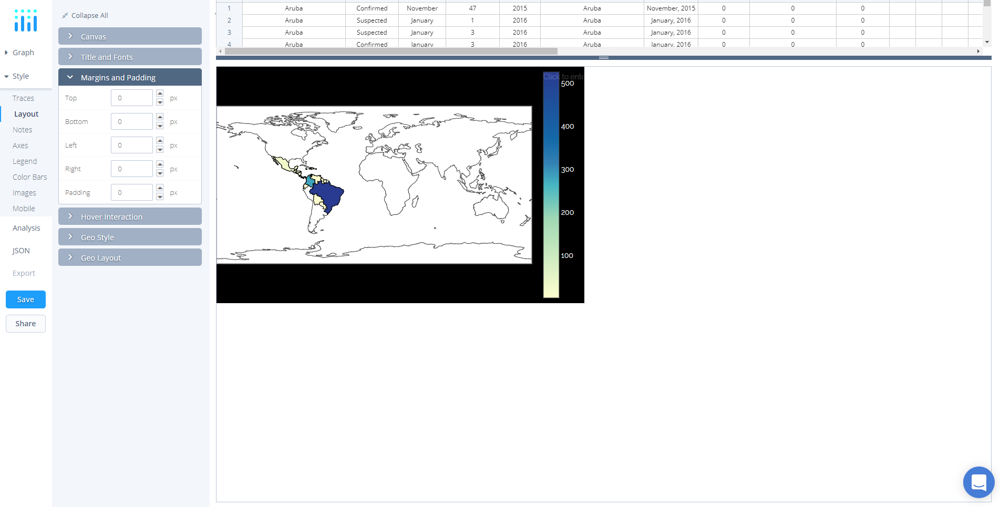

In choropleth maps, we have *Geo Style* and *Geo Layout*. To alter the former, select *Geo Style* and set *Land* and *Coastline* to **Show**. Set *Color* to **#222222** and **#000000**, respectively. Next, set *Oceans* to **Show** and *Color* **#000000**; *Country* to **Show** and *Color* **#000000**. Lastly, *Frame* to **Hide**.

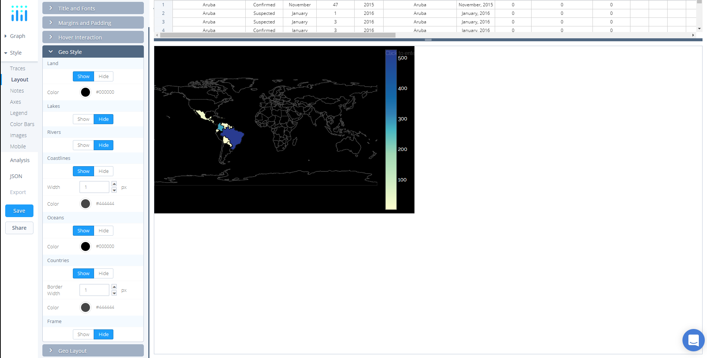

Next, in *Geo Layout* you can define attributes such as *Map Scope*, *Projection*, *Rotation*, *Scale*, and *Map Resolution*. Set *Longitude* to **-62** and *Map Scale* to **2**.

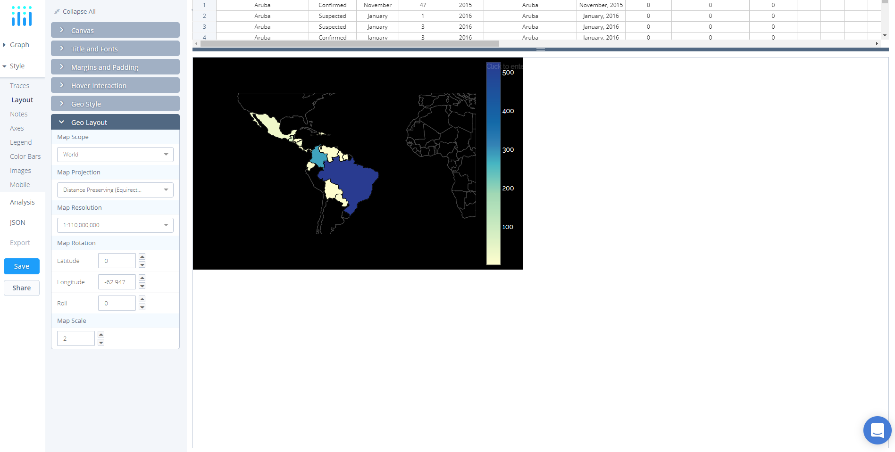

##### 2.1.6. Axes
With the *Layout* finished, navigate to *Axes* and set *Range*. Here, select *Longitude* and set it to *-180* and *45*.

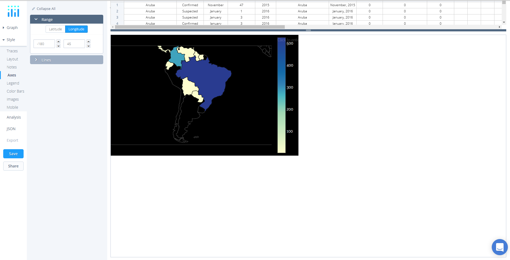

##### 2.1.7. Color Bars

Finally, click *Color Bars* under *Style* and open *Size and Positioning*. To minimize the *Height* set it to **0.9**. To move it inward set *Horizontal Position* to **0.83**.

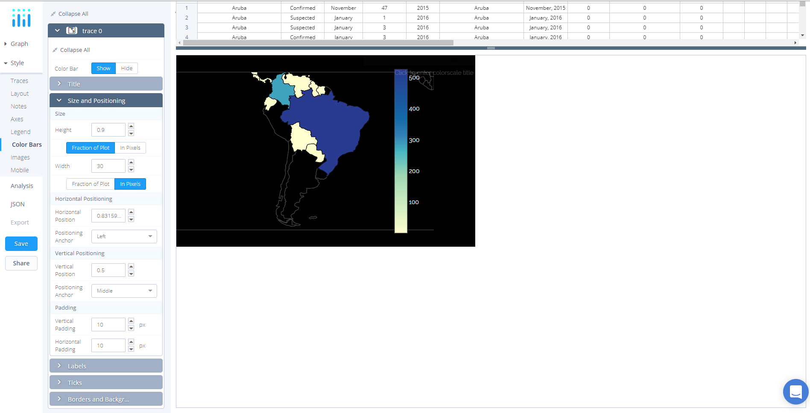

##### 2.1.8. Save
Congrats, your chart is complete! Click **Save** on the left-hand side of the screen. In the pop-up, enter your filename and select either **Public** (visible to all) or **Private Link** (visible only to those who you share the link with) and hit **Save**. Since these plots are destined for a dashboard, they can't be set to private.

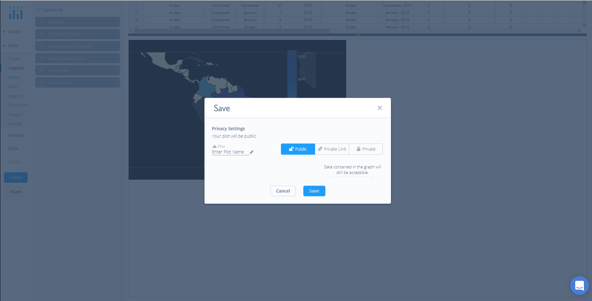
 
### 2.2. Average per Month Map
Using the same grid as the previous plot, open the data in the Chart Studio.

##### 2.2.1. Create
Now that we have the data added to the grid, we can select our chart type. To do so, select *Graph* on the left-hand side, then *Create*. Click *Chart Type*, and **Choropleth** from the *Maps* column.

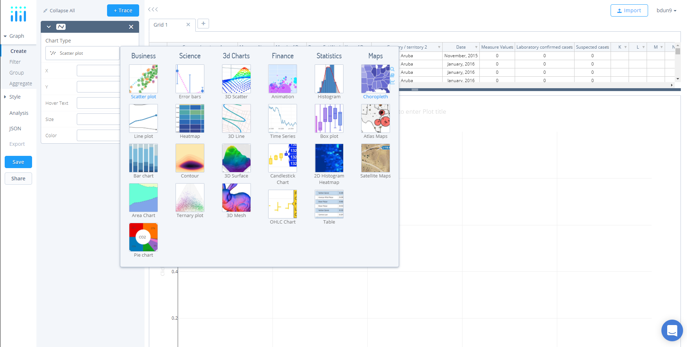

Now to populate the graph with data, in the *Locations* and *Values* dropdown select **Country / territory 1** and **Laboratory confirmed cases**, respectively. Additionally, set **Country Names** in the *Locations Format* dropdown, **World** in the *Map Regions*, and set the *Projections* to **Distance Preserving (Equirectangular)**. You ought to note that states aren't defined yet as we need to aggregate the data.

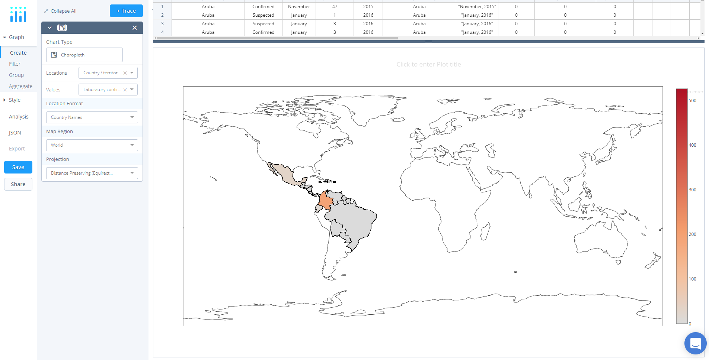

##### 2.2.2. Filter
Our Laboratory confirmed cases column consists of two categorical variables: confirmed and suspected. For this visual, we only want to plot the confirmed cases. Thus, we'll apply a filter. To do so, click *Filter* in the *Graph* tab. Then, filter on **Measure Names** and select **Laboratory confirmed cases** as the *Traces to Filter*. Set *Operator* to **Matching Values**, **Include**, and select the categorical variable **Confirmed**.

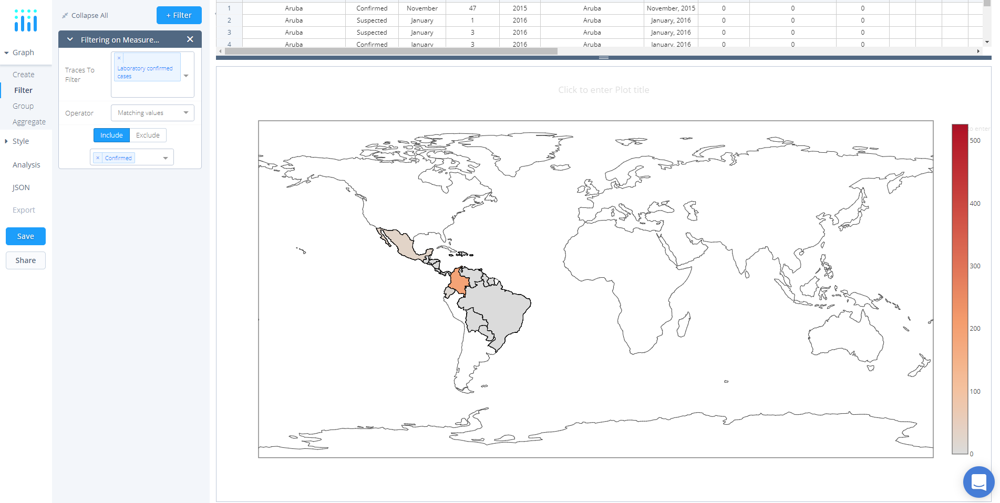

##### 2.2.3. Aggregate
Now, for this choropleth we want to plot the maximum number of confirmed cases. Therefore, we need to aggregate the data. To do so, open *Aggregate*, select **Country / territory 1** as the *Group By Column*, and **Laboratory confirmed cases** as the *Trace*. Then, set *Z* value to **avg**.

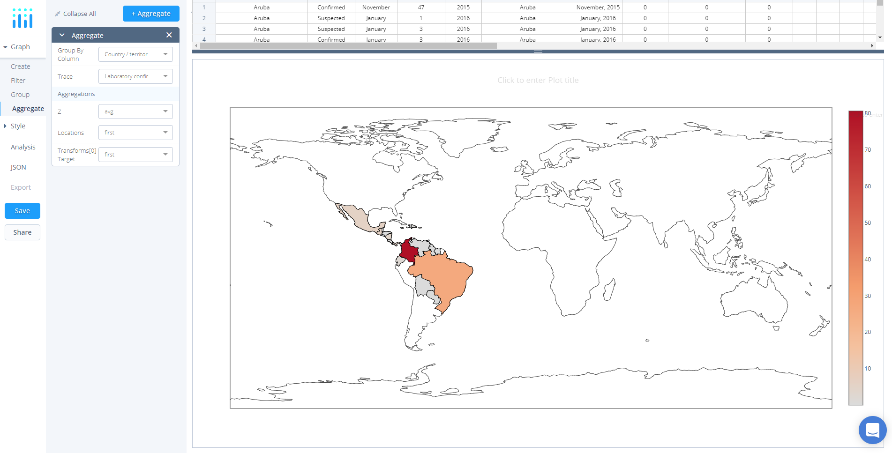

##### 2.2.4. Traces
To style, under *Style* click *Traces*. Here, we can change the colorscale by clicking the **greens** palette (around the 3rd from the left).

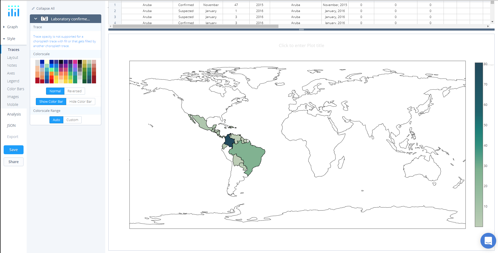

##### 2.2.5. Layout
Now that we've finished styling the trace, click *Layout* to style the background, fonts, and margins. To complete the former, select *Canvas* and set **#000000** as the *Margin Color*.

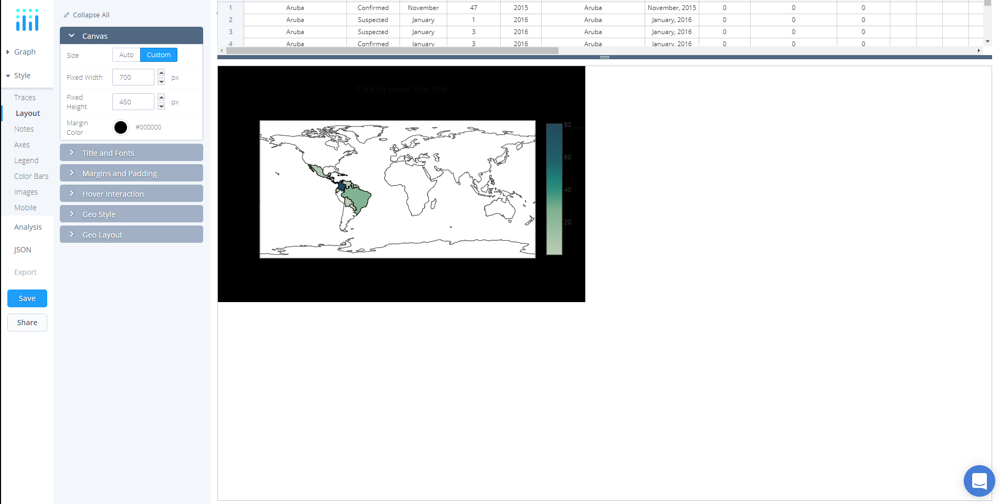

Below *Canvas*, open the *Title and Fonts* box and under *Global Font*, set *Typeface* to **Raleway**, *Font Size* to **14**, and *Font Color* to **#FFFFFF**.

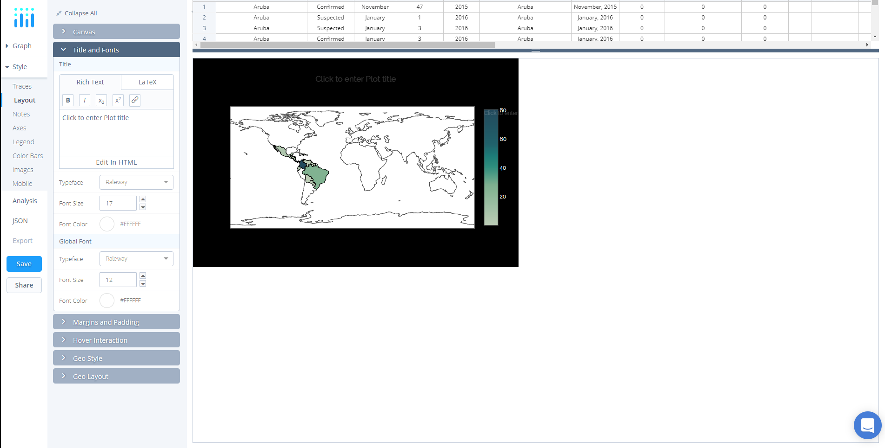

Next, navigate to the *Layout* tab, open *Margins and Paddings* and set all the values to **0** to make it full width and height.

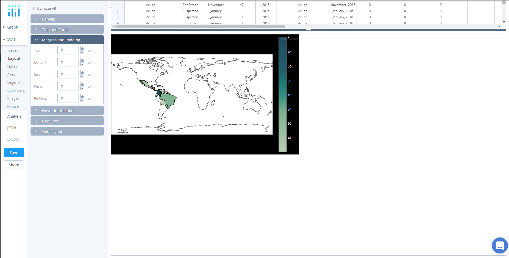

In choropleth maps, we have *Geo Style* and *Geo Layout*. To alter the former, select *Geo Style* and set *Land* and *Coastline* to **Show**. Set *Color* to **#222222** and **#000000**, respectively. Next, set *Oceans* to **Show** and *Color* **#000000**; *Country* to **Show** and *Color* **#000000**. Lastly, *Frame* to **Hide**.

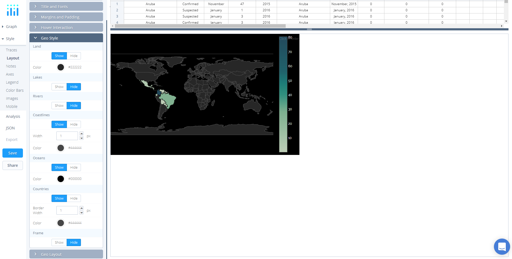

Next, in *Geo Layout* you can define attributes such as *Map Scope*, *Projection*, *Rotation*, *Scale*, and *Map Resolution*. Set *Longitude* to **-62** and *Map Scale* to **2**.

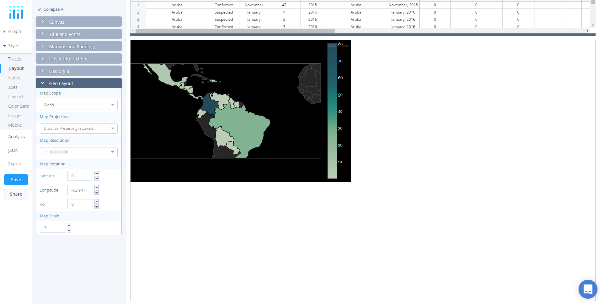

##### 2.2.6. Color Bars

Finally, click *Color Bars* under *Style* and open *Size and Positioning*. To minimize the *Height* set it to **0.9**. To move it inward set *Horizontal Position* to **0.83**.

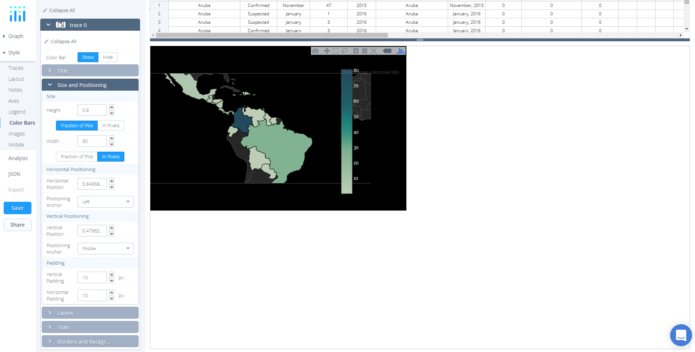

##### 2.2.7. Save
Congrats, your chart is complete! Click **Save** on the left-hand side of the screen. In the pop-up, enter your filename and select either **Public** (visible to all) or **Private Link** (visible only to those who you share the link with) and hit **Save**. Since these plots are destined for a dashboard, they can't be set to private.

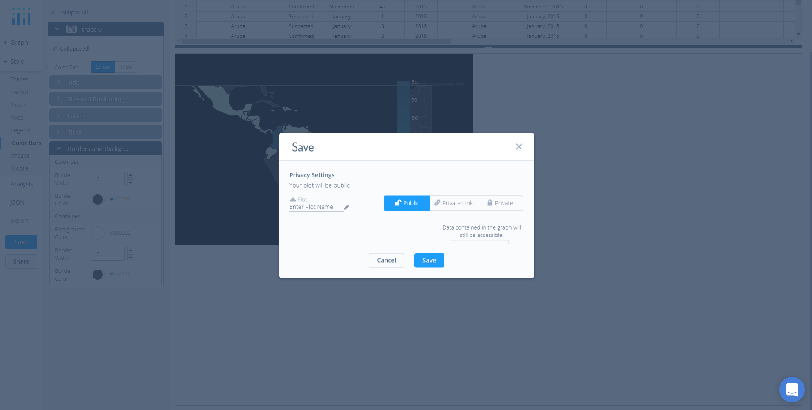

### 2.3. Confirmed Cases by Week Scatter Plot
Using the same grid as the previous plot, open the data in the Chart Studio.

##### 2.3.1. Create
Now that we have the data added to the grid, we can select our chart type. To do so, select *Graph* on the left-hand side, then *Create*. Click *Chart Type*, and **Scatter** from the *Business* column.

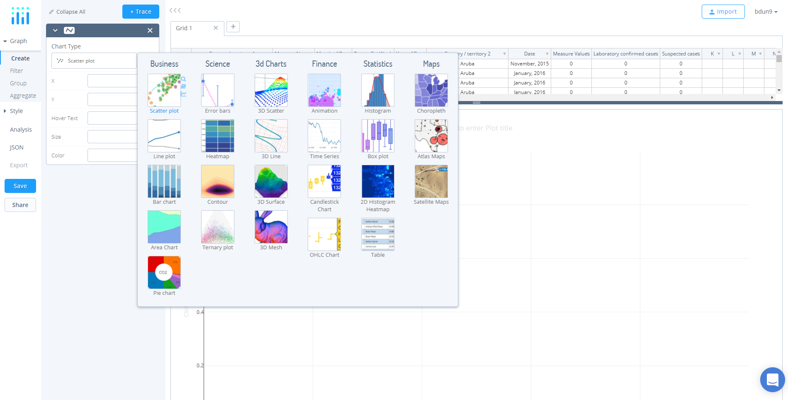

Now to populate the graph with data, in the *x* and *y* dropdown select **Report Epi Week** and **Laboratory confirmed cases**, respectively. Additionally, select **Country / territory 1** in the *hover text* dropdown and **Year of Date** in the *Color* dropdown.

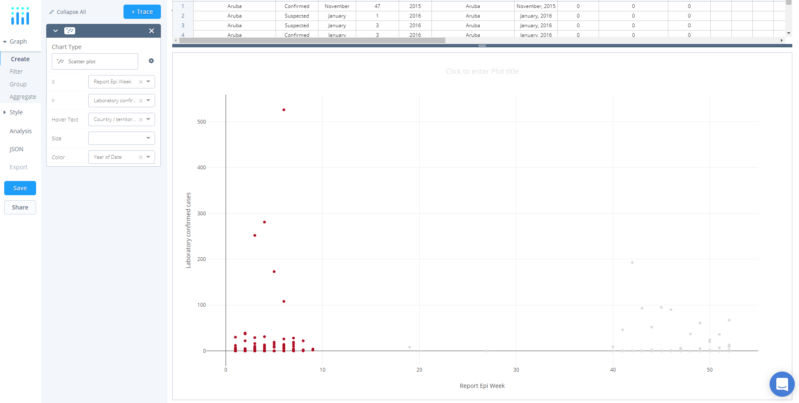

##### 2.3.2. Traces
To begin styling the plot, click *Traces* under *Style*. To change the color of the scatter points, set the colorscale to *pink/green*. Toward the bottom of *Traces* change the *Diameter* to **5** and *Border-Width* to **0**.

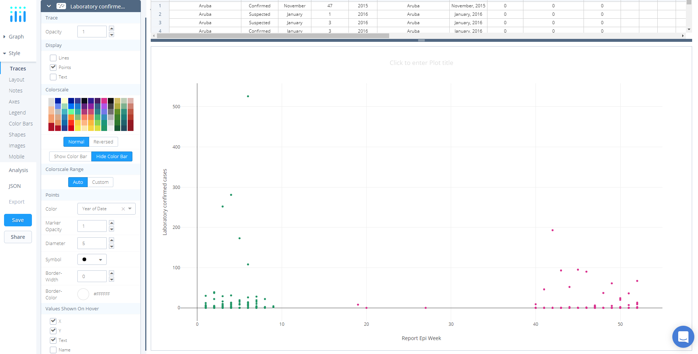

##### 2.3.3. Layout
Next, navigate to the *Layout* tab, open *Canvas* and set the *Plot* and *Margin Color* to **#000000** to keep with the dark theme of the previous plots.

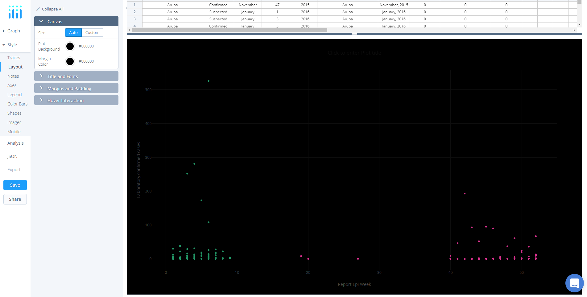

Below *Canvas*, open the *Title and Fonts* box and under *Global Font*, set *Typeface* to **Raleway**, *Font Size* to **12**, and *Font Color* to **#FFFFFF**.

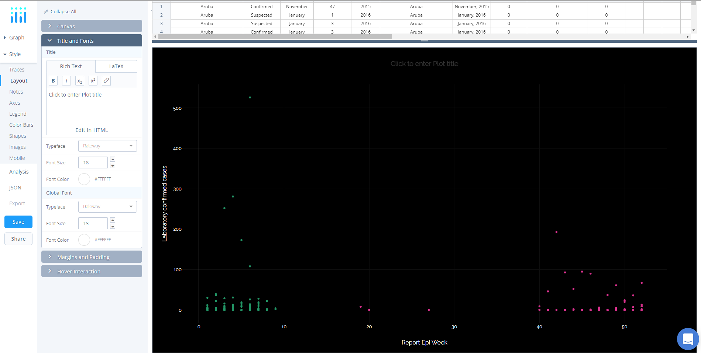

Next, open *Margins and Paddings* and set all the values to **0** to make the scatter plot full width and height.

##### 2.3.4. Axes
Moving on to the *Axes* tab, select *Title*. Remove the *Y* title, then  click *X* and set the title to **Week of year**.

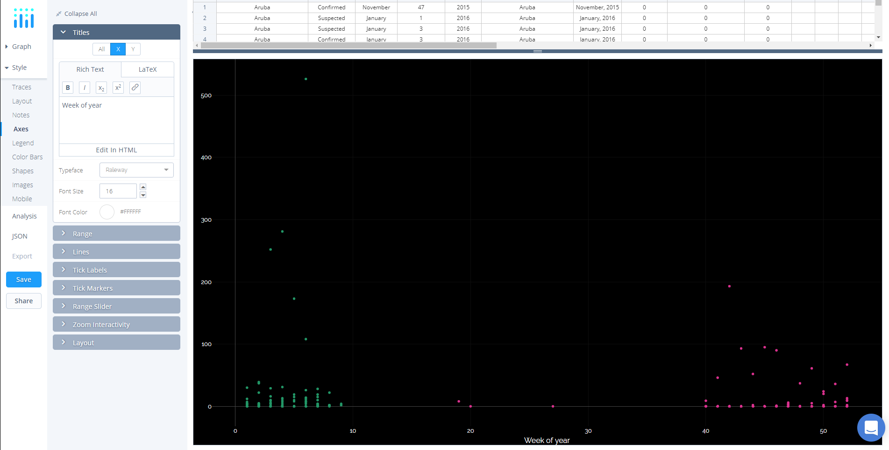

Next, select *Range* to set the y axis to log scale, which will make the data more readable. To do so, select *y* and set *Axis Type* to **Log**.

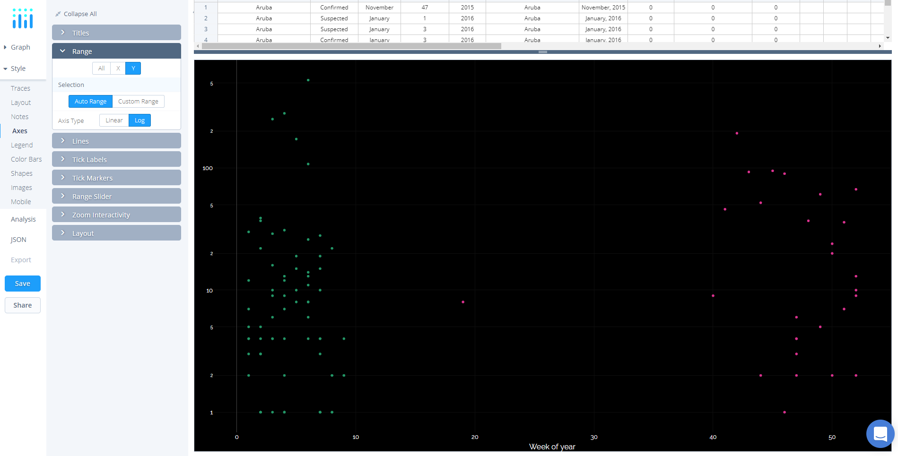

Now to make changes to the grid and zero lines, open *Lines*. First, click *x* and set *Vertical Line* to **Show** and *Color* to **#FFFFFF**. Next, select **Hide** for both *Horizontal Grid Lines* and *Zero Line*.

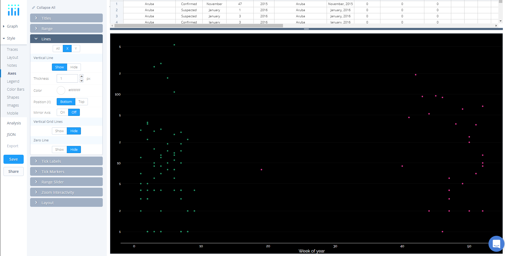

Then, click *y* and select **Show** for all options, but set *Horizontal Line Color* to **#FFFFFF**, *Horizontal Grid Lines Color* to **#000000**, and *Zero Line Color* to **#444444**.

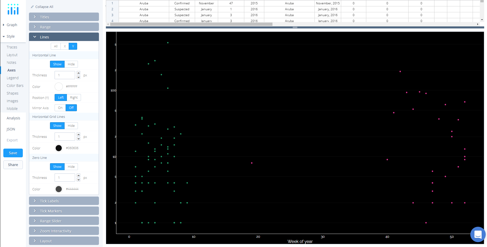

Lastly, for the *Axes*, open *Zoom* and select **Disable**.

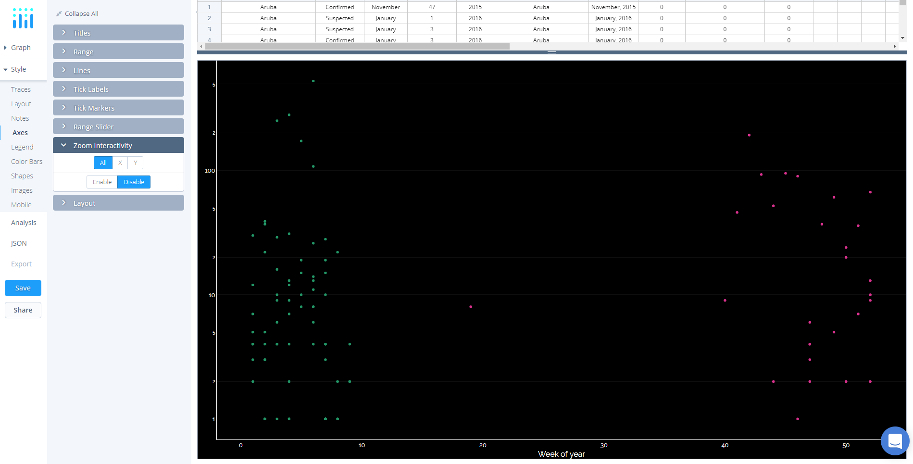

##### 2.3.5. Shapes

As you can see, the x axis is plotted over 2015 and 2016, starting around week 12 of 2015. Thus, we can add a horizontal line to make this distinction. To do so, select *Shapes* under *Style* then click the blue *+ Shape* button. Now, set *Relative To* to **Axes** and the *Start* and *End Point* to **12**. Next, toward the bottom, change *Type* to **- - -**.

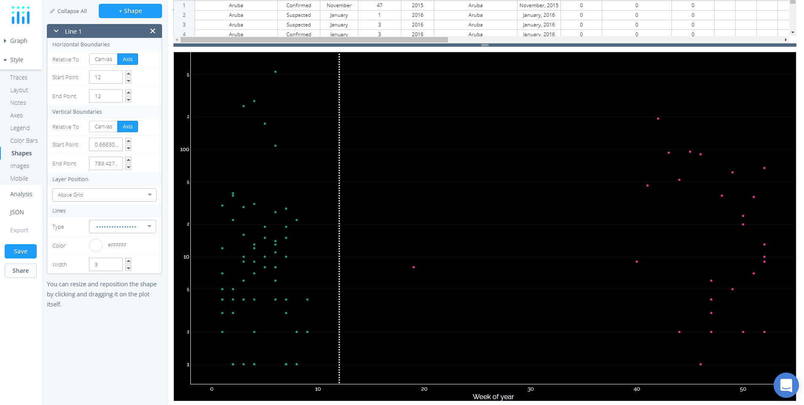

##### 2.3.6. Annotations

To further illustrate the year, we can use annotations. Here, open *Notes* then click *+ Annotation* and **General Annotation**. You ought to see an annotation appear in the middle of the plot. Here, you have the option of editing directly in the plot or by using the annotation box that appeared below the blue *+ Annotation* button. For this tutorial, we'll use the latter method. Thus, set the *Title* to **2016**, *Typeface* to **Raleway**, *Size* to **22**, and the *Color* to **#2CA02C**. To define its position, enter **4.9** as the *Horizontal Position* and **1.8** as the *Vertical Position*.

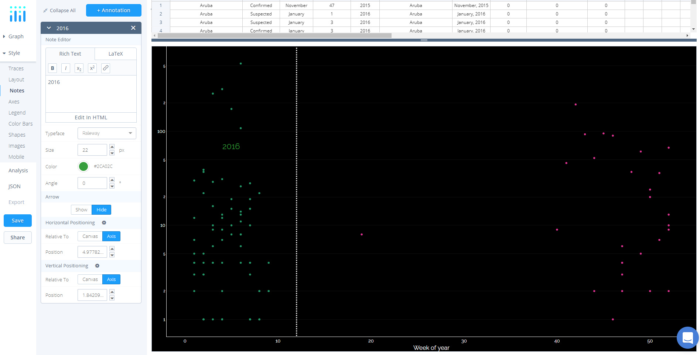

Too add another annotation, click *+ Annotation* and select **General Annotation**. Using the same method as above, set the *Title* to **2015**, *Typeface* to **Raleway**, *Size* to **22**, and *Color* to **#E377C2**. Like previously, to define its position, enter **48.4** as the *Horizontal Position* and **1.1** as the *Vertical Position*.

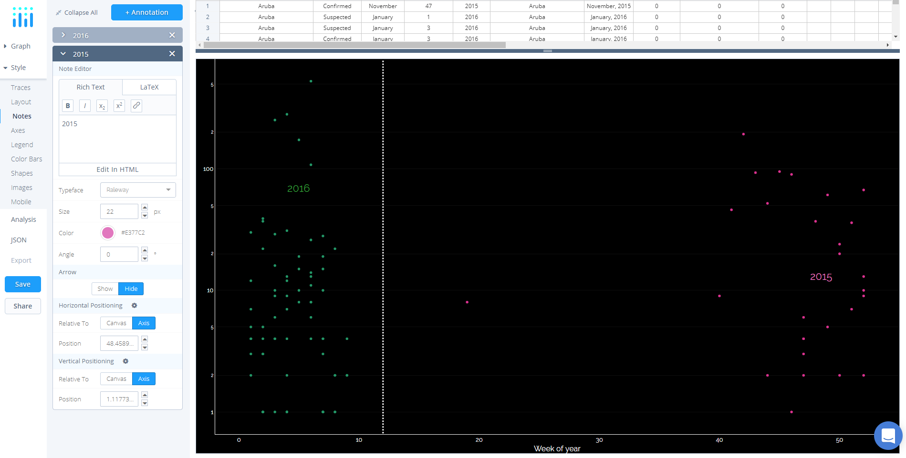

##### 2.3.7. Save
Congrats, your chart is complete! Click **Save** on the left-hand side of the screen. In the pop-up, enter your filename and select either **Public** (visible to all) or **Private Link** (visible only to those who you share the link with) and hit **Save**. Since these plots are destined for a dashboard, they can't be set to private.

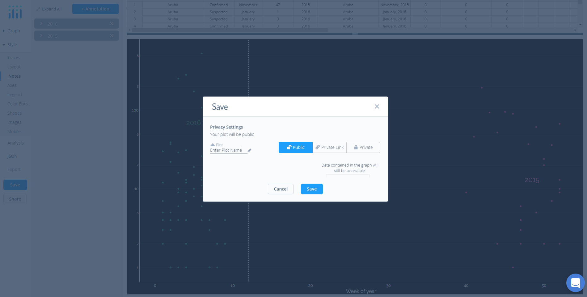

### 2.4. Confirmed Cases by Country Scatter Plot
Using the same grid as the previous plot, open the data in the Chart Studio.

##### 2.4.1. Create
Now that we have the data added to the grid, we can select our chart type. To do so, select *Graph* on the left-hand side, then *Create*. Click *Chart Type*, and **Scatter** from the *Business* column.

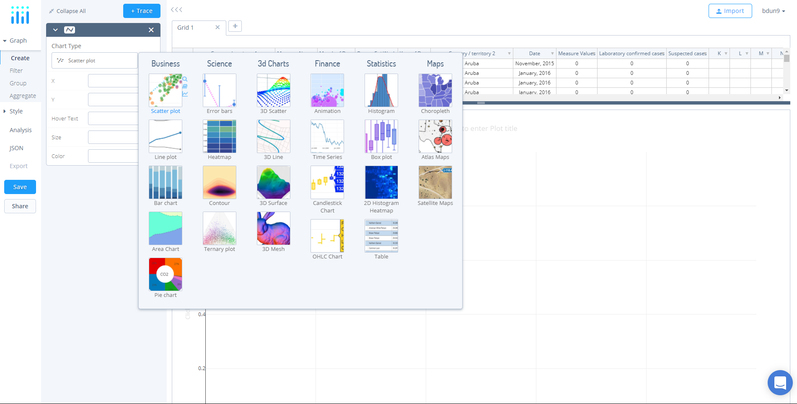

Now to populate the graph with data, in the *x* and *y* dropdown select **Country . territory 1** and **Laboratory confirmed cases**, respectively. Additionally, select **Report Epi week** in the *hover text* and *Color* dropdown.

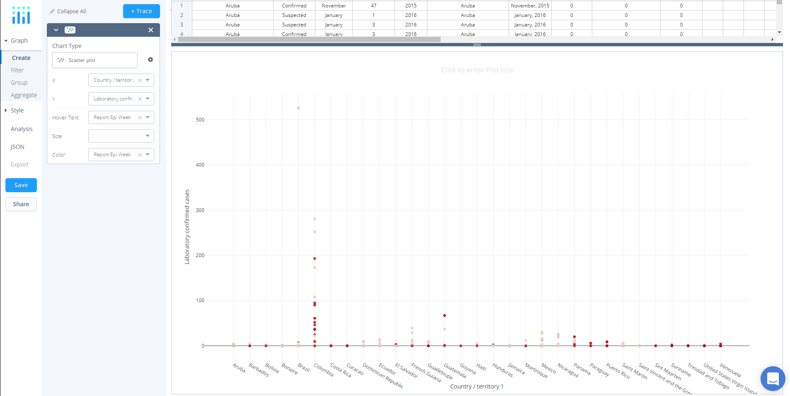

##### 2.4.2. Traces
To begin styling the plot, click *Traces* under *Style*. To change the color of the scatter points, set the colorscale to *yellow/blue*. Toward the bottom of *Traces* change the *Diameter* to **11** and set the *Symbol* to **-**.

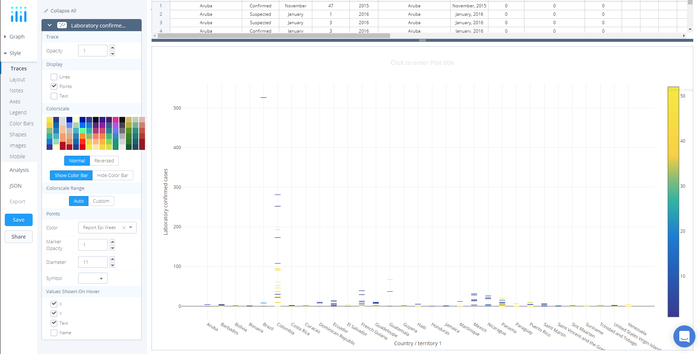

##### 2.4.3. Layout
Next, navigate to the *Layout* tab, open *Canvas* and set the *Plot* and *Margin Color* to **#000000** to keep with the dark theme of the previous plots.

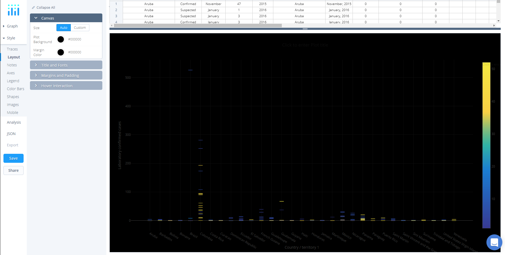

Below *Canvas*, open the *Title and Fonts* box and under *Global Font*, set *Typeface* to **Raleway**, *Font Size* to **12**, and *Font Color* to **#FFFFFF**.

Next, open *Margins and Paddings* and set the values to **20**, **150**, **40**, **40**, and **0**.

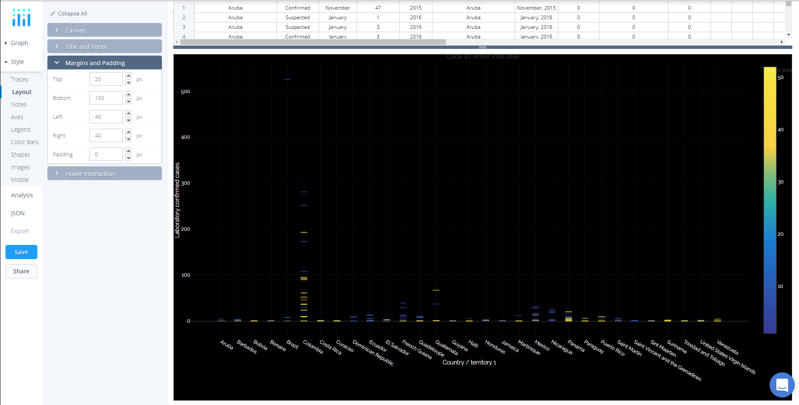

##### 2.4.4. Axes
Moving on to the *Axes* tab, select *Title*. Here, click *All* and remove all titles.

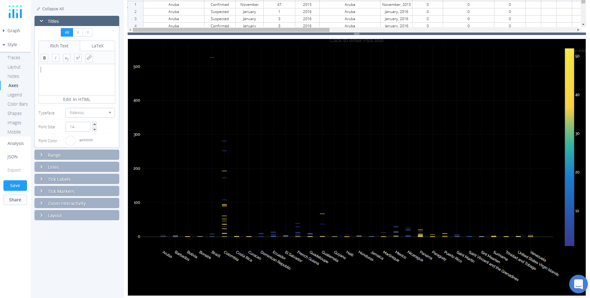

Next, select *Range* to set the y axis to log scale, which will make the data more readable. To do so, select *y* and set *Axis Type* to **Log**.

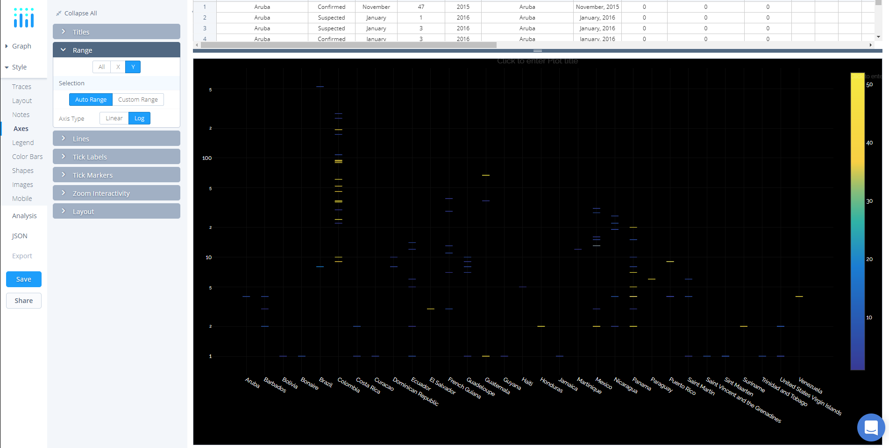

Now to make changes to the grid and zero lines, open *Lines*. First, click *x* and set *Vertical Line* to **Show** and *Color* to **#FFFFFF**. Next, select **Hide** for both *Horizontal Grid Lines* and *Zero Line*.

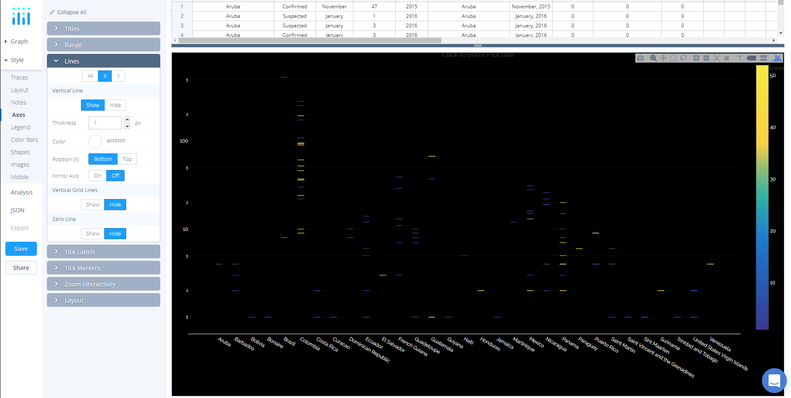

Click *y* and repeat the same process as the x axis.

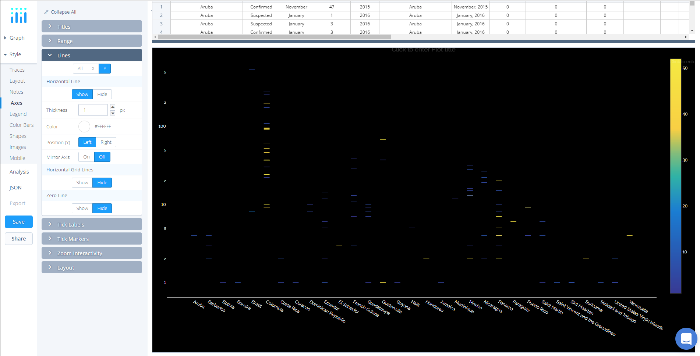

Lastly, for the *Axes*, open *Zoom* and select **Disable**.

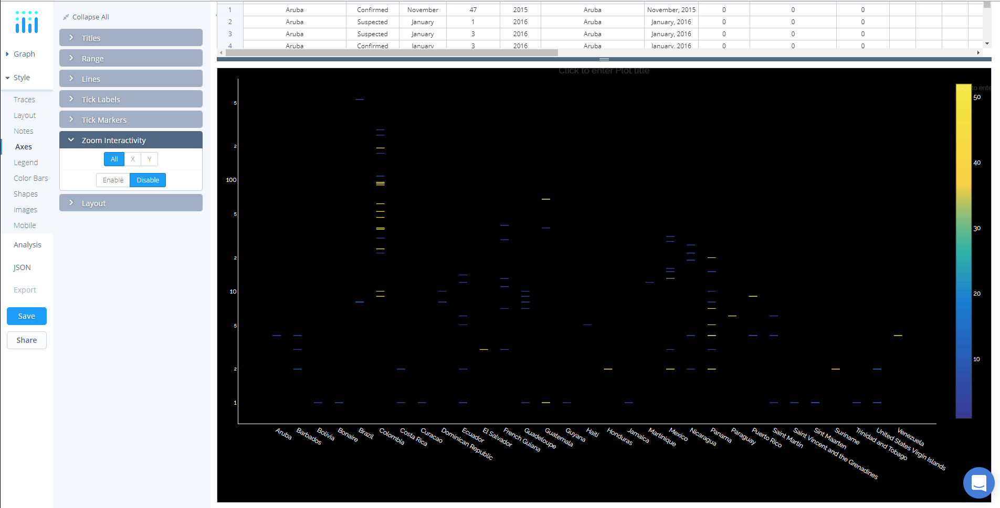

##### 2.4.5. Color Bars

Finally, click *Color Bars* under *Style*, open *Title*, and set it to **Week of year**.

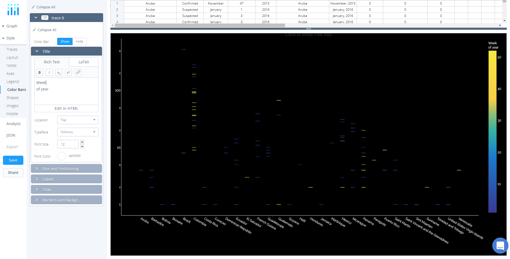

##### 2.4.6. Save
Congrats, your chart is complete! Click **Save** on the left-hand side of the screen. In the pop-up, enter your filename and select either **Public** (visible to all) or **Private Link** (visible only to those who you share the link with) and hit **Save**. Since these plots are destined for a dashboard, they can't be set to private.

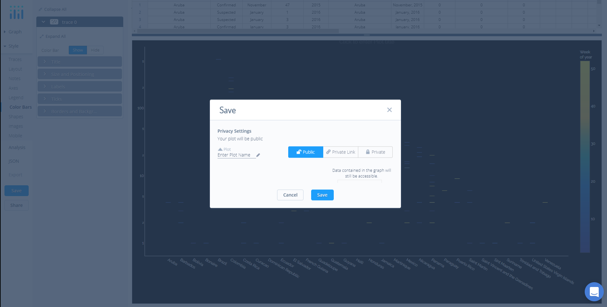

## 3. Create a Dashboard

With the charts completed and saved in your [home folder](https://plot.ly/organize/home), we can now create a dashboard by simply adding these charts, adjusting the layout, and styling the dashboard before sharing and interacting. To get started with creating a dashboard, hover over the *+Create* button and select **Dashboard** from the menu. Alternatively, open this [link](https://plot.ly/dashboard/create).

### 3.1. Add Charts

First, to add the Maximum Cases per Month Map, click *+Plot* in the bottom left corner of the screen. A new box ought to appear with the option to 'Add a Plot'. Click, the *'Your Files'* option and then in the pop-up select the **Maximum Cases per Month Map** we made earlier.

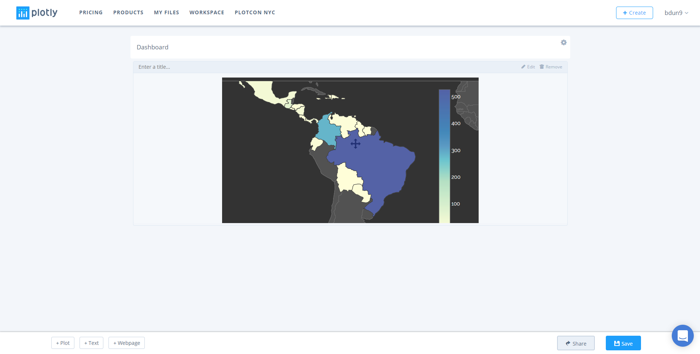

Next, add the Average Cases per Month Map following the same process. This time drag and drop the plot on the right half of the Maximum Cases per Month Map. You ought to something like below.

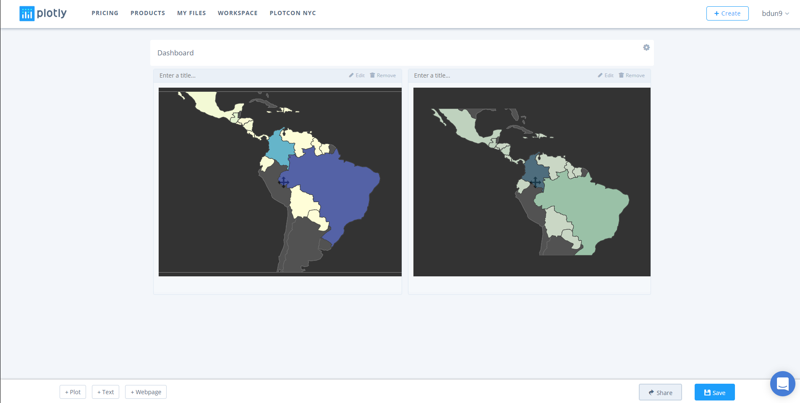

Immediately below, add the Confirmed Cases by Week of Year Scatter Plot and leave its position as-is.

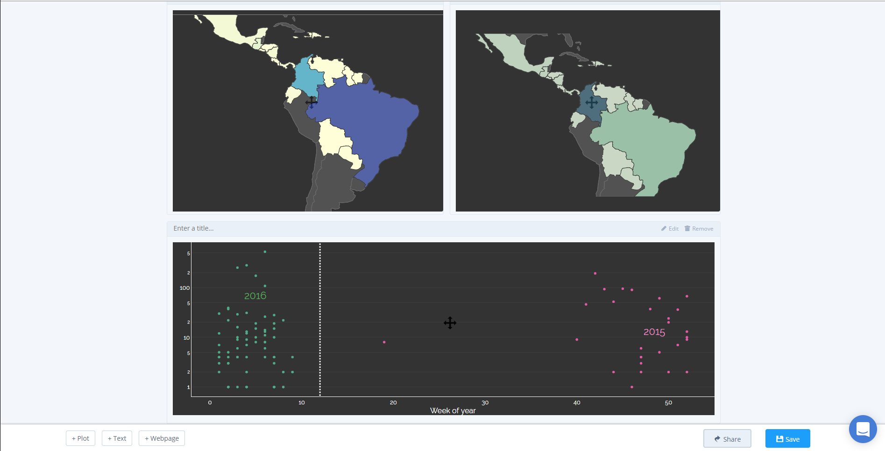

For the final plot, the Confirmed Cases by Country Scatter Plot, add this to the bottom of the dashboard and drag down accordingly.

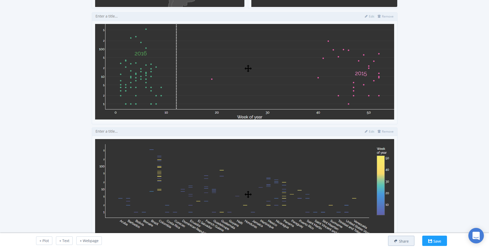

Now that we have added all the plots to the dashboard, for each plot where it says, "Enter a title..." insert plot titles: **Maximum confirmed cases per month 2015-16**, **Average confirmed cases per month 2015-16**, **Confirmed cases by week of year**, and **Confirmed cases by country (colored by week of year)** in the same order as we added the plots. Your result ought to look like below.

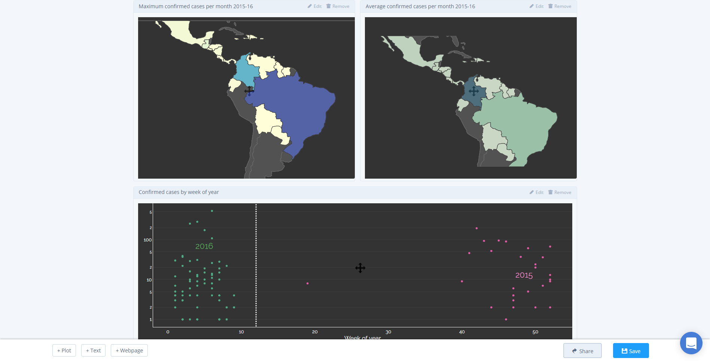

### 3.2. Style It

Now that we have the structure of our dashboard, we can style it. To do so, navigate to the *settings icon* directly opposite the dashboard title. When hovering you ought to see the option settings from the menu.

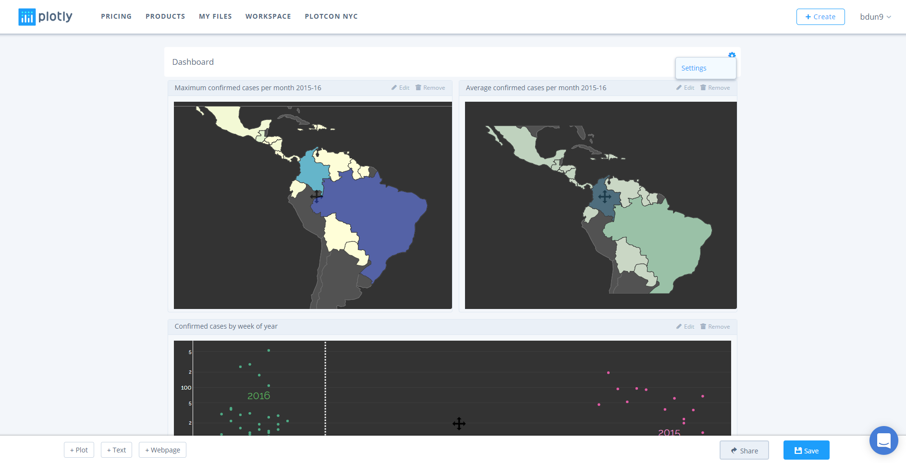

After clicking *settings*, a panel ought to appear from the right-hand side of the screen. Here, we have the option of headers, colors, text, layout, and filter. First, in *Headers*, we can set the title, add a logo, and multiple links. For this tutorial, add **Laboratory Confirmed Zika Cases 2015-2016** to the *Title* text box. Next, let's add the Pan American Health Organization logo. We can do this by simply adding the URL for the logo PNG: **http://www.paho.org/cardioapp/web/img/logo%20negro%20eng.png**.

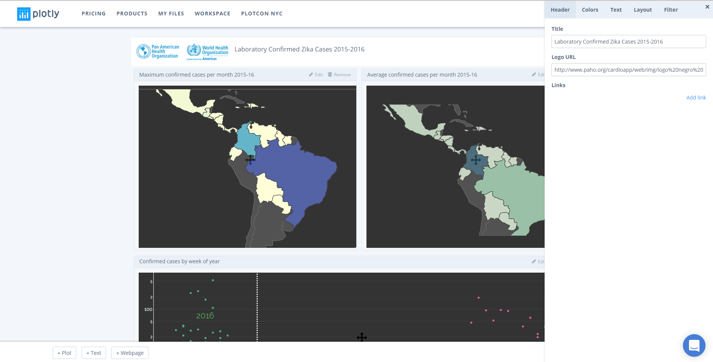

In the next tab, *Colors*, we can manipulate the background, borders, and text colors. As you can see, the dashboard has already added these by default. That said, keeping with our plot themes, we will set *Header Background*, *Page Background*, *Box Background*, *Box Border*, and *Box Header Background* to **#000000**. Then, set *Header Font Color* and *Box Header Font Color* to **#FFFFFF**.

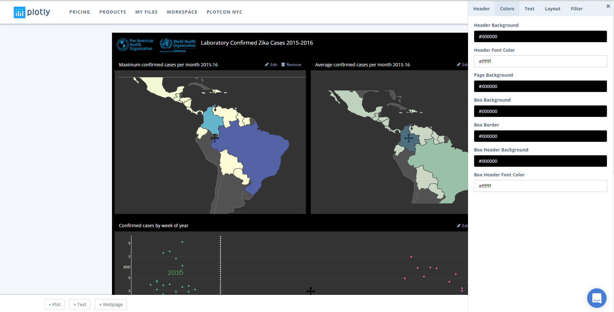

*Text*, the third settings option, allows you to control all things text, including font color, family, and size, as well as header styles and text box styles. Again, like the Colors tab, some values are defined. However, here, we'll set the *Font Family* to **Raleway**. Make the header font larger by selecting **2.2em** in the *Header Font Size* and, additionally, change the *Header Font Weight* to **300**.

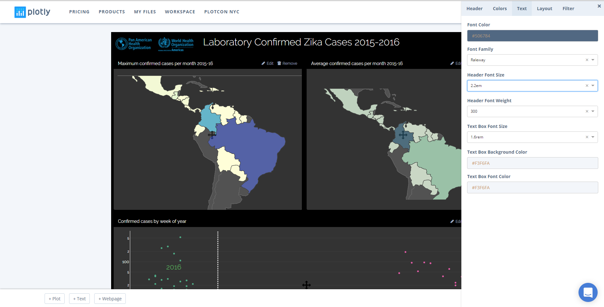

In *Layout*, you have the option of setting the page layout as either a dashboard or a report. Here, we'll leave it as the default dashboard setting. The last settings category, *Filter*, provides you with the option to enable or disable the Search Bar or the Crossfilter feature. For this tutorial, leave the *Search Bar* as-is but let’s enable the *Crossfilter* feature by selecting **Enable** (for more information about this feature see the next section).

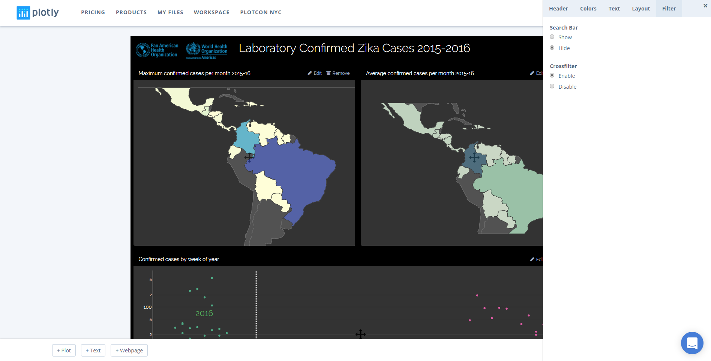

Congrats, your dashboard is complete! Click **Save** on in the bottom right-hand side of the screen. In the pop-up, enter your filename and select either **Public** (visible to all), or **Private Link** (visible only to those who you share the link with), or **Private** (visible only to you) and hit **Save**. .

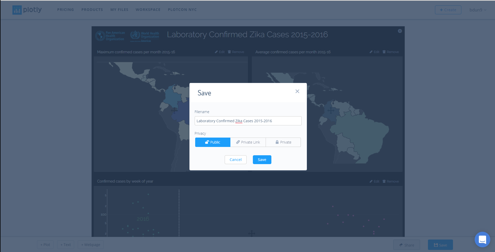

## 4. Crossfilter
Finally, we'll briefly demonstrate crossfilter.

**Crossfilter** is a visual analysis technique for multidimensional data. It is used to clarify relationships between dimensions. As discussed in the previous section, crossfilter functionality is invoked by setting **Enable** in Settings > Filter.

To use crossfilter, simply click-and-drag on a chart. Selected data that shares common rows with other charts will highlight and all other data will fade out. To reset the dashboard, click anywhere on a graph that doesn't have data.

